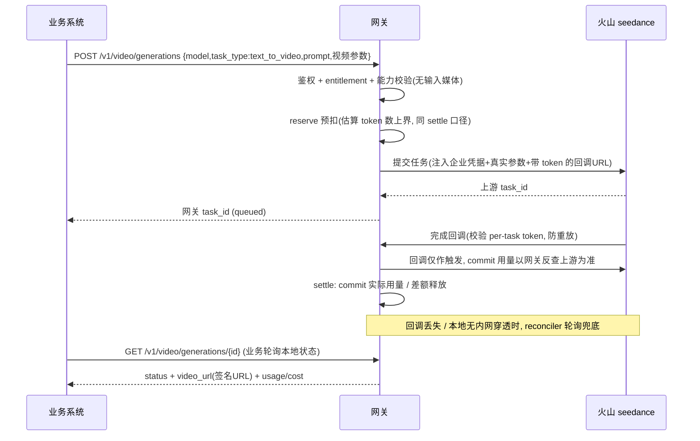

# 网关「真实可用」第一刀 —— 异步视频生成核心闭环（需求）

## 问题框架

网关是基础设施层（`docs/multimedia-gateway-design.md` §三bis），为已存在的业务系统（多媒体创作平台，如 storyboard-assistant）提供统一模型接入 API，屏蔽厂商复杂度 + 统一计费。业务系统当前各自直连火山 seedance 2.0 视频生成 + 自做积分，需迁移到网关。

主力负载是**异步图像/视频长任务**（seedance 2.0，几十秒~几分钟）。已建可复用骨架：账本 LedgerService（reserve/commit/release，CAS，单一真相源）、business key 鉴权、httpapi 中间件、audit、metrics。

**现状盘点（避免低估工作量）**：`migrations/0001_init.up.sql` 已建 `channel`/`channel_routing_rule`/`task`(task_status enum)/`webhook_event_outbox`/`webhook_subscription` 表骨架，但 `internal/db/querier.go` 里这些表**零 sqlc 查询**——task 状态机 CAS、channel CRUD、routing 求值、outbox dispatcher 全部待新建。现有 `internal/relay` 是**同步** relay（F-min，ProviderAdapter 仅 `ChatCompletion` 单方法、settle 在单请求内闭环），**异步视频无法复用**，需平行的 async adapter。go.mod 当前无 Asynq / Redis 客户端 / 对象存储 SDK。

**第一刀目标**：让 storyboard-assistant 把**一个真实视频生成工作流**改为调网关，小流量生产灰度跑稳——打通"业务提交→鉴权→预扣→提交上游→回调/轮询→按真实用量结算→业务轮询取结果"，账目对得上、不丢任务、可随时切回直连。

## 用户流程（异步视频生成闭环）

## 需求

**业务对外 API（统一抽象）**
- R1. 网关暴露统一多媒体生成提交端点（如 `POST /v1/video/generations`），请求体 = `{model: 逻辑名, task_type, 通用参数, extra 透传袋}`；同步返回网关 task_id（异步语义）。
- R2. `task_type` 为**模型无关**的生成模式枚举。**第一刀仅实现 `text_to_video`（文生视频）**——首个灰度迁移工作流用的模式，无输入媒体（纯 prompt→视频），是最干净的闭环。其余模式（image_to_video / first_last_frame / storyboard 智能多帧 / 续写链式）枚举占位但校验层直接拒绝，留后续刀。
- R3. 网关按 catalog 中该 gateway-model 的能力描述符校验请求（task_type 是否支持、参数取值档、媒体输入约束、必填项）；不支持/越界返 400（OpenAI 兼容错误形状）。**换上游模型 = 改 catalog，业务请求不变**。
- R4. 业务通过**轮询**查询任务（`GET /v1/video/generations/{id}`），返回规范化状态（queued/running/succeeded/failed）+ 结果（video_url 签名URL / 规范化 usage / cost）+ 失败原因。**轮询只读网关本地 task 状态，不同步触发上游查询**。webhook 推送推后。
- R5. 业务侧只读查询 API：查任务状态、查账户余额、查用量。
- R5a.（安全·硬要求）所有按 id 的查询/引用（task_id、asset-id、balance/usage）必须在数据访问层强制 `business_account_id = 当前鉴权账户`；归属不符返 **404**（不返 403，避免泄露资源存在性）。须附跨租户越权单元测试（A 查 B 的 task 应 404）。

**能力描述符与模型字典（catalog）**
- R6. **第一刀 catalog 沿用 env 单条**（F-min 模式，单 gateway-model 直绑一个 seedance channel）。catalog DB 化 + 多 model 推后到需要管理 UI / 多模型时。
- R7. 能力描述符为声明式数据结构（借鉴 storyboard-assistant `VideoModelCapability`：media_inputs[] + params[] + task_type 支持集）。**第一刀只做"驱动校验"这一个用途**，只声明该工作流校验所需的字段子集；routing_keys / system_managed / 文件细粒度限制 / UI 渲染 / 文档生成等随对应消费者（后续刀）再补。"单一真相源驱动 UI+文档"是设计意图（north star），非第一刀验收项。

**异步任务工作流**
- R8. 提交流程：鉴权 → 跨租户归属（R5a）→ entitlement（R13）→ 能力校验（R3）→ reserve 预扣 → 提交上游（注入企业凭据 + 改写真实参数）→ 落 task 记录 → 返网关 task_id。任一前置校验失败必须在 reserve **之前**短路（403/400/402），不留 orphan reserve。reserve 与 task 落库的事务边界须明确（同事务，或先 reserve 后落库失败即 Release + reconciler 兜底）。
- R9. 完成机制：**回调优先**——火山 seedance **官方支持任务完成回调**（已确认）；提交时注册带 per-task 不可预测 token 的回调 URL，上游完成推送网关。**轮询兜底**——独立 reconciler 扫描超时未回调任务主动查上游，防丢回调（亦覆盖本地无内网穿透的开发场景）。**本地测回调需内网穿透**（火山打不到 localhost）。
- R9a.（安全·硬要求）回调 ingress 是公网入口：校验 per-task token（常量时间比较 + 绑定 task_id）+ 防重放窗口；**回调体内的 status/usage 不可信**，commit 的真实用量以网关**主动反查上游**为准，回调仅作"去查"的触发信号；回调端点独立速率限制 + 请求体大小上限 + 对未知/已终态 task_id 快速短路。
- R10. 结算：上游成功 → 按真实 usage `commit` 实际扣费（≤ reserve，差额释放）；失败/超时 → `release` 预扣。结算用独立上下文；状态机 CAS，handler 可重入（重复回调/轮询无害，幂等 = 状态机 CAS + ledger correlation 双层）。**非二元结局须定义**：产物 URL 不可用/转存失败 → 视为失败 release 或退费 + 告警；上游永不返终态 → 超最长执行期一律 EXPIRED + release（task 终态收敛不变量：所有 task 必在有限时间进终态，reserved 不永久占用）。
- R11. 每个 job 关联 ledger entries（reserve/commit/release），actor = business_key；可按 task_id / correlation_id 反查对账。

**凭据隔离与功能开通**
- R12. Channel 凭据 DB 化 + **从零构建**凭据加解密（P0 单一 AES-GCM，KEK 取自 `GATEWAY_KEK_V1`；当前仓库无 envelope 加密代码，非"复用"）；seedance 5 段（API_KEY + ARK AK/SK + TOS AK/SK + bucket + project_id）；per 企业 project_id 隔离。解密失败 fail-closed（拒绝提交而非裸调上游）。
- R12a.（安全·硬要求）解密后明文凭据**严禁**进入 audit / metrics / 应用日志 / 错误响应 / 业务查询响应；Channel 配置接口 write-only（不回显明文，只给掩码）；解密作用域最小化。涉凭据 PR 必须附边界单测。
- R13. 最小 entitlement：声明每个业务账户可用哪些 gateway-model；调用未开通 model 返 403。entitlement（授权层）与能力校验（输入合法层）职责分离，均在 reserve 前完成。粒度仅到 model 为第一刀"已知限制"。人像库等"功能开通"推后。

**计费与并发**
- R14. 计费复用账本（reserve→settle）。**计费口径 = token**（对齐参考实现 storyboard-assistant：`CNY 单价/百万token`，settle 用上游 `usage.completion_tokens`；seedance 响应确实返 token usage）。**reserve 估算的也是 token 数**（`(duration × W×H × fps)/1024` 估 token，再按同一单价定价），与 settle **同口径**；reserve 必须是**可证上界**（账本 `Commit` 硬校验 `实际 ≤ reserve`，估偏低会 settle 失败）。价格走 **catalog 配置 + 提交时价格快照**（不硬编码；火山调价不影响 inflight 任务结算、历史可重算）。货币 CNY（minor unit 分），时区 UTC。
  > 注：设计文档 §5.1 的 `per_video_second` 计费口径**已过时**（早于 seedance 2.0 的 token 计费），planning 时应以参考实现的 token 口径为准，并回头更新设计文档；R14 不使用 third-party/new-api 的 billingexpr（ADR-0001 禁抄）。
- R15. **账户×模型并发硬上限**：每个 (账户, model) 系统默认并发数（如 seedance=10），账户级可覆写；inflight 超限直接 429。**硬上限语义要求跨副本一致**——计数须集中式（Redis 原子 / DB 约束 / 复用设计文档 §9.4 的 Asynq 企业队列 concurrency），禁用纯进程内计数；若灰度确为单实例，须在依赖假设显式标注"单实例假设 + 多实例前置补全局计数"。计数增减与 task 状态机原子（防崩溃泄漏，对齐 `submit_locked_until` 回收）。模型全局上限 + 排队 + 削并发降级推后。

**资产与存储**
- R16.（**第一刀不需要**）TOS 媒体代理上传服务于有输入媒体的模式（图生/首尾帧/多参）。**text_to_video 无输入媒体，故媒体代理上传不在第一刀关键路径**，随 image_to_video 等需要输入媒体的模式再做。届时：业务把素材交给网关→网关用企业凭据上传 TOS + 签名 URL 喂上游；上传失败须在 reserve 前或失败即 Release；大文件流式避免全量入内存。
- R17. 结果存储：上游产物落 TOS（企业 bucket）+ 下发签名 URL 给业务；记录 oss_object_meta。OSS 月度对账推后。
- R17a.（安全·硬要求）签名 URL = bearer 凭证：最小必要 TTL（喂上游的素材 URL 覆盖上游最长排队+生成窗口；下发业务的结果 URL 覆盖业务轮询窗口，可配且 ≥ 任务 max_wait_time）、限定单对象 GET 只读、bucket/对象路径按 project_id 隔离、对象 key 含不可枚举随机段、签名 URL 不进 audit/日志。

**运维配置（CLI/API，UI 推后）**
- R18. 运维通过 admin-cli / Admin API 配置：创建/管理 Channel（admin-only，write-only 凭据）、维护 model catalog（含能力描述符 + pricing）、给账户开通 model（entitlement）、设并发上限。运维管理 UI 推后。

**可观测与可靠性（达灰度门槛）**
- R19. 审计：每次提交/查询/回调 emit audit（**不记** prompt / 媒体正文 / 凭据明文 / 签名 URL 等敏感内容）；记 account / model / task_id / status / cost / duration。
- R20. metrics：任务提交/成功/失败、结算失败、并发拒绝、回调接收、轮询兜底触发等指标。
- R21. 错误恢复（灰度门槛）：回调丢失由轮询兜底；上游提交中途崩溃由超时机制回收 inflight（防孤儿，对齐 `submit_locked_until`）；**settle 失败有重试终态契约**（最大重试次数 + 退避；耗尽落 `settle_failed` 终态 + 告警 + 进对账队列，保证"账目对得上"在 settle 永久失败时仍有确定收敛路径）。

## 成功标准

- storyboard-assistant 把**一个真实视频生成工作流**改为调网关，小流量**生产灰度**跑数天：
  - **网关自洽**：账目对得上（commit 合计 = 业务实际消费，可对账）、不丢任务（回调丢失能被轮询兜底捞回）、失败任务正确 release 无 orphan reserve、计费按真实 usage 准确。
  - **业务端到端可用**：业务拿到的 video_url 在有效期内可下载、规范化 usage/cost 字段业务可消费。
  - **可回滚**：灰度期业务可一键切回直连 seedance（双轨并存，网关不可用不阻断业务）。
  - **新旧可对比**：同一工作流网关计费结果与业务原直连自算积分逐任务对比，差异在约定容差内（放行/回滚依据）。

## 范围边界（第一刀非目标）

- 输入媒体 TOS 代理上传（text_to_video 无输入媒体；随 image_to_video 等需要输入媒体的模式再做）
- 人像库（虚拟/真人）开通 + 真人验证编排（独立后续工作流）
- 模型全局并发上限 + 排队 + 削并发降级（第一刀仅账户×模型硬上限 429）
- 续写链式（一 job 多 subtask，continuous_chain/transition_fill）+ 非目标工作流的 task_type（含 storyboard 智能多帧，除非确认是首个迁移工作流）
- catalog DB 化 + 多 model（第一刀 env 单条）
- 能力描述符的 UI 渲染 / 文档生成 / routing_keys 等校验外用途
- 运维管理 UI（React）——第一刀运维走 admin-cli/API
- webhook 推送业务（第一刀业务轮询）
- OSS 月度对账
- 多 provider（第一刀仅 seedance 2.0）
- LLM / 同步 chat（F-min 已交付，本里程碑不动）

## 关键决策

- **对外 API = 统一 schema + 能力声明**（非原生透传）：屏蔽厂商、换模型业务不改。第一刀能力描述符仅驱动校验。
- **完成机制 = 回调优先 + 轮询兜底**：火山 seedance 官方支持回调（已确认）；轮询兜底兼顾丢回调与本地无穿透场景。回调 ingress 按公网攻击面加固（per-task token + 回调体不可信 + commit 反查上游）。
- **业务取结果 = 轮询网关本地状态**（webhook 推后）：业务原本就轮询，迁移成本最低；轮询不触发上游查询。
- **资产 = 网关代理上传**（参考项目已验证 TOS 上传+签名）：text_to_video 无输入媒体，第一刀仅做 TOS **结果**存储 + 签名 URL；输入媒体代理上传与人像库推后。
- **计费 = token 口径，复用账本**：对齐参考实现（设计文档 per_video_second 过时）；reserve 估 token 数同口径、可证上界；价格走 catalog + 快照不硬编码。
- **异步执行与现有 relay 平行**：异步 adapter（submit/poll）与现有同步 ChatCompletion 并存，provider_type 扩 seedance。
- **第一刀收敛**：只做目标工作流的 task_type + env 单条 catalog + 校验级能力描述符，把 DB 化/多模式/UI/全局并发等推后，更快足进灰度。
- **第一刀验收 = 生产灰度迁移一个真实工作流**：网关自洽 + 业务端到端可用 + 可回滚 + 新旧计费可对比。

## 依赖 / 假设

- 复用已建账本（LedgerService，注意 `Commit` 硬校验 `实际 ≤ reserve`、`Release` 金额须等于 reserve）、business key 鉴权、audit、metrics。
- **task/channel/routing/outbox 当前为 schema-only（0 sqlc 查询）**：需新建全部数据访问 + task 状态机 CAS（显式 from/to）+ channel CRUD + outbox dispatcher；task 表需加列（callback_token、能力/价格快照等）→ 一条 0005 migration（up/down 配套）。
- 现有 `internal/relay` 为同步包，异步视频需平行 async adapter（不可直接复用）。
- 火山 seedance 官方支持回调（已确认）；**本地测回调需内网穿透 + 用户配置穿透域名**（否则火山打不到 localhost）。
- 企业火山凭据（Channel）可得；加解密 P0 单一 AES-GCM（KEK 取 `GATEWAY_KEK_V1`）。
- storyboard-assistant（`F:\AiWorkspace\storyboard-assistant\storyboard-assistant`，仅参考不照搬 new-api）为 seedance 能力面 / 能力描述符 / **计费口径（credit pricing + usage normalizer，对账权威基准）** 的蓝本。
- 假设业务系统能改造为：调网关提交 + 轮询网关取结果（改动小）。

## Outstanding Questions

### Resolve Before Planning
- （无）首个 task_type 已确认 = text_to_video；核心产品决策已锁定，可进入 planning。

### Deferred to Planning
- [影响 R8/R9/R21][Technical][Needs ADR] 异步执行基座选型：引 Asynq + Redis（开 ADR，等于把设计文档"工作流 A"提前到本里程碑）vs 进程内调度 + DB 轮询兜底（task 表 submit 恢复索引已预留）。reconciler / 重试退避 / 终态收敛由谁承载。
- [影响 R9][Needs research] 火山 seedance 回调的具体 payload 格式 / 是否带上游签名 / 注册方式（已确认支持，细节待查官方文档）。
- [影响 R2/R7][Technical] task_type 到上游 seedance `reference_mode` 的映射；能力描述符"校验子集"的 DB/结构设计。
- [影响 R8/R11/R12][Technical] 复用 0001 `task`/`channel` 表的程度 + 需加列（callback_token、快照、upstream_task_id）；Channel 5 段凭据加密 schema。
- [影响 R14][Technical] reserve 估 token 公式与 settle 实算的对账等式 + 价格快照机制（对齐 storyboard-assistant credit pricing/usage normalizer 口径，先查 seedance 真实 usage 字段）。
- [影响 R15][Technical] inflight 跨副本计数实现（Redis 原子 / DB 约束 / Asynq 队列 concurrency）+ 默认/覆写并发数配置位置 + 提交竞态（并发同时通过上限）处理。
- [影响 R16/R17][Technical] TOS 上传 / 签名 URL 实现路径（SDK vs REST，SDK 需 ADR）+ gateway-side asset-id 抽象。

## Next Steps

→ `/ce:plan`（Resolve-Before-Planning 已清空）。建议工作流拆分（text_to_video 闭环，无输入媒体）：Channel/凭据加密(AES-GCM) → catalog/能力描述符(校验级, env单条) → 异步任务状态机+提交+回调(带token)+轮询兜底 → 计费(token口径 reserve→settle)+账户×模型并发 → TOS结果存储+签名URL → 业务只读API(含跨租户隔离)+运维CLI。异步执行基座(Asynq vs 进程内)需在 plan 内开 ADR 决策。
