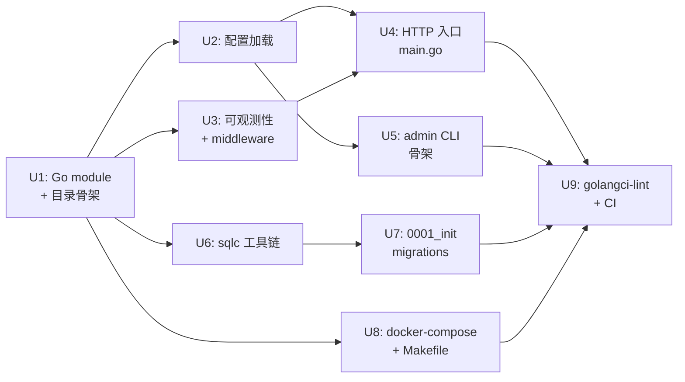

# Phase 1 — 项目骨架 + 初始 PG migrations

## Overview

为 api-gateway 多媒体 AI 网关项目落地**第一份可编译、可启动、可迁移、可跑 CI** 的工程骨架。
此 Phase **不包含**任何业务逻辑（无 ledger / routing / outbox / Admin handler 实现），其目标是把所有「工具链与目录结构」立起来，保证 Phase 2 起每条业务工作流都能在干净基线上并行推进。

Phase 1 一次性交付：

1. 编译通过的 Go module + 目录骨架（含 `cmd/admin-cli/` + `internal/<subsystem>/`）
2. 可启动的 HTTP 服务器（`/healthz` + `/readyz` + `/metrics` + graceful shutdown）
3. 可执行的 admin CLI（占位子命令，`--help` 全列出来）
4. sqlc + golang-migrate 工具链就位（即使无业务 query 也能 `sqlc generate` 通过）
5. P0 必需的 9 张表完成 `migrations/0001_init.{up,down}.sql`，up/down 双向幂等
6. 本地 `docker-compose up` 可拉起 PG 15 + Redis 7
7. CI（GitHub Actions）跑 lint + test + sqlc-diff + migration 烟雾测试

## Problem Frame

仓库目前只有文档（设计文档 v1.3、5 份 ADR、CLAUDE.md、CONTEXT.md），**没有任何 Go 代码**。
按 v1.3 设计文档第十六章 P0 落地清单，业务工作流 E (账本) / B-min (路由) / C-min (outbox) / D-min (Admin API) 必须在「骨架已立 + schema 已建」的前提下并行展开。
此 Phase 是这些工作流的**前置必要条件**：

- 无 `go.mod` → 后续任何 Go 代码无法编译
- 无 migrations → 账本表不存在，工作流 E 写出来无表可写
- 无 middleware / observability → 任何 handler 无法生产可观测信号
- 无 CI → 后续 PR 缺少防回退保障
- 无 `sql/sqlc.yaml` → 后续 query 无法生成类型安全代码

按 handoff（`E:\temp\handoff-api-gateway-20260526.md`）规划，本 Phase 工期 **1-2 工作日**，2 Agent 并行：Agent A 负责后端骨架轨，Agent B 负责数据库 schema 轨；收尾 Unit 8 / 9 任一 Agent 承接。

## Requirements Trace

源自 v1.3 设计文档与 ADR 的明确要求：

- **R1.** Monorepo 布局：根目录 `main.go` + `cmd/admin-cli/` + `internal/<subsystem>/` + `web/admin/` + `sql/queries/` + `migrations/`（v1.3 基线决策 #30）
- **R2.** Go module path = `github.com/sunxin-git/api-gateway`（v1.3 基线决策 #30）
- **R3.** Go 1.25 / 1.26（CLAUDE.md 技术栈）
- **R4.** 数据访问层 sqlc + database/sql，PG 单选（ADR-0002 + ADR-0003）
- **R5.** Migration 工具 golang-migrate（ADR-0003 实施清单第 3 项 + CLAUDE.md 技术栈）
- **R6.** 基础 middleware：requestid / recover / slog (JSON) / cors / prometheus / OpenTelemetry（CLAUDE.md 技术栈 + handoff Agent A 清单）
- **R7.** P0 必需 9 张表：`business_account`、`business_account_ledger`、`business_account_balance`、`channel`、`channel_routing_rule`、`webhook_event_outbox`、`gateway_admin_token`、`webhook_subscription`、`task`（handoff Agent B 清单 + v1.3 §16）
- **R8.** 账本不变量字段就位：`available + reserved + used_total = recharge_total`（CONTEXT.md 账本不变量 + v1.3 基线决策 #19）
- **R9.** task 表含 `UPSTREAM_SUBMITTING` 状态枚举 + `submit_locked_until` + `submit_recover_count`（v1.3 v1.2.2-1 修正）
- **R10.** `business_account.isolation_required` + `break_glass_until` 字段（v1.3 基线决策 #20）
- **R11.** `channel_routing_rule.fallback_policy` 默认 `strict`（CONTEXT.md fallback_policy）
- **R12.** `webhook_event_outbox` 单调递增 `event_id` + `is_financial` + `retention_until` + `locked_by` + `locked_until` + `delivery_idempotency_key`（v1.3 §16 工作流 C-min）
- **R13.** `gateway_admin_token` 含 `scopes` + `ip_allowlist` + `daily_recharge_quota_limit` + `daily_account_create_limit` + `single_recharge_max`（v1.3 基线决策 #16 + §16 工作流 D-min）
- **R14.** **不**复制 `third-party/new-api/` 任何代码片段，且静态检查阻止 import（ADR-0001 + CLAUDE.md 第一性原理 #5）
- **R15.** 输出语言中文（文档 / 注释 / commit / PR），标识符英文（CLAUDE.md §一、输出语言）

## Scope Boundaries

**Phase 1 包含**：

- 后端骨架（编译通过、可启动、有 health/metrics）
- 9 张表的 PG schema + up/down migrations
- 本地 dev 环境（docker-compose）
- CI 防回退（lint + test + sqlc-diff + migration 烟雾）

**Phase 1 明确不包含**（即使骨架阶段「顺手能做」也推迟）：

- ❌ 任何业务 query（ledger / routing / outbox / admin / task）— 推到对应工作流 Phase
- ❌ 任何业务 handler — 推到对应工作流 Phase
- ❌ Asynq client / server 接入 — 推到 P1（v1.3 §16 明确）
- ❌ embed.FS 嵌入前端 dist — UI Phase 才接入（前端尚未初始化 Vite 项目）
- ❌ Provider Cost Catalog 表 / OSS storage 表 — 推到 P2/P3（v1.3 §16）
- ❌ Webhook 拉取 / 重放接口 — P1（v1.3 §16 工作流 D-min 简化）
- ❌ envelope encryption KEK/DEK 二级密钥结构 — P1（v1.3 §16 工作流 B-min 简化）
- ❌ React UI（`web/admin/`）项目初始化 — UI Phase 专门负责

## Context & Research

### Relevant Code and Patterns

仓库尚无 Go 代码，无本地模式可参照。但已有的设计约束等价于「已定模式」：

- **目录布局源头：** v1.3 设计文档基线决策 #30 + handoff `Phase 1 推荐启动方式`
- **sqlc 风格源头：** `docs/adr/0003-sqlc-instead-of-gorm.md` 实施清单
- **migration 命名源头：** ADR-0003 第 3 项「`golang-migrate` 风格 `0001_init.up.sql` / `0001_init.down.sql`」
- **9 张表字段定义源头：** `docs/multimedia-gateway-design.md` 各章节（§3ter.2 账本、§8.2 channel / routing、§9bis.4.1 outbox、§9bis.6 / §9bis.7 admin token + webhook subscription、§9 task）
- **第一性原理：** `CLAUDE.md` 第二节

### Institutional Learnings

无 `docs/solutions/`。Phase 1 是首份计划，沉淀点要等 Phase 2+ 实战后才有。

唯一的「血泪历史」是 v1.2.4 的 7 轮 Codex 评审（`docs/reviews/codex-review-v{1..1.2.4}.md`），其结论已**全部并入** v1.3 设计文档与 CONTEXT.md，本计划直接引用。

### External References

不依赖外部研究。技术栈所有项均在 CLAUDE.md / ADR 中锁定。需要时查官方文档：

- sqlc v2 config：<https://docs.sqlc.dev/en/stable/reference/config.html>
- golang-migrate：<https://github.com/golang-migrate/migrate/tree/master/database/postgres>
- pgx v5：<https://pkg.go.dev/github.com/jackc/pgx/v5>
- Gin v1.10：<https://gin-gonic.com/docs/>

## Key Technical Decisions

- **PG 驱动 = pgx/v5 + stdlib**：sqlc 对 pgx 类型映射更精确（uuid / numeric / jsonb / timestamptz）；事务用 `pgx.Tx`；database/sql 接口走 `pgx/v5/stdlib`（用户确认）
- **sqlc.yaml v2 + 单 engine postgresql**：ADR-0003 已定；queries 按子系统分文件（`ledger.sql` / `routing.sql` / `outbox.sql` / `admin.sql` / `task.sql` / `relay.sql`），Phase 1 仅放 `_smoke.sql` 验证管线
- **Migration 工具 = golang-migrate CLI**：用户确认；`migrations/NNNN_<descr>.{up,down}.sql` 命名；CI 跑 `migrate up` → `migrate down` → `migrate up` 三步验证幂等
- **Config 加载 = koanf**：CLAUDE.md 技术栈锁定；支持 `.env.local` 文件 + 环境变量两层
- **observability 三件套**：`log/slog` (JSON handler) + `prometheus/client_golang` + `go.opentelemetry.io/otel`（含 stdout exporter，P0 暂不接 collector）
- **CLI 框架 = Cobra**：标准选择，与 Go 生态主流契合；Phase 1 子命令仅占位（`migrate up/down/version`、`token create`、`account create`、`drift-check`）
- **不接 embed.FS**：`web/admin/dist` 不存在，Phase 1 main.go 不引入 embed；UI Phase 加入时再带 build tag 控制
- **不引 Asynq client/server**：Phase 1 端口空跑；Redis 在 docker-compose 中先就位，方便后续 P1 引入 Asynq 直接连
- **golangci-lint depguard 禁止 `third-party/new-api`**：作为 ADR-0001 的静态守门
- **测试库 = testify**（CLAUDE.md 技术栈）；Phase 1 暂不引 dockertest（无 DB 代码可测）
- **CI runner = ubuntu-latest**：Linux 跑 PG service container；本地开发兼容 Windows（用户主机 win32）

## Open Questions

### Resolved During Planning

- **Phase 1 是否包含 docker-compose / CI / sqlc 首次生成 / 前端初始化？** → 包含前三项；前端不初始化（`web/admin/.gitkeep` 占位）
- **PG 驱动 pgx vs lib/pq？** → pgx/v5 + stdlib
- **Migration 工具？** → golang-migrate
- **sqlc 无业务 query 时如何验证管线？** → 写一条 `_smoke.sql` 的 `HealthProbe` 查询（`SELECT NOW()::timestamptz AS ts`），生成代码后通过 `go vet`；Phase 2 写真正 query 时该文件可保留作探活

### Deferred to Implementation

- **OpenTelemetry exporter 类型**：Phase 1 暂用 stdout exporter；P1 接 OTel collector 时切到 OTLP
- **HTTP graceful shutdown 超时**：暂用 30s 上限；Phase 2 有真实负载后再调
- **slog level 默认值**：暂 `info`；按 env `LOG_LEVEL` 覆盖
- **prometheus metric 命名前缀**：暂 `gateway_`；正式上线前与运维确认
- **Migration 文件具体索引清单**：草案在 Unit 7 列出；实施时若 EXPLAIN ANALYZE 显示瓶颈再补 PR

## High-Level Technical Design

> *本节给出目录骨架与单元依赖的方向性指引（directional guidance），用于让 reviewer 快速校准 Phase 1 范围与并行编排。这不是实现规约 —— 实施 Agent 应把它当上下文，不要逐字复制。*

### 目录骨架（Phase 1 完成后）

```
api-gateway/
├── main.go                      # HTTP 服务器入口
├── go.mod / go.sum              # module github.com/sunxin-git/api-gateway
├── Makefile                     # build / test / lint / sqlc / migrate-up / dev-up
├── docker-compose.yml           # 本地 PG 15 + Redis 7
├── .env.example                 # 环境变量样板（含 KEK_V1 占位）
├── .editorconfig / .gitattributes
├── .golangci.yml                # linter + depguard 守门
├── tools.go                     # build tag tools，锁 sqlc / migrate / golangci 版本
├── cmd/
│   └── admin-cli/
│       └── main.go              # Cobra CLI 入口（子命令占位）
├── internal/
│   ├── config/                  # koanf 配置加载
│   ├── obs/                     # slog / metrics / tracing 三件套封装
│   ├── httpapi/
│   │   └── middleware/          # requestid / recover / slog / cors / prom / otel
│   ├── ledger/         .gitkeep # Phase 2 工作流 E 落地
│   ├── outbox/         .gitkeep # Phase 2 工作流 C-min 落地
│   ├── routing/        .gitkeep # Phase 2 工作流 B-min 落地
│   ├── admin/          .gitkeep # Phase 2 工作流 D-min 落地
│   ├── relay/          .gitkeep # Phase 3+ provider adapter 落地
│   ├── auth/           .gitkeep # Phase 3 admin token / session 落地
│   └── crypto/         .gitkeep # P1 envelope encryption 落地
├── sql/
│   ├── sqlc.yaml                # v2 config, engine postgresql
│   └── queries/
│       └── _smoke.sql           # HealthProbe 一条查询，验证生成管线
├── migrations/
│   ├── 0001_init.up.sql         # 9 张 P0 表
│   └── 0001_init.down.sql       # 反向 DROP TABLE
├── web/
│   └── admin/        .gitkeep   # UI Phase 初始化 Vite 项目
├── docs/                        # 现有文档（不改）
└── .github/
    └── workflows/
        └── ci.yml               # lint + test + sqlc-diff + migration 烟雾
```

### 单元依赖图



**并行编排建议（handoff 推荐的 2 Agent 模式）**：

- **Agent A（骨架轨）：** U1 → (U2 ∥ U3) → U4 → U5
- **Agent B（数据轨）：** U1 → U6 → U7
- **任一 Agent 收尾：** U8（依赖 U1） → U9（依赖 U4 + U5 + U7 + U8）

U1 是单点收敛起点；U9 是单点收敛终点。中间 7 个单元天然两轨并行。

## Implementation Units

- [ ] **Unit 1: Go module 初始化 + 目录骨架**

**Goal:** 立起一个能 `go build ./...` 通过的最小 Go module，并固化所有子目录占位。

**Requirements:** R1, R2, R3, R15

**Dependencies:** 无

**Files:**
- Create: `go.mod`（module `github.com/sunxin-git/api-gateway`, go directive 1.25）
- Create: `cmd/admin-cli/.gitkeep`
- Create: `internal/config/.gitkeep`
- Create: `internal/obs/.gitkeep`
- Create: `internal/httpapi/middleware/.gitkeep`
- Create: `internal/ledger/.gitkeep`
- Create: `internal/outbox/.gitkeep`
- Create: `internal/routing/.gitkeep`
- Create: `internal/admin/.gitkeep`
- Create: `internal/relay/.gitkeep`
- Create: `internal/auth/.gitkeep`
- Create: `internal/crypto/.gitkeep`
- Create: `sql/queries/.gitkeep`
- Create: `migrations/.gitkeep`
- Create: `web/admin/.gitkeep`

**Approach:**
- `go.mod` 仅声明 module + go 版本；依赖留空，后续单元按需 `go get`
- `internal/<subsystem>/.gitkeep` 是「领域子系统」的目录占位，Phase 2+ 填具体代码；每个 `.gitkeep` 是空文件
- **不**在 Phase 1 创建领域代码（哪怕 `package ledger` 也不要写）—— 避免 Phase 2 工作流 E 起步时与占位代码冲突

**Patterns to follow:**
- Go 标准布局：根目录 `main.go` + `cmd/<binary>/main.go` + `internal/<package>/`
- CLAUDE.md §三 简版速查中的「布局」段

**Test scenarios:**
- 烟雾：`go build ./...` 返回 exit code 0
- 烟雾：`go vet ./...` 无 issue
- Test expectation: 无额外行为测试 — 本 Unit 仅创建空目录与 `go.mod`，无可测行为

**Verification:**
- 仓库根目录可见所有上列子目录
- `go env GOMOD` 指向新建的 `go.mod`
- 提交 PR 时 git diff 仅含上列文件 + go.mod

---

- [ ] **Unit 2: 配置加载层（koanf）**

**Goal:** 提供进程内统一的配置访问入口，支持环境变量 + `.env.local` 两层来源，启动时强校验关键字段。

**Requirements:** R3, R15

**Dependencies:** Unit 1

**Files:**
- Create: `internal/config/config.go`
- Create: `internal/config/config_test.go`
- Create: `.env.example`

**Approach:**
- `Config` struct 集中持有：`HTTPAddr` / `LogLevel` / `PGDSN` / `RedisAddr` / `GatewayKEKV1` / `AdminTokenSigningKey` / `OTelExporter`（枚举 `stdout`/`otlp`，默认 `stdout`）
- `Load() (*Config, error)`：koanf 加载顺序 = 默认值 → `.env.local` → 进程 env；env 优先
- 强校验：缺 `PGDSN` / `GATEWAY_KEK_V1` / `ADMIN_TOKEN_SIGNING_KEY` 任一项立即返回错误（fail-fast，符合 CLAUDE.md §四 失败优先）
- `.env.example` 列出所有键，带中文注释；标记敏感项「**勿提交真实值**」

**Patterns to follow:**
- koanf 官方文档的 file + env provider 混合用法
- CLAUDE.md §四 5. 失败优先：缺关键字段直接拒绝启动

**Test scenarios:**
- Happy path：env 全填齐时 `Load()` 返回完整 `Config` 且无错误
- Edge case：仅设 env，无 `.env.local` 文件 → 正常加载
- Edge case：仅有 `.env.local`，env 未设 → 正常加载
- Edge case：env 与 `.env.local` 同 key 冲突 → env 胜出（表 driven 至少 2 条 case）
- Error path：缺 `PGDSN` → `Load()` 返回 `ErrMissingPGDSN`
- Error path：缺 `GATEWAY_KEK_V1` → `Load()` 返回 `ErrMissingKEK`
- Error path：缺 `ADMIN_TOKEN_SIGNING_KEY` → `Load()` 返回明确错误

**Verification:**
- `go test ./internal/config/...` 全绿
- `.env.example` 与代码中所有键一一对应（grep 双向核对）

---

- [ ] **Unit 3: 可观测性 + 基础 middleware 套件**

**Goal:** 提供进程级 slog / metrics / tracing 三件套初始化函数，并在 `internal/httpapi/middleware/` 提供六个标准 Gin middleware。

**Requirements:** R6, R15

**Dependencies:** Unit 1

**Files:**
- Create: `internal/obs/log.go`（slog JSON handler 工厂）
- Create: `internal/obs/metrics.go`（prometheus registry + 进程基础指标）
- Create: `internal/obs/tracing.go`（OTel tracer provider + stdout exporter）
- Create: `internal/obs/obs_test.go`
- Create: `internal/httpapi/middleware/requestid.go`
- Create: `internal/httpapi/middleware/recover.go`
- Create: `internal/httpapi/middleware/slog.go`
- Create: `internal/httpapi/middleware/cors.go`
- Create: `internal/httpapi/middleware/prom.go`
- Create: `internal/httpapi/middleware/otel.go`
- Create: `internal/httpapi/middleware/middleware_test.go`

**Approach:**
- **slog**：JSON handler，时间字段 ISO8601；level 由 config 注入；attribute 标准化 `request_id` / `business_account_id`（Phase 2 起填）
- **metrics**：`prometheus.NewRegistry()`（不用 default）；预注册 `gateway_http_request_duration_seconds`（histogram, labels=method/path/status）+ `gateway_build_info`（gauge with version label）
- **tracing**：OTel tracer provider + batch span processor + stdout exporter（P0）；`Tracer("gateway")` 返回供 middleware 使用
- **middleware 链顺序**（Phase 1 main.go 注册时遵循）：`recover → requestid → slog → otel → prom → cors`
  - requestid：从 `X-Request-Id` 取，缺失则生成 UUIDv7；写回响应 header；写入 `gin.Context` + slog ctx
  - recover：捕 panic 转 500 + 输出 slog error + bump `gateway_panic_total` 指标
  - slog：每请求一条结构化 access log（含 method / path / status / latency_ms / request_id）
  - prom：包 `httpsnoop` 模式记 latency / status
  - otel：包 `otelgin` 抽 span；exporter 由 config 控制
  - cors：白名单 origin 由 env `CORS_ALLOWED_ORIGINS` 注入；缺失默认拒绝（fail-closed）

**Patterns to follow:**
- `log/slog` 标准库 JSONHandler 用法
- `prometheus/client_golang` 推荐的「自有 registry + promhttp.HandlerFor」
- `otelgin` 中间件官方示例

**Test scenarios:**
- Happy path：requestid middleware 在请求无 `X-Request-Id` 时生成 UUIDv7 并写回响应
- Happy path：requestid middleware 在请求带 `X-Request-Id` 时透传该值
- Error path：recover middleware 捕获 handler panic 后返回 500 + 写 error log + 计数 +1
- Happy path：slog middleware 输出 JSON，含 `request_id` / `method` / `status` 字段
- Integration：完整 middleware chain 串联测试，模拟一次 GET `/healthz`，断言响应含 request id header + prom histogram 计数 +1
- Edge case：cors 中间件在 `CORS_ALLOWED_ORIGINS=""` 时拒绝所有跨域

**Verification:**
- `go test ./internal/obs/... ./internal/httpapi/...` 全绿
- 启动后 `curl /metrics` 看到 `gateway_http_request_duration_seconds_bucket` 系列

---

- [ ] **Unit 4: HTTP 服务器入口 (`main.go`)**

**Goal:** 在根目录 `main.go` 装配 Gin engine + middleware chain + health/ready/metrics endpoints + graceful shutdown，使 `go run .` 能起一个空网关。

**Requirements:** R1, R6, R15

**Dependencies:** Unit 1, Unit 2, Unit 3

**Files:**
- Create: `main.go`
- Create: `main_test.go`（仅作为「编译期 smoke」入口；行为测试在 `internal/httpapi/server_test.go`）
- Create: `internal/httpapi/server.go`（封装 engine 构造与 lifecycle，方便测试）
- Create: `internal/httpapi/server_test.go`

**Approach:**
- `main.go` 仅负责：解析 config → 初始化 obs → 调 `httpapi.NewServer(cfg)` → 启动 → 监听 SIGINT/SIGTERM → graceful shutdown（30s 上限）
- `httpapi.NewServer(cfg)` 返回 `*http.Server`，内部装配 Gin engine + middleware chain（Unit 3 顺序）
- endpoints：
  - `GET /healthz`：永远 200 OK，body `{"status":"ok","version":"<build>"}`
  - `GET /readyz`：检查 DB 连接（Phase 1 暂用 `db.PingContext`；DB 未连返回 503）
    - Phase 1 由于 main.go 不连 DB，`/readyz` 暂行为 = 直接 200；Phase 2 接 ledger 时改为真 ping
  - `GET /metrics`：Prom HTTP handler，从 Unit 3 自有 registry 暴露
- **不**接 embed.FS、**不**接业务路由组、**不**起 Asynq worker
- graceful shutdown：收到信号后 `srv.Shutdown(ctx)`，ctx 超时 30s；超时强制 `srv.Close()`

**Patterns to follow:**
- Gin v1.10 官方推荐的 `srv := &http.Server{Handler: r}` 模式
- Go 1.25 `signal.NotifyContext` 处理信号

**Test scenarios:**
- Happy path：`GET /healthz` 返回 200 + JSON body 含 `status:"ok"`
- Happy path：`GET /readyz` 返回 200（Phase 1 暂无 DB 依赖）
- Happy path：`GET /metrics` 返回 200 + `text/plain; version=0.0.4`
- Integration：完整启动 → SIGTERM → 在 5s 内退出（用 httptest + goroutine + signal mock）
- Edge case：handler panic 后 server 继续服务下一个请求（recover middleware 生效）
- Error path：端口被占用时 `NewServer().ListenAndServe()` 返回明确错误

**Verification:**
- `go run .` 启动后 `curl localhost:8080/healthz` 返回 200
- Ctrl+C 后进程在 30s 内退出且无 goroutine 泄漏

---

- [ ] **Unit 5: cmd/admin-cli 骨架（Cobra）**

**Goal:** 在 `cmd/admin-cli/` 立起一个 Cobra CLI，注册所有 P0 必需子命令的「壳」（含完整 `--help` 文案），但内部逻辑均返回 `errors.New("not implemented yet — Phase X")`。

**Requirements:** R1, R15

**Dependencies:** Unit 1, Unit 2

**Files:**
- Create: `cmd/admin-cli/main.go`
- Create: `cmd/admin-cli/cmd/root.go`
- Create: `cmd/admin-cli/cmd/migrate.go`（占位）
- Create: `cmd/admin-cli/cmd/token.go`（占位）
- Create: `cmd/admin-cli/cmd/account.go`（占位）
- Create: `cmd/admin-cli/cmd/drift_check.go`（占位）
- Create: `cmd/admin-cli/cmd/cmd_test.go`

**Approach:**
- `root.go` 装配 Cobra `rootCmd`（短名 `admin-cli`）
- 子命令树（与 v1.3 §16 工作流 E/B/C/D 对齐）：
  - `migrate up` / `migrate down N` / `migrate version`  — 占位，Phase 1 真要跑 migration 用 `golang-migrate` CLI（避免重复实现）；本子命令仅供后续封装统一 CLI 入口
  - `token create --scope <list> --ip-allowlist <cidr>` — 占位（Phase 2 工作流 D-min）
  - `account create --id <bid> [--isolation-required]` — 占位（Phase 2 工作流 D-min）
  - `account recharge --id <bid> --amount <n>` — 占位
  - `drift-check` — 占位（Phase 2 工作流 E）
- 所有 RunE 暂返回 `fmt.Errorf("not implemented yet — see Phase 2 工作流 X")`
- `--help` 文案必须完整且中文化（CLAUDE.md §一）

**Patterns to follow:**
- spf13/cobra 官方推荐结构：`cmd/<cli>/main.go` → `cmd/<cli>/cmd/<verb>.go`
- 错误信息引用具体工作流，方便接续 Agent 直接定位

**Test scenarios:**
- Happy path：`admin-cli --help` 退出码 0 且 stdout 含所有子命令名
- Happy path：`admin-cli migrate --help` 列出 `up` / `down` / `version`
- Error path：`admin-cli token create` 返回非零退出码 + stderr 含 `not implemented yet — Phase 2`
- Edge case：未知子命令 `admin-cli xxx` 返回 Cobra 标准错误 + 非零退出码

**Verification:**
- `go build -o bin/admin-cli ./cmd/admin-cli && ./bin/admin-cli --help` 输出完整命令树
- Cobra 自动生成的 help 文案无英文残留

---

- [ ] **Unit 6: sqlc + golang-migrate 工具链**

**Goal:** 立起 sqlc 配置 + 工具版本锁定，使 `make sqlc` 能在空 query 下跑通；并准备 golang-migrate 的 Makefile target。

**Requirements:** R4, R5

**Dependencies:** Unit 1

**Files:**
- Create: `sql/sqlc.yaml`
- Create: `sql/queries/_smoke.sql`（一条 HealthProbe 查询）
- Create: `tools.go`（build tag `tools`，import sqlc / migrate / golangci-lint）
- Modify: `go.mod`（`go get` 工具依赖）

**Approach:**
- `sql/sqlc.yaml` v2 config：
  - `engine: "postgresql"`
  - `queries: "sql/queries"`
  - `schema: "migrations"`（sqlc 读 migrations 推导 schema）
  - `gen.go.package: "db"`、`gen.go.out: "internal/db"`、`gen.go.sql_package: "pgx/v5"`
  - `overrides`：jsonb → `[]byte`、timestamptz → `time.Time`、bigint → `int64`
- `sql/queries/_smoke.sql` 写一条最小查询：
  ```sql
  -- name: HealthProbe :one
  SELECT NOW()::timestamptz AS ts;
  ```
  作用 = 验证生成管线通；Phase 2 起 ledger.sql / outbox.sql 等真正 query 进入后，此文件可作探活查询保留或删除
- `tools.go`：标准 Go 工具锁定模式
  ```go
  //go:build tools
  package tools
  import (
    _ "github.com/sqlc-dev/sqlc/cmd/sqlc"
    _ "github.com/golang-migrate/migrate/v4/cmd/migrate"
    _ "github.com/golangci/golangci-lint/cmd/golangci-lint"
  )
  ```
- 此 Unit **不**生成 `internal/db/*.go`（要等 Unit 7 写出 migrations 后才能 generate）；CI / Makefile 来负责 generate

**Patterns to follow:**
- sqlc 官方推荐的 v2 + pgx/v5 配置
- Go 工具锁定常见模式（`tools.go` + build tag）
- ADR-0003 实施清单

**Test scenarios:**
- 烟雾：`go install ./...` 能装到工具（间接验证 tools.go 编译）
- 烟雾：完成 Unit 7 后 `go run github.com/sqlc-dev/sqlc/cmd/sqlc generate` 不报错且生成 `internal/db/queries.go` + `internal/db/models.go`
- Verification（推迟到 Unit 7 完成后）：生成代码 `go vet ./internal/db/...` 全绿

**Verification:**
- `sql/sqlc.yaml` 通过 `sqlc verify` 校验
- `_smoke.sql` 语法合法（PG 解析通）

---

- [ ] **Unit 7: 初始 PG migrations（9 张 P0 表）**

**Goal:** 写出 `migrations/0001_init.{up,down}.sql`，包含 P0 必需的 9 张表 + 索引 + check 约束 + 枚举类型，up/down 双向幂等。

**Requirements:** R4, R5, R7, R8, R9, R10, R11, R12, R13

**Dependencies:** Unit 6

**Files:**
- Create: `migrations/0001_init.up.sql`
- Create: `migrations/0001_init.down.sql`
- Create: `docs/db/schema-v0001.md`（schema 总览人类可读版，含每张表的字段语义）

**Approach:**

按以下顺序在 `0001_init.up.sql` 中创建（依赖在前）：

1. **枚举类型**（必须先于表）：
   - `ledger_entry_type`：`recharge`, `reserve`, `commit`, `release`, `refund`, `cashout`, `recharge_reversal`, `adjust`, `expire`（CONTEXT.md ledger entry type）
   - `task_status`：`SUBMITTED`, `UPSTREAM_SUBMITTING`, `UPSTREAM_SUBMITTED`, `COMPLETED`, `FAILED`, `CANCELLED`, `EXPIRED`, `SETTLING`, `SETTLED`（CONTEXT.md 任务状态枚举）
   - `outbox_delivery_status`：`pending`, `delivering`, `delivered`, `failed`, `dead_letter`
   - `fallback_policy`：`strict`, `next_rule`, `global_pool`, `legacy_distributor`（CONTEXT.md fallback_policy）
   - `business_account_status`：`active`, `suspended`, `frozen`, `deleted`

2. **`business_account`** 表（v1.3 基线决策 #20）
   - 主键 `id` (text)（业务系统外部 ID，不用 UUID）
   - `status business_account_status NOT NULL DEFAULT 'active'`
   - `isolation_required boolean NOT NULL DEFAULT false`
   - `break_glass_until timestamptz NULL`
   - `metadata jsonb NOT NULL DEFAULT '{}'`
   - `created_at` / `updated_at`（timestamptz）

3. **`business_account_balance`** 表（v1.3 §3ter.2，账本投影）
   - `business_account_id text PRIMARY KEY REFERENCES business_account(id) ON DELETE RESTRICT`
   - `available bigint NOT NULL DEFAULT 0`
   - `reserved bigint NOT NULL DEFAULT 0`
   - `used_total bigint NOT NULL DEFAULT 0`
   - `recharge_total bigint NOT NULL DEFAULT 0`
   - `refund_total bigint NOT NULL DEFAULT 0`（不进不变量，仅审计）
   - `version bigint NOT NULL DEFAULT 0`（CAS 用）
   - `frozen boolean NOT NULL DEFAULT false`
   - `frozen_reason text NULL`
   - `frozen_at timestamptz NULL`
   - `updated_at timestamptz NOT NULL DEFAULT NOW()`
   - **CHECK 约束**：`CHECK (available >= 0 AND reserved >= 0 AND used_total >= 0)`
   - **CHECK 约束**：`CHECK (available + reserved + used_total = recharge_total)` —— **账本不变量硬保障**

4. **`business_account_ledger`** 表（v1.3 §3ter.2，不可变流水）
   - `id bigserial PRIMARY KEY`
   - `business_account_id text NOT NULL REFERENCES business_account(id) ON DELETE RESTRICT`
   - `entry_type ledger_entry_type NOT NULL`
   - `amount bigint NOT NULL`
   - `correlation_id text NOT NULL`（task_id / external_ref，幂等用）
   - `idempotency_key text NULL`（充值幂等键）
   - `snapshot jsonb NOT NULL DEFAULT '{}'`（BillingSnapshot）
   - `created_at timestamptz NOT NULL DEFAULT NOW()`
   - 索引：`(business_account_id, created_at DESC)`、`(correlation_id)`、`UNIQUE (idempotency_key) WHERE idempotency_key IS NOT NULL`

5. **`channel`** 表（v1.3 §8.2 + handoff）
   - `id bigserial PRIMARY KEY`
   - `name text NOT NULL UNIQUE`
   - `provider_type text NOT NULL`（`volc_seedance_v2` 等）
   - `enabled boolean NOT NULL DEFAULT true`
   - `restricted_business_accounts text[] NOT NULL DEFAULT '{}'`
   - `channel_purpose text NULL`
   - `credentials_encrypted bytea NOT NULL`（envelope encryption ciphertext；P0 用单一 AES-GCM 过渡）
   - `key_version int NOT NULL DEFAULT 1`
   - `other_settings jsonb NOT NULL DEFAULT '{}'`
   - `created_at` / `updated_at`
   - 索引：GIN on `restricted_business_accounts`

6. **`channel_routing_rule`** 表（v1.3 §8.2）
   - `id bigserial PRIMARY KEY`
   - `business_account_id text NULL REFERENCES business_account(id) ON DELETE CASCADE`（NULL = 全局默认）
   - `priority int NOT NULL DEFAULT 100`
   - `condition_expr text NOT NULL`
   - `target_channel_ids bigint[] NOT NULL`
   - `fallback_policy fallback_policy NOT NULL DEFAULT 'strict'` —— **R11 默认 strict**
   - `enabled boolean NOT NULL DEFAULT true`
   - `created_at` / `updated_at`
   - 索引：`(business_account_id, priority)`、`(enabled)`

7. **`webhook_event_outbox`** 表（v1.3 §9bis.4.1，**主库强制**）
   - `event_id bigserial PRIMARY KEY`（**单调递增**）
   - `business_account_id text NULL REFERENCES business_account(id) ON DELETE SET NULL`
   - `event_type text NOT NULL`（`account.created` / `account.recharged` / ...）
   - `payload jsonb NOT NULL`
   - `is_financial boolean NOT NULL DEFAULT false`
   - `retention_until timestamptz NOT NULL`（财务事件 ≥ 1 年）
   - `delivery_status outbox_delivery_status NOT NULL DEFAULT 'pending'`
   - `delivery_attempts int NOT NULL DEFAULT 0`
   - `locked_by text NULL`
   - `locked_until timestamptz NULL`
   - `delivery_idempotency_key text NOT NULL`
   - `last_pushed_at timestamptz NULL`
   - `created_at timestamptz NOT NULL DEFAULT NOW()`
   - 索引：`(delivery_status, event_id) WHERE delivery_status IN ('pending', 'delivering')`、`UNIQUE (delivery_idempotency_key)`、`(retention_until)`
   - **NOTE**：表必须建在 main DB；启动 fail-fast 校验由 Phase 2 工作流 C-min 落地

8. **`gateway_admin_token`** 表（v1.3 §9bis.6 + 基线决策 #16）
   - `id bigserial PRIMARY KEY`
   - `token_hash text NOT NULL UNIQUE`（bcrypt or argon2id，不存明文）
   - `description text NOT NULL`
   - `scopes text[] NOT NULL DEFAULT '{}'`
   - `ip_allowlist cidr[] NOT NULL DEFAULT '{}'`
   - `daily_recharge_quota_limit bigint NULL`（null = 无限）
   - `daily_account_create_limit int NULL`
   - `single_recharge_max bigint NULL`
   - `requests_per_minute int NULL`
   - `circuit_breaker_enabled boolean NOT NULL DEFAULT false`
   - `created_by text NOT NULL`
   - `created_at` / `expires_at` / `revoked_at`
   - 索引：`(revoked_at) WHERE revoked_at IS NULL`

9. **`webhook_subscription`** 表（v1.3 §9bis）
   - `id bigserial PRIMARY KEY`
   - `business_account_id text NOT NULL REFERENCES business_account(id) ON DELETE CASCADE`
   - `endpoint_url text NOT NULL`
   - `hmac_secret_encrypted bytea NOT NULL`
   - `key_version int NOT NULL DEFAULT 1`
   - `event_types text[] NOT NULL DEFAULT '{}'`（空 = 订阅全部）
   - `enabled boolean NOT NULL DEFAULT true`
   - `created_at` / `updated_at`
   - 索引：`(business_account_id, enabled)`

10. **`task`** 表（v1.3 §9 + v1.2.2-1 修正）
    - `id text PRIMARY KEY`（雪花或 ulid，应用层生成）
    - `business_account_id text NOT NULL REFERENCES business_account(id) ON DELETE RESTRICT`
    - `token_id bigint NULL`
    - `channel_id bigint NULL REFERENCES channel(id)`
    - `provider_type text NOT NULL`
    - `model text NOT NULL`
    - `status task_status NOT NULL DEFAULT 'SUBMITTED'`
    - `upstream_task_id text NULL`
    - `submit_locked_until timestamptz NULL` —— **R9**
    - `submit_locked_by text NULL`
    - `submit_recover_count int NOT NULL DEFAULT 0` —— **R9**
    - `financial_snapshot jsonb NOT NULL DEFAULT '{}'`
    - `accounting_month text NOT NULL`（YYYY-MM，提交时刻归属）
    - `submitted_at timestamptz NOT NULL DEFAULT NOW()`
    - `terminal_at timestamptz NULL`
    - `error_code text NULL`
    - `error_message text NULL`
    - `updated_at timestamptz NOT NULL DEFAULT NOW()`
    - 索引：`(business_account_id, status) WHERE status NOT IN ('COMPLETED','FAILED','CANCELLED','EXPIRED','SETTLED')`（inflight 查询）、`(status, submit_locked_until) WHERE status = 'UPSTREAM_SUBMITTING'`（崩溃恢复 cron）、`(accounting_month, status)`（月结）、`(channel_id)`

**`0001_init.down.sql`** 按反向依赖 DROP：
- DROP TABLE `task` → `webhook_subscription` → `gateway_admin_token` → `webhook_event_outbox` → `channel_routing_rule` → `channel` → `business_account_ledger` → `business_account_balance` → `business_account`
- DROP TYPE `business_account_status` → `fallback_policy` → `outbox_delivery_status` → `task_status` → `ledger_entry_type`
- 所有 DROP 用 `IF EXISTS`

**`docs/db/schema-v0001.md`** 人类可读 schema 文档：
- 每张表一节，字段表（含中文语义）+ 索引说明 + 关联 design doc 章节锚点
- 用于 PR review 时不用翻 SQL 文件就能定位字段

**Patterns to follow:**
- v1.3 §3ter.2 / §8.2 / §9bis.4.1 / §9bis.6 / §9bis.7 / §9 的字段定义
- CONTEXT.md 各术语定义
- golang-migrate 推荐的「up 是新建、down 是撤销，对称且幂等」

**Test scenarios:**
- Happy path：`migrate up` 后 9 张表 + 5 个 enum type 全部创建（用 `\dt` / `\dT` 校验）
- Happy path：`migrate down 1` 后所有上述对象消失（信息 schema 查询断言）
- Integration：`migrate up → migrate down → migrate up` 三步序列，每步成功（幂等校验）
- Edge case：`INSERT INTO business_account_balance(business_account_id, available, reserved, used_total, recharge_total) VALUES (..., 100, 50, 50, 200)`  → 触发 CHECK 约束 reject（available + reserved + used_total ≠ recharge_total 时拒绝）
- Edge case：`UPDATE business_account_balance SET available = -1 WHERE ...` → 触发非负 CHECK 约束 reject
- Edge case：`INSERT INTO task(..., status = 'INVALID_STATUS')` → 触发 enum 校验 reject
- Edge case：`INSERT INTO webhook_event_outbox(...delivery_idempotency_key = '同一值')` 两次 → 第二次违反 UNIQUE 约束
- Integration：`channel_routing_rule.fallback_policy` 不显式赋值时，默认值 = `'strict'`（R11 默认 strict 验证）
- Integration：`business_account.isolation_required` 不显式赋值时，默认值 = `false`（R10）

**Verification:**
- 本地 docker-compose 启动 PG 后 `make migrate-up` 成功
- `make migrate-down` 后 `\dt gateway*` / `\dt business*` 等查询为空
- `sqlc generate` 基于 migration 推导 schema 成功，`internal/db/models.go` 出现 9 个 model struct + 5 个 enum 类型
- `docs/db/schema-v0001.md` 字段清单与 `.up.sql` 一一对应（review checklist）

---

- [ ] **Unit 8: 本地开发环境（docker-compose + Makefile）**

**Goal:** 让一名新接入开发者执行 `make dev-up && make migrate-up && make run` 三步即可起一个空网关，且本地与 CI 行为对齐。

**Requirements:** R4, R5, R15

**Dependencies:** Unit 1

**Files:**
- Create: `docker-compose.yml`
- Create: `Makefile`
- Create: `docs/dev-setup.md`（中文，5 分钟上手指南）

**Approach:**
- `docker-compose.yml`：
  - `postgres:15-alpine`（暴露 5432，volume `pgdata`，healthcheck `pg_isready`）
  - `redis:7-alpine`（暴露 6379，healthcheck `redis-cli ping`）
  - 启动 env：`POSTGRES_DB=gateway`、`POSTGRES_USER=gateway`、`POSTGRES_PASSWORD=gateway_dev`（**仅本地**，与 `.env.example` 注释强提醒）
- `Makefile` target（POSIX 兼容；Windows 用户可通过 git-bash 或 WSL 运行）：
  - `build`：`go build -o bin/gateway . && go build -o bin/admin-cli ./cmd/admin-cli`
  - `run`：`go run .`（依赖 dev-up + migrate-up）
  - `test`：`go test ./... -race -count=1`
  - `lint`：`go run github.com/golangci/golangci-lint/cmd/golangci-lint run`
  - `sqlc`：`go run github.com/sqlc-dev/sqlc/cmd/sqlc generate`
  - `sqlc-verify`：`go run github.com/sqlc-dev/sqlc/cmd/sqlc verify`
  - `sqlc-diff`：`sqlc` 后 `git diff --exit-code internal/db/`（CI 防忘记 generate）
  - `migrate-up`：`go run github.com/golang-migrate/migrate/v4/cmd/migrate -path migrations -database "$(PG_DSN)" up`
  - `migrate-down`：`... down 1`（互动确认）
  - `migrate-create name=<n>`：`... create -ext sql -dir migrations -seq $(name)`
  - `dev-up`：`docker compose up -d && docker compose ps`
  - `dev-down`：`docker compose down`
  - `dev-clean`：`docker compose down -v`（连 volume 一起删）
- `docs/dev-setup.md`：
  - 前置：Go 1.25+、Docker Desktop / Docker Engine、make
  - 第一次启动：`cp .env.example .env.local && make dev-up && make migrate-up && make run`
  - 常用排查：DB 连不上、端口冲突、Redis 持久化

**Patterns to follow:**
- docker-compose v2 标准 yaml（不带 version 字段）
- 主流 Go 项目 Makefile（GNU make 兼容）

**Test scenarios:**
- Smoke：`make dev-up` 后 `docker ps` 显示 2 个 healthy 容器
- Smoke：`make build` 输出 `bin/gateway` + `bin/admin-cli`
- Smoke：`make test` 在 Unit 2 / 3 / 4 / 5 测试就位后全绿
- Smoke：`make lint` 在 Unit 9 `.golangci.yml` 就位后无 issue
- Edge case：`make sqlc` 在 sqlc.yaml + 任意 query 文件存在时不报错
- Test expectation: 无独立单元测试 — Makefile / docker-compose 由各下游 target 隐式验证

**Verification:**
- `cp .env.example .env.local` 后 `make dev-up && make migrate-up && make run` 三步全绿
- `curl localhost:8080/healthz` 200
- `docs/dev-setup.md` 上手时间实测 ≤ 5 分钟

---

- [ ] **Unit 9: 代码质量与 CI**

**Goal:** 落地 lint 配置（含 ADR-0001 静态守门）+ GitHub Actions CI，保证后续 PR 不能引入 new-api 代码片段、不能漏跑 `sqlc generate`、不能写出 up/down 不对称的 migration。

**Requirements:** R14, R15

**Dependencies:** Unit 4, Unit 5, Unit 7, Unit 8

**Files:**
- Create: `.golangci.yml`
- Create: `.editorconfig`
- Create: `.gitattributes`
- Create: `.github/workflows/ci.yml`
- Create: `.github/PULL_REQUEST_TEMPLATE.md`（中文 PR 模板，含 ADR-0001 自检项）

**Approach:**
- `.golangci.yml`（v1.60+ 兼容）启用：`govet`、`staticcheck`、`gosimple`、`ineffassign`、`unused`、`errcheck`、`gofmt`、`goimports`、`gci`、`gocritic`、`gosec`、`sqlclosecheck`、`depguard`
- **depguard 规则**（ADR-0001 静态守门）：
  ```yaml
  depguard:
    rules:
      no-new-api-import:
        deny:
          - pkg: "github.com/QuantumNous/new-api"
            desc: "ADR-0001 reimplement-only：禁止 import new-api 任何包"
          - pkg: "github.com/songquanpeng/one-api"
            desc: "同上游约束"
  ```
- `.editorconfig`：UTF-8、LF 换行、Go 文件 tab 缩进、其余 2 空格
- `.gitattributes`：`*.sql text eol=lf`、`*.go text eol=lf`
- `.github/workflows/ci.yml` job 编排（matrix Go 1.25 / 1.26，**只**在 Linux）：
  - `setup-go` v5
  - `setup` PG 15 service container（自带 `--health-cmd pg_isready`）
  - **step 1：deps**：`go mod download && go mod verify`
  - **step 2：lint**：`make lint`
  - **step 3：sqlc-diff**：`make sqlc && git diff --exit-code -- internal/db/`
  - **step 4：test**：`make test`
  - **step 5：migrate smoke**：`make migrate-up && make migrate-down && make migrate-up`（验证 up/down/up 幂等）
  - **step 6：reimplement guard**：`! grep -rE "QuantumNous/new-api|songquanpeng/one-api" --include="*.go" .`（双保险，即使 depguard 漏掉也兜底）
  - 失败任意 step → CI fail
- `.github/PULL_REQUEST_TEMPLATE.md` 中文模板，含：
  - 变更摘要
  - 关联 ADR / 工作流
  - **reimplement 自检清单**：本 PR 是否引入 `third-party/new-api/` 代码片段（grep diff）
  - SQL 变更是否附 EXPLAIN
  - 涉及账本 / 状态机的并发测试

**Patterns to follow:**
- golangci-lint 官方推荐的项目级 `.golangci.yml`
- GitHub Actions `services:` 标准 PG service container 用法
- ADR-0001 §「操作纪律」与 CLAUDE.md §六 PR / 代码评审硬规则

**Test scenarios:**
- Happy path：CI 在 main 分支干净状态下全绿
- Error path：故意提交一个 `fmt.Println` 未删 → `gosimple` / `staticcheck` 报 issue → CI fail
- Error path：故意添加 `import _ "github.com/QuantumNous/new-api/foo"` → depguard + grep 双重拦截 → CI fail（合并 Unit 7 + 8 后跑）
- Error path：故意改 `migrations/0001_init.up.sql` 添加新表但不更新 `.down.sql` → migrate smoke step `down` 后再 `up` 探测到差异？  *(对称性不易自动验证，标记为「reviewer 人工把关」)*
- Error path：故意改 `sql/queries/_smoke.sql` 但不跑 `make sqlc` → step 3 `git diff --exit-code` fail
- Integration：PR 模板渲染时所有自检项可点击勾选

**Verification:**
- 首 PR（即本 Phase 的 PR）CI 全绿
- 在 PR 上提交一条 demo 反例（如 `import` new-api）观察 CI 红 → 回滚

## System-Wide Impact

- **Interaction graph：** Phase 1 不接 Asynq worker、不接业务 handler，无运行时回调或中间件穿透行为可分析。但 middleware chain 顺序（`recover → requestid → slog → otel → prom → cors`）会被 Phase 2 起所有业务 handler 继承，**顺序错了会导致 panic 不被 recover 捕获或 request_id 没注入 slog**，PR review 必须检查注册顺序
- **Error propagation：** Phase 1 引入的 `httpapi.Server.Shutdown` 是 fail-fast graceful 路径；Phase 2 加入 ledger / outbox 时必须确保关闭顺序：HTTP server stop → outbox dispatcher stop → DB close → Redis close
- **State lifecycle risks：** 9 张表的 schema 一旦合并到 main 即视为「上线后版本 0001」，**后续不允许修改 0001_init**，只能写新 migration（0002_*）；账本不变量的 CHECK 约束如果发现需要调整，必须新写 migration ADD/DROP CONSTRAINT 而不能改 0001 内容
- **API surface parity：** 暂无对外 API
- **Integration coverage：** sqlc-diff CI step 是「生成代码与 source query 一致」的强保障；reimplement grep CI step 是「ADR-0001 不破窗」的强保障；migrate up/down/up CI step 是「migration 双向幂等」的强保障 —— 这三个 step 在 Phase 1 合并前必须全部通过
- **Unchanged invariants：** Phase 1 不动 v1.3 设计文档、不动 5 份 ADR、不动 CLAUDE.md / CONTEXT.md；如发现设计文档与本计划某字段定义冲突，**以 v1.3 设计文档为准**，本计划修订

## Risks & Dependencies

| 风险 | 缓解 |
|------|------|
| sqlc + pgx/v5 类型映射错误（如 numeric 没被识别） | sqlc.yaml `overrides` 显式声明常用类型映射；Unit 7 完成后跑一次 `sqlc generate` 校验 `internal/db/models.go` 字段类型 |
| migration up/down 不对称（漏写 DROP TYPE） | CI step migrate up→down→up 三步序列；reviewer 人工核对 .up.sql 与 .down.sql 的 CREATE/DROP 对应关系 |
| ADR-0001 reimplement 纪律破窗（无意中 copy-paste new-api 代码片段） | golangci-lint `depguard` + CI grep 双层守门；PR 模板含自检项；CLAUDE.md §六 PR 硬规则中也已列入 |
| Windows 下 `make` 不可用 | `docs/dev-setup.md` 标注 Windows 用户用 git-bash 或 WSL2；CI 始终在 Linux 跑，本地行为差异不会影响合并基线 |
| Phase 2 工作流 E 启动时发现某账本表字段缺失 | Phase 1 严格按 v1.3 §3ter.2 + CONTEXT.md 落字段；Unit 7 review 时拿设计文档逐项比对（schema-v0001.md 作为人工 checklist） |
| `business_account_balance` CHECK 约束 `available + reserved + used_total = recharge_total` 在初始化（全 0）时是否成立 | 初始化 `INSERT business_account_balance VALUES (id, 0, 0, 0, 0, 0, ...)` 满足 `0+0+0=0`，CHECK 通过；Unit 7 测试用例覆盖 |
| `webhook_event_outbox.event_id BIGSERIAL` 在多节点下是否真单调 | PG 的 SEQUENCE 全库唯一且单调，但**不保证**插入顺序与 commit 顺序一致；Phase 2 工作流 C-min 处理消费侧时按 `event_id` 排序消费即可。Phase 1 仅建表，不实现消费 |
| OTel stdout exporter 在生产产生大量日志 | Phase 1 默认 `OTEL_EXPORTER=stdout`，env 可切；P1 接 OTLP collector 时改为 `OTEL_EXPORTER=otlp`，无需改代码 |

## Documentation / Operational Notes

- 合并本 Phase 后必须更新 `CLAUDE.md` §七 参考文档导航，添加：
  - `docs/db/schema-v0001.md`
  - `docs/dev-setup.md`
  - `docs/plans/2026-05-26-001-feat-phase-1-skeleton-and-migrations-plan.md`（本计划自身）
- `README.md` 当前只有 first commit 的占位内容；Phase 1 合并时一并更新 README，加入 5 分钟 quick start 段（指向 `docs/dev-setup.md`）
- 部署相关（KEK 真实值如何保管、PG 实例归属、Redis HA）**不在 Phase 1 范围**，由 handoff 中「未决外部依赖」与主作者 sunxin 单独决策

## Sources & References

- **Origin 文档：** `docs/multimedia-gateway-design.md` v1.3（§3ter.2 / §8.2 / §9 / §9bis.4.1 / §9bis.6 / §9bis.7 / §16）
- **核心 ADR：**
  - [`docs/adr/0001-reimplement-only-no-fork-new-api.md`](../adr/0001-reimplement-only-no-fork-new-api.md)
  - [`docs/adr/0002-postgresql-only-no-multi-db.md`](../adr/0002-postgresql-only-no-multi-db.md)
  - [`docs/adr/0003-sqlc-instead-of-gorm.md`](../adr/0003-sqlc-instead-of-gorm.md)
  - [`docs/adr/0004-p0-includes-full-react-ui.md`](../adr/0004-p0-includes-full-react-ui.md)
  - [`docs/adr/0005-frontend-stack-industry-mainstream.md`](../adr/0005-frontend-stack-industry-mainstream.md)
- **项目宪法：** [`CLAUDE.md`](../../CLAUDE.md)
- **术语表：** [`CONTEXT.md`](../../CONTEXT.md)
- **Handoff：** `E:\temp\handoff-api-gateway-20260526.md`（私有，不入仓）
- **外部参考（按需查阅）：**
  - sqlc v2 config：<https://docs.sqlc.dev/en/stable/reference/config.html>
  - golang-migrate：<https://github.com/golang-migrate/migrate/tree/master/database/postgres>
  - pgx v5：<https://pkg.go.dev/github.com/jackc/pgx/v5>
  - Gin v1.10：<https://gin-gonic.com/docs/>
