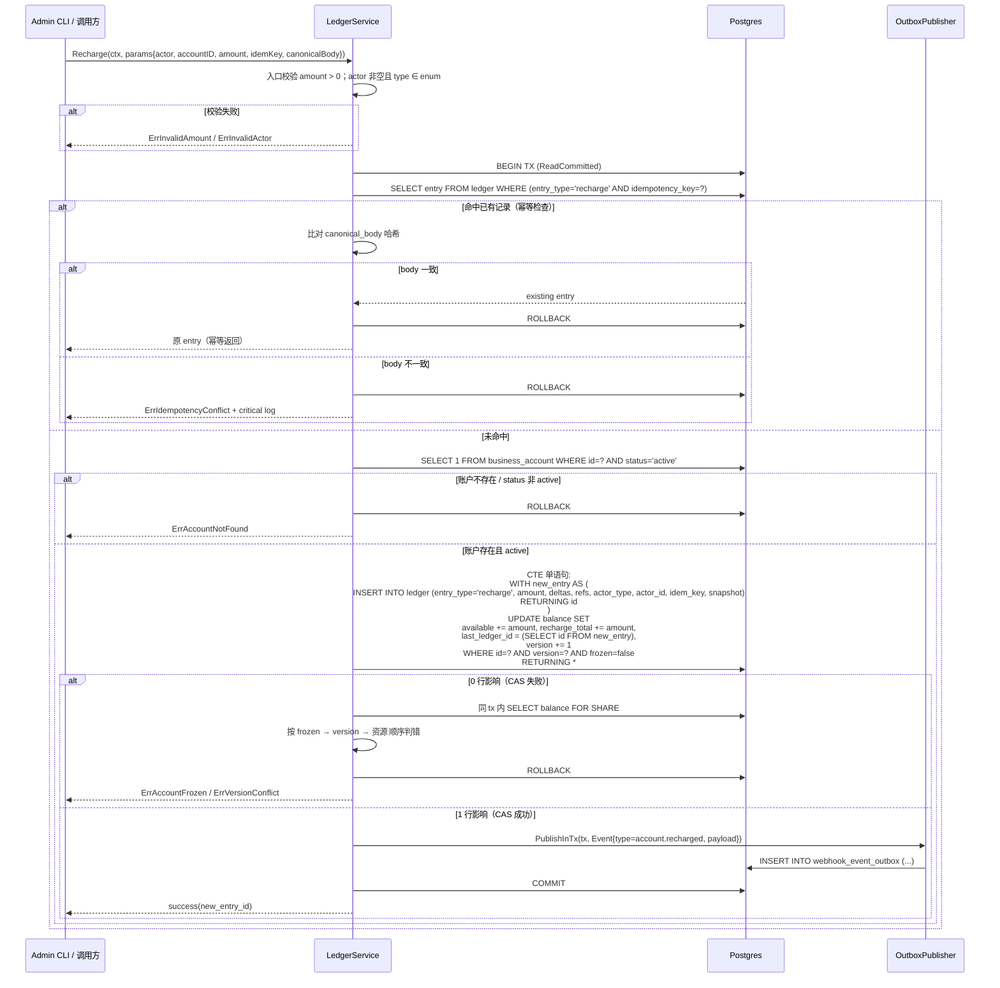
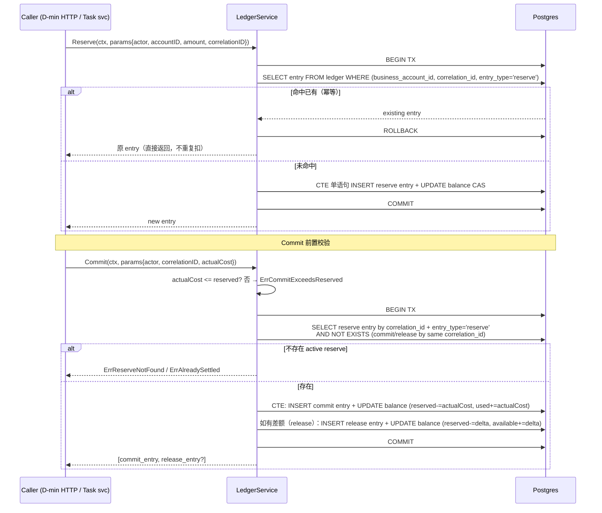
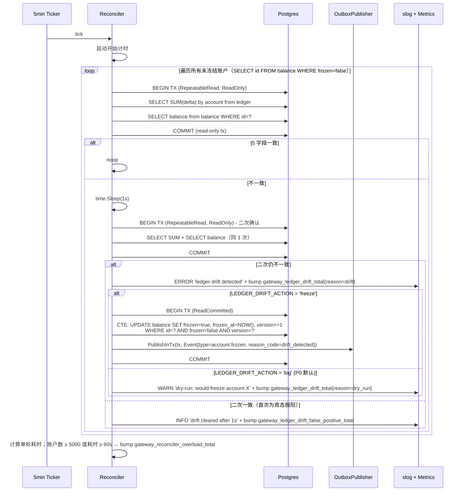
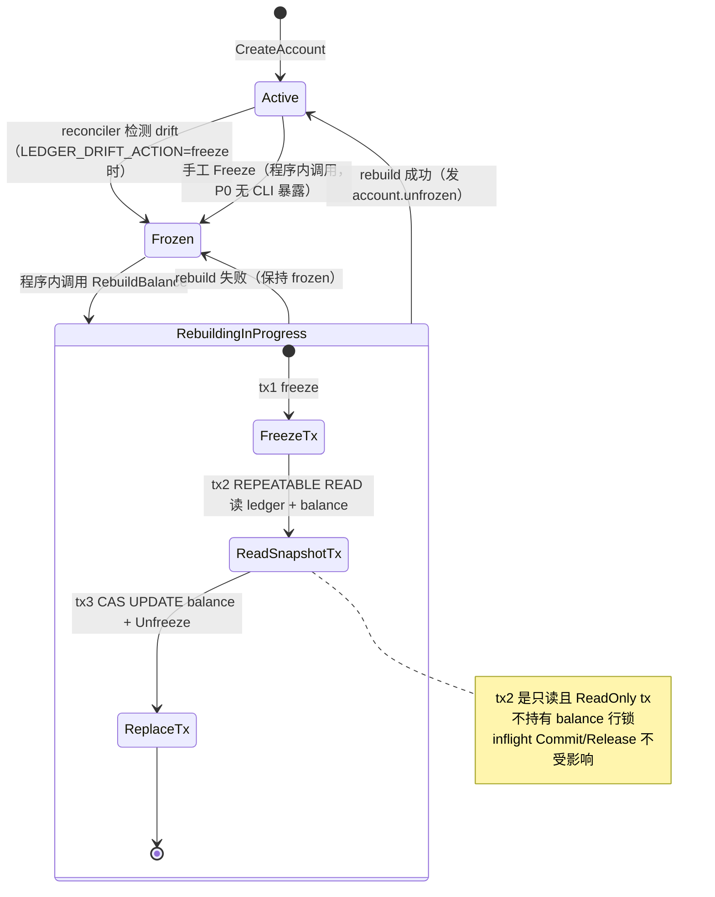
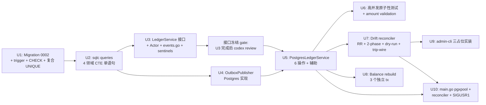

# 工作流 E — 账本基础设施（Phase 2）

> **修订说明**：本计划经 document-review 多 persona 评审后做了重大深化（2026-05-26 deepened），重点针对 reviewer 一致指出的 8 项阻塞性架构错误（pgx 错配 / reconciler race / CAS 原子性 / 幂等设计 / Commit 跨任务踩账 / created_by 伪造 / DB trigger / Rebuild 锁等）做了系统性修正。原 v1 草稿见 git 历史。

## Overview

落地 api-gateway 的**唯一财务真相源** —— `business_account_ledger`（不可变流水） + `business_account_balance`（严格投影）之间的服务层与守门机制。
本工作流是 v1.3 §16 P0 路线图的**前置依赖**：B-min（路由）、C-min（outbox 投递）、D-min（Admin API）所有涉及扣费的动作，必须能调用本工作流提供的 `LedgerService.{CreateAccount, Recharge, Reserve, Commit, Release, Refund}` 接口，否则它们没有真相源可写。

一次性交付：

1. **Migration 0002**：按设计文档 §3ter.2 + 多 persona 评审结论扩展 schema：补 ledger / balance 缺失字段（delta + actor_type/actor_id + metadata + last_ledger_id）；UNIQUE 索引改为 `(entry_type, idempotency_key)` 复合；新增 `(business_account_id, correlation_id, entry_type)` 幂等复合 UNIQUE；增加 entry-level CHECK 约束（按 entry_type 校验 delta 组合）；增加 ledger 不可变 trigger（阻 DELETE/UPDATE）
2. **sqlc query 集**：ledger / business_account / business_account_balance / webhook_event_outbox 四个领域的 P0 操作；所有写操作走 **PG CTE 单语句**（`INSERT ... RETURNING + UPDATE ... WHERE`）保证原子性
3. **`LedgerService` 接口与 Postgres 实现（基于 pgx/v5 原生）**：**10 个公共方法 + 2 个内部辅助** —— 公共: CreateAccount / Recharge / Reserve / Commit / Release / Refund / GetBalance / Freeze / Unfreeze / RebuildBalance；同包辅助: freezeInTx / unfreezeInTx。每个写操作含 `Actor` 上下文（actor_type enum + actor_id）；同事务 outbox publish
4. **Outbox event 治理**：`internal/ledger/events.go` 集中定义事件常量与 typed payload struct；`docs/events/v1.md` 作为本工作流交付物的事件目录；payload 字段白名单；frozen_reason 改为 `reason_code` enum，diff 走独立 metadata 字段
5. **Drift reconciler（深化版）**：每 5 分钟扫描所有未冻结账户；用 `REPEATABLE READ` 单只读事务读 ledger SUM + balance（一致快照）；首次发现 drift 等 1s 重读确认（2-phase confirm）；通过 env `LEDGER_DRIFT_ACTION=log|freeze` 控制动作（**P0 默认 `log`，生产 1-2 周零误报后切 `freeze`**）；账户数 ≥ 5000 或单轮 ≥ 60s 触发 Prometheus 告警 trip-wire
6. **Balance rebuild**：**程序内方法 only**（`LedgerService.RebuildBalance`），不暴露 admin-cli 子命令；拆 **3 个独立事务**（freeze / read snapshot REPEATABLE READ / replace+unfreeze），避免长事务持锁阻塞 inflight Commit
7. **admin-cli U9 实装**：**严格按 Phase 1 三个占位**（`account create` / `account recharge` / `drift-check`）；不新增 freeze / unfreeze / rebuild 子命令；admin-cli **不接 `--created-by` flag**，P0 写死 `actor_type=cli, actor_id=bootstrap` 并在 ADR 标注「P0 admin-cli created_by 不可信」
8. **main.go 接入**：pgxpool + reconciler goroutine + `/readyz` DB ping + SIGUSR1 暂停 reconciler（供 migration 部署用）
9. **高并发原子性测试**：100 goroutine 并发 Reserve 验**不超卖**；`assertInvariant(t, db, accountID)` helper 含完整不变量；amount > 0 / amount = 0 / amount < 0 三类校验测试
10. **不在本工作流的范围**（与 v1 草稿差异）：**Cashout 操作砍掉**（设计文档 §16 工作流 E 仅列 5 操作，Cashout P0 无真实调用方）；balance rebuild 的 CLI 子命令砍掉（首次真实 drift 发生后再上 CLI）

## Problem Frame

设计文档 v1.3 §3ter（账本与原子扣减设计）+ §16 工作流 E 已为本工作流定义了完整的业务规则与数学不变量；document-review 多 persona 评审在草稿基础上进一步暴露了 8 项阻塞性架构错误（详见 docs/reviews/codex-review-* 后续）。

**问题不是"做什么"（设计文档已锁），而是"怎么做才能让财务路径在并发下不超卖、在 drift 时立即可见且不误报、在故障后可重建、在审计上不可伪造"**。

具体诉求（强化版）：

- **R-不超卖**：100 goroutine 同 reserve 不能扣到负数（应用层 CAS + DB 层 CHECK 双兜底）
- **R-原子单语句**：每次写操作的 ledger INSERT + balance UPDATE 在**单一 PG CTE 语句**内完成，杜绝中间态被 reconciler 看见
- **R-幂等多层**：充值幂等用 `(entry_type, idempotency_key)` + body 一致性校验；Reserve/Commit/Release/Refund 幂等用 `(business_account_id, correlation_id, entry_type)` 复合 UNIQUE
- **R-原子-跨表**：每次操作的 ledger INSERT + balance UPDATE + outbox INSERT 必须在**同一事务**
- **R-可对账（不误冻）**：reconciler 用 REPEATABLE READ 读 + 1s 二次确认；P0 默认 dry-run 模式（仅 log+metric，不冻结）
- **R-可重建**：单账户余额错乱时能 replay ledger 重建 balance，rebuild 拆 3 tx 避免阻塞 inflight 任务
- **R-不可伪造审计**：每条 ledger entry 含 `actor_type` + `actor_id`（结构化两列，非自由字符串）；ledger 表 DB 层加 trigger 阻 DELETE/UPDATE
- **R-不可踩账**：Commit/Release 前置 SELECT 同 correlation_id 的 active reserve entry，缺失则拒绝
- **R-完整 fail-fast**：所有入口 amount > 0 校验；所有 sentinel error 在 service 层入口即时返回（不进 tx）

P0 阶段不解决（推到 P1）：跨账户预留池、批量结算、高 QPS 优化、增量 reconciler、DB role 分级、event sourcing（见 §3ter.5）。

## Requirements Trace

源自 v1.3 §3ter + CONTEXT.md + §16 工作流 E + document-review 评审结论：

### 财务正确性（账本核心）

- **R1.** 账本是**唯一真相源**：所有扣减/退款/对账只走 `business_account_ledger`（v1.3 §3ter.1 #1）
- **R2.** balance 是**严格投影**（不是缓存）：drift 触发**账户冻结**而非告警，但 P0 默认 `LEDGER_DRIFT_ACTION=log` 验证后切 `freeze`（v1.3 §3ter.1 #2 + 评审 C2/C12）
- **R3.** ledger 不可变：每次变动写一条 entry，永不 UPDATE / DELETE；**DB 层 trigger 强制**（评审 C16）
- **R4.** 原子 CAS 扣减：`UPDATE balance SET available -= e WHERE available >= e AND frozen = false AND version = ?`（v1.3 §3ter.1 #6）
- **R5.** 三态余额不变量：`available + reserved + used_total = recharge_total`（v1.3 §3ter.1 #7，Phase 1 CHECK 约束硬保障）
- **R6.** 5 个核心操作：Recharge / Reserve / Commit / Release / Refund，每个操作的等式守恒（v1.3 §3ter.3；**Cashout 砍掉**，评审 C20）
- **R7.** 充值幂等：`idempotency_key = sha256(external_ref + canonical_body)` (canonical 用 RFC 8785 JCS)，UNIQUE 索引按 `(entry_type, idempotency_key)`（Phase 1 已就位，0002 扩展为复合）；命中时**必须比对 body** 一致，不一致触发 ErrIdempotencyConflict + critical 告警（评审 C8）
- **R8.** Reserve/Commit/Release/Refund 幂等：以 `(business_account_id, correlation_id, entry_type)` 复合 UNIQUE 防重放；同 correlation_id 重复 Reserve 返回原 entry（评审 C9）
- **R9.** Commit/Release **必须**前置 SELECT 同 correlation_id 的 active reserve entry，缺失 → ErrReserveNotFound；已 commit/release → ErrAlreadySettled（评审 C14）
- **R10.** Commit(actualCost > reserved) 在 service 层入口提前拒绝为 ErrCommitExceedsReserved，**不**进 tx 尝试扣 available（评审 C7）
- **R11.** ledger entry **三 delta 字段 + entry_type CHECK 约束**：按 entry_type 校验 delta 组合（recharge / reserve / commit / release / refund），防 service bug 写出非守恒 entry（评审 C15）

### 并发与隔离

- **R12.** 所有写操作用 **PG CTE 单语句**：`WITH new_entry AS (INSERT ... RETURNING id) UPDATE balance ... last_ledger_id = (SELECT id FROM new_entry), version+=1 WHERE version=? AND 业务条件`，单一 statement 内原子完成（评审 C3）
- **R13.** CAS 0-row 后的 fresh-read **必须在同一 tx 内**做（保证一致快照），按 frozen → version → available 顺序判错（评审 C4）
- **R14.** Drift reconciler 用 **REPEATABLE READ** 单只读事务读 ledger SUM + balance（一致快照）；首次发现 drift 等 1s 重读一致再 freeze（2-phase confirm）（评审 C2/C5）
- **R15.** Balance rebuild **拆 3 个独立事务**（freeze / read snapshot / replace+unfreeze），避免长事务持锁阻塞 inflight Commit/Release（评审 C6）

### 审计与边界

- **R16.** ledger entry 含 `actor_type` (enum: `admin_token` / `cli` / `system` / `task`) + `actor_id` 两列；不接受自由字符串（评审 C11）
- **R17.** admin-cli **不接 `--created-by` flag**，P0 写死 `actor_type=cli, actor_id=bootstrap`；ADR 标注「P0 admin-cli created_by 不可信，等同 root 操作」（评审 C11）
- **R18.** LedgerService 每个方法接受 `Actor` 上下文参数，P0 阶段调用方各自构造（admin-cli/reconciler），D-min 落地时 HTTP handler 从 Admin Token 解析（评审 C28）
- **R19.** balance.frozen（drift / 管理冻结）与 business_account.status（admin lifecycle）**两个独立字段**；本工作流仅管 frozen，组合状态行为见高层设计的状态组合表（评审 C18）
- **R20.** ledger entry 含 `reference_type` + `reference_id` 反查路径；metadata jsonb（v1.3 §3ter.2）
- **R21.** balance 含 `last_ledger_id` 投影游标（v1.3 §3ter.2 + 评审 C25）

### 事件治理

- **R22.** Outbox event 5 个事件类型（`account.created` / `account.recharged` / `account.refunded` / `account.frozen` / `account.unfrozen`）；事件常量 + typed payload struct 在 `internal/ledger/events.go` 集中定义（评审 C23）
- **R23.** 事件 payload **字段白名单**：禁止透传任意 metadata / snapshot 原值 / reference_id 原值；frozen_reason 改为 `reason_code` enum，详细 diff 走独立 metadata 字段不进 payload（评审 C24）
- **R24.** `docs/events/v1.md` 事件目录作为本工作流交付物

### 输入校验与扩展性

- **R25.** 所有写操作入口校验 `amount > 0`，amount ≤ 0 → ErrInvalidAmount（评审 C26）
- **R26.** Reconciler 加 trip-wire 告警：账户数 ≥ 5000 或单轮耗时 ≥ 60s 触发 Prometheus alert（评审 C25）
- **R27.** Sentinel errors **10 个**（6 核心 + 4 语义化）：`ErrAccountNotFound` / `ErrAccountFrozen` / `ErrInsufficientBalance` / `ErrInsufficientReserved` / `ErrInsufficientUsed` / `ErrVersionConflict` + `ErrInvalidAmount` / `ErrCommitExceedsReserved` / `ErrReserveNotFound` / `ErrAlreadySettled` / `ErrIdempotencyConflict`（评审 C7/C8/C14/C26/C31）。**砍** `ErrInvariantViolation`（CHECK 触发即 panic，应用层无 caller）+ **砍** `ErrInvalidActor`（P0 Actor 全编译期保证，用 `fmt.Errorf` 包装即可 / pass-2 scope F2）

### 项目宪法继承（不在本工作流单独验证，CLAUDE.md 全局强制）

- **C-Inherit**：sqlc + database/sql + pgx/v5 native，**不**用 GORM（ADR-0003）；中文注释/错误信息/文档（CLAUDE.md §一）；reimplement 纪律（ADR-0001）；显式优于隐式（CLAUDE.md §四 #6）；账本事务必须显式传 tx（CLAUDE.md §四 #6）；fallback_policy 默认 strict（fail-closed，本工作流不涉及 routing 但延伸原则即 drift → 冻结）

## Scope Boundaries

**包含**：
- ledger / balance / business_account / webhook_event_outbox INSERT 路径的全部 query（PG CTE 单语句）
- LedgerService 接口（基于 pgx/v5 原生）+ Postgres 实现（**6 个**公共方法 + 4 个辅助方法）：
  - 公共：CreateAccount / Recharge / Reserve / Commit / Release / Refund + GetBalance
  - 辅助：Freeze / Unfreeze（含 FreezeInTx / UnfreezeInTx 包内版本）/ RebuildBalance
- OutboxPublisher 接口 + Postgres 实现（仅 INSERT，dispatch 由 C-min 落地）
- Outbox event 集中定义（events.go + docs/events/v1.md）
- Drift reconciler 后台 job（REPEATABLE READ + 2-phase confirm + dry-run + trip-wire）
- Balance rebuild **程序内方法**（不暴露 admin-cli）
- admin-cli **三个**子命令实装（create / recharge / drift-check），保持 Phase 1 占位结构
- main.go pgxpool + reconciler goroutine + SIGUSR1 暂停控制 + /readyz DB ping

**明确不包含**（推到对应工作流）：

- ❌ **Cashout 操作** — 设计文档 §16 工作流 E 不在列；P0 无真实调用方；CONTEXT.md ledger entry type 含 cashout/recharge_reversal 但仅作为 ledger_entry_type enum 占位（Phase 1 已建），service 层不实现（评审 C20）
- ❌ Balance rebuild 的 **admin-cli 子命令** — Rebuild 作为程序内方法保留（运维可通过临时脚本调用），CLI 等首次真实 drift 后再加（评审 C21）
- ❌ admin-cli `account freeze` / `unfreeze` 子命令 — 推到 D-min（HTTP 路径会同时实现）（评审 C22）
- ❌ HTTP `POST /admin/api/business-accounts/...` 等 Admin API endpoint — 工作流 D-min
- ❌ Outbox dispatcher / DB claim+lease 多节点扫描 / dead_letter 处理 — 工作流 C-min
- ❌ Webhook 拉取 (`GET /events?since_id=`) / replay 接口 — P1（v1.3 §16）
- ❌ Provider Cost Catalog（`provider_cost_catalog` 表 + 变价检测） — 工作流 C（推 P2）
- ❌ billingexpr v1/v2/vp + 任务双快照 — 工作流 F（推 P1）
- ❌ Asynq webhook 推送 worker — P1
- ❌ Admin Token 鉴权 + scope + 阀门 — 工作流 D-min
- ❌ 跨账户预留池 / 批量结算 / 高 QPS 优化 — P2（v1.3 §3ter.5）
- ❌ 任务 8 态状态机 + UPSTREAM_SUBMITTING 中间态 — 工作流 F
- ❌ Suspend / Resume / Delete 账户的 lifecycle（`business_account.status` 状态切换）— D-min；本工作流仅处理 `balance.frozen`
- ❌ Reconciler **增量算法**（用 last_ledger_id）— P1；P0 全表扫 + trip-wire 告警
- ❌ DB role 分级（app vs reconciler vs migration）— P1 部署阶段；P0 单一 connection 用户
- ❌ event sourcing 替代方案（不维护 balance 表）— 已在 Alternatives Considered 评估并拒绝
- ❌ new-api `user.quota` / `token.RemainQuota` 兼容 — Reimplement 路线下**不存在**

## Context & Research

### Relevant Code and Patterns

- **Phase 1 已落地**：`migrations/0001_init.up.sql` 9 张表 + 5 个 enum + 账本不变量 CHECK 约束（投影层）
- **Phase 1 已生成**：`internal/db/{db,models,querier,smoke.sql}.go`（sqlc v1.30.0 + **pgx/v5 原生**，非 stdlib）
- **关键确认**：`sql/sqlc.yaml` 中 `sql_package: "pgx/v5"` 意味着 `Queries.WithTx(tx)` 只接受 `pgx.Tx`，事务管理用 `*pgxpool.Pool.BeginTx(ctx, pgx.TxOptions{IsoLevel: pgx.ReadCommitted | pgx.RepeatableRead})`
- **sqlc 风格参照**：`sql/queries/smoke.sql`（`-- name: X :one` annotation）
- **Service 接口风格参照**：`internal/httpapi/server.go` 的 `Server` struct + dependency injection
- **Cobra 子命令风格参照**：`cmd/admin-cli/cmd/root.go::mustMarkFlagRequired`
- **错误处理风格参照**：`internal/config/config.go` 的 sentinel error + `errors.New`
- **观测接入参照**：`internal/obs/log.go`（slog）+ `internal/obs/metrics.go`（自有 Prometheus registry）

### Institutional Learnings

`docs/solutions/` 尚不存在。v1.3 设计文档 + 7 轮 Codex 评审 + 本计划的 document-review 多 persona 评审（2026-05-26）共同沉淀：

- **账本不变量数学**：v1.2.1 经数学校准，最终形式 `available + reserved + used_total = recharge_total`（refund_total **不进**等式，仅作审计）。Phase 1 CHECK 约束硬保障。
- **Drift 处理**：v1.2 从「告警」收敛到「冻结账户」；但本计划的 document-review 进一步发现「即时冻结 + READ COMMITTED 双 SELECT」在生产 QPS 下必然偶发误报。**最终决策**：reconciler 用 REPEATABLE READ + 1s 二次确认 + P0 默认 dry-run。
- **Outbox 主库**：v1.2 收敛 `webhook_event_outbox` **必须**与 ledger 同库同事务，**不受** `LOG_SQL_DSN` 分库影响。
- **充值幂等**：v1.2 修订为 `sha256(external_ref + canonical_body)`；本计划进一步把 canonical_body 算法锁定为 **RFC 8785 JCS**；命中时**必须比对 body**。
- **delta 字段必要性**：reconciler 用 `sum(delta) by account` 重算 balance；按 entry_type 推导反而易遗漏。
- **CTE 单语句优于多 UPDATE**：v1 草稿用「先 UPDATE 占位 → INSERT → 再 UPDATE last_ledger_id」两次 UPDATE 模式，被评审发现 version 二次跳问题；改为单 CTE 语句一次性完成（评审 C3）。
- **created_by 结构化**：v1 用自由字符串易伪造；改为 `actor_type` enum + `actor_id` 两列（评审 C11）。
- **ledger 不可变需 DB 强制**：仅靠应用层约定不够；用 PG trigger 阻 DELETE/UPDATE（评审 C16）。

### External References

不引入外部研究：
- sqlc + pgx 模式：ADR-0003 已锁
- PG CTE：标准 SQL，本身无歧义
- pgx v5 transaction：标准库文档

按需查官方文档：
- pgx v5 native API：<https://pkg.go.dev/github.com/jackc/pgx/v5>
- pgxpool：<https://pkg.go.dev/github.com/jackc/pgx/v5/pgxpool>
- sqlc transactions: <https://docs.sqlc.dev/en/stable/howto/transactions.html>
- PG REPEATABLE READ 隔离：<https://www.postgresql.org/docs/15/transaction-iso.html>
- RFC 8785 JCS canonical form：<https://www.rfc-editor.org/rfc/rfc8785>

## Key Technical Decisions

| 决策 | 选择 | 理由 / 评审引用 |
|------|------|---------------|
| 数据访问层 | sqlc + **pgx/v5 原生**（**非** stdlib）+ pgxpool | Phase 1 sqlc.yaml `sql_package: "pgx/v5"` 已锁；用 stdlib 编译失败（评审 C1） |
| 连接池 | `pgxpool.Pool`（MaxConns=25, MinConns=5, MaxConnLifetime=30min, MaxConnIdleTime=5min） | 与 Unit 6 高并发测试 50+ goroutine 留余量 |
| 事务管理 | `pool.BeginTx(ctx, pgx.TxOptions{IsoLevel: ...})`；服务层接受 `pgx.Tx`（不是 `*sql.Tx`） | 与 sqlc 生成代码兼容（评审 C1） |
| 写操作隔离 | `pgx.ReadCommitted`（业务路径）；reconciler 单事务读用 `pgx.RepeatableRead` | READ COMMITTED + CAS 防超卖；REPEATABLE READ 让 reconciler 看一致快照（评审 C2） |
| 写操作原子性 | **PG CTE 单语句** + **service 显式 rollback** 双重保障：`WITH new_entry AS (INSERT ledger ... RETURNING id) UPDATE balance SET deltas, last_ledger_id = (SELECT id FROM new_entry), version+=1 WHERE id=? AND version=? AND 业务条件 RETURNING ...` | **关键 PG 语义**：data-modifying CTE 即使最终 SELECT 0 行（CAS 失败），sibling INSERT 仍**执行到完成**（PG queries-with.html 明文：「Data-modifying statements in WITH are executed exactly once, and always to completion」）。**原子性靠 tx 级 ROLLBACK 保证**：service 在 `pgx.ErrNoRows` 时**必须**显式 `tx.Rollback`，否则未提交的孤儿 ledger entry 会随外层 tx 一起 commit。Reconciler 看不到中间态是因为 tx 隔离，**不是**因为单 statement 原子（评审 C3 / pass-2 Feas F1） |
| CAS 字段组合 | **按操作分**：Recharge/Reserve 含 `frozen=false`；Commit/Release/Refund **不**查 frozen（允许 inflight 完成）；所有 CAS 都含 `version=?` | 设计文档 §3ter.2 段尾原则；评审 C5/C6 |
| CAS 0-row 后的错误分类 | 在**同一 tx 内** fresh-read balance；按 frozen → version → available 顺序判错 | 同 tx 保证一致快照，避免 TOCTOU（评审 C4） |
| 重试策略 | service **不**内部重试；返回 sentinel 让调用方决策 | 避免重试风暴；调用方上下文更清楚 |
| 幂等键（Recharge） | `(entry_type, idempotency_key)` 复合 UNIQUE（partial index where idempotency_key IS NOT NULL）；命中后**必须比对 canonical_body** 一致，不一致 → ErrIdempotencyConflict + critical 告警 | 跨 entry_type 复用同字符串不会撞索引；body 一致性防沉默篡改（评审 C8/C10） |
| 幂等键（Reserve/Commit/Release/Refund） | `(business_account_id, correlation_id, entry_type)` 复合 UNIQUE | 下游重试时复用同一 correlation_id（一般是 task_id）；同 correlation+type 第二次直接返回原 entry（评审 C9） |
| canonical_body 算法 | **RFC 8785 JCS**（JSON Canonicalization Scheme） | 标准化，跨语言一致；避免不同调用方实现差异（评审 C8） |
| OutboxPublisher 接口位置 | 接口在 `internal/ledger/outbox.go`（consumer-owns-interface）；Postgres 实现在 `internal/outbox/postgres.go` | DIP |
| OutboxPublisher 签名 | `PublishInTx(ctx, tx pgx.Tx, event Event) error` | 强制传 tx |
| Event 治理 | 事件常量 + typed payload struct 集中在 `internal/ledger/events.go`；payload 字段**白名单**；`reason_code` enum 替代自由 frozen_reason；详细 diff 走独立 metadata 字段 | C-min 落地无需返工；防 PII / 内部状态泄露（评审 C23/C24） |
| 事件目录文档 | `docs/events/v1.md` 作为本工作流交付物（不推迟到 D-min） | 业务系统接入有单一真相源 |
| Drift 检测策略 | (1) 全表扫账户；(2) **单只读事务 REPEATABLE READ** 读 SUM(ledger) + balance；(3) 首次 drift 等 1s 重读确认；(4) `LEDGER_DRIFT_ACTION=log\|freeze` env 控制；P0 默认 log，1-2 周生产数据零误报后切 freeze | 一致性 + 二次确认 + 运营保护（评审 C2/C5/C12） |
| Drift trip-wire | 账户数 ≥ 5000 或单轮 ≥ 60s 触发 Prometheus alert | 提前发现性能 cliff（评审 C25） |
| Balance rebuild | **3 个独立事务**：(1) freeze tx；(2) read snapshot REPEATABLE READ；(3) replace+unfreeze tx 用 CAS WHERE last_ledger_id = expected | 避免长事务持锁阻塞 inflight Commit/Release（评审 C6） |
| Balance rebuild 暴露层 | **仅程序内方法**，不上 admin-cli 子命令 | 首次真实 drift 发生前不需要 CLI（评审 C21） |
| `actor_type` enum | `admin_token` / `cli` / `system` / `task` | 结构化两列防伪造（评审 C11） |
| admin-cli `--created-by` flag | **拒绝接受**；写死 `actor_type=cli, actor_id=bootstrap` | ADR 标注「P0 不可信」（评审 C11） |
| Migration 0002 部署流程 | `make migrate-up` 之前必须 SIGUSR1 暂停 reconciler 或停整个 gateway 进程 | 防 ALTER TABLE ACCESS EXCLUSIVE 与 reconciler SELECT 互锁（评审 C19） |
| ledger 不可变强制 | Migration 0002 加 PG trigger：`CREATE TRIGGER ledger_immutable BEFORE UPDATE OR DELETE ON business_account_ledger FOR EACH ROW EXECUTE FUNCTION raise_exception` | 应用层约定不够；DB 强制（评审 C16） |
| ledger entry delta CHECK | Migration 0002 加 entry-level CHECK：按 `entry_type` CASE 校验 `(available_delta, reserved_delta, used_delta)` 组合 | 防 service bug 写非守恒 entry（评审 C15） |
| Commit 前置 reserve 校验 | Commit/Release 必须 SELECT 同 `correlation_id + entry_type=reserve` 的 entry 且未被 commit/release；否则 ErrReserveNotFound | 防跨任务踩账（评审 C14） |
| Commit(actualCost > reserved) | service 层入口校验，超出直接 ErrCommitExceedsReserved；**不**进 tx 尝试扣 available 补差额 | 避免「任务结果已回但 ledger 没法落账」的死循环（评审 C7） |
| 输入校验 | 所有写操作入口校验 `amount > 0`；amount ≤ 0 → ErrInvalidAmount（不进 tx） | 防御性（评审 C26） |
| `business_account.status` vs `balance.frozen` 边界 | 两个独立字段：status 由 D-min 管理 lifecycle（active/suspended/deleted），frozen 由 E 管理 drift；服务层入口先查 status 后查 frozen（详见高层设计的状态组合表） | 评审 C18 |
| 测试基础设施 | docker-compose PG 15 + 测试 helper `TRUNCATE ... CASCADE`（不引 dockertest） | dockertest 拉镜像慢；docker-compose 持久启动够快 |
| 高并发测试 | 100 goroutine × Reserve 20，初始 1000；**栅栏 `chan struct{}` 同时发车**；`assertInvariant(t, db, accountID)` helper 含完整不变量；MaxConns 调高至 50+ | 避免串行命中 CAS；防连接池饥饿（评审 C27） |
| 时间字段 | 全部 `timestamptz` + `time.Time`，UTC | Phase 1 已就位 |
| Migration 0002 风格 | `ALTER TABLE ADD COLUMN` + `ALTER TABLE ALTER COLUMN ... TYPE`；NULL 列或常量 DEFAULT；down.sql 顶部加注释「仅本机/CI 回滚；生产 ledger 有数据后禁用」 | PG 11+ 不重写表；防生产误操作 |
| 时钟注入 | **不**注入 clock 函数；用 `time.Now()` 直接调用；reconciler 启动延迟通过 constructor 参数 `initialDelay time.Duration` 注入 | 简化；P0 测试不需要冻结时间（评审 C37） |

## Open Questions

### Resolved During Planning

- **是否在 0002 migration 补齐 ledger / balance 字段？** → 是。Phase 1 `schema-v0001.md` 顶部偏离记录已声明。
- **是否同时加 actor_type/actor_id 拆列、entry CHECK 约束、不可变 trigger？** → 是。一次性完成，避免后续 ledger schema 多次变更（评审 C11/C15/C16）。
- **是否补 `(business_account_id, correlation_id, entry_type)` 复合 UNIQUE？** → 是。所有写操作幂等都用此索引（评审 C9）。
- **CAS / CTE 风格选择？** → 用 PG CTE 单语句，一次原子完成 INSERT ledger + UPDATE balance（评审 C3）。
- **Drift 检测的一致性策略？** → REPEATABLE READ 单只读事务 + 1s 二次确认 + P0 默认 dry-run（评审 C2/C5）。
- **drift action 默认是 log 还是 freeze？** → P0 默认 log（仅记录 + bump metric，不冻结）；生产 1-2 周数据零误报后切 freeze。env `LEDGER_DRIFT_ACTION` 控制。
- **Cashout 是否在 P0？** → 否，砍掉（评审 C20）。
- **Balance rebuild 是否暴露 admin-cli？** → 否，仅程序内方法（评审 C21）。
- **account create / recharge 由谁实现？** → 本工作流（admin-cli 直接调 LedgerService），D-min 后续加 HTTP 包装。
- **suspend / resume / delete 在本工作流？** → 否，仅管 `balance.frozen`（评审 C18）。
- **OutboxPublisher 接口位置？** → `internal/ledger/outbox.go`（DIP）。
- **事件目录由谁交付？** → 本工作流（`docs/events/v1.md`）（评审 C23）。
- **canonical_body 算法？** → RFC 8785 JCS（评审 C8）。
- **admin-cli 是否接 `--created-by` flag？** → 否，写死 `cli:bootstrap`（评审 C11）。
- **Reconciler P0 增量还是全表扫？** → 全表扫 + trip-wire 告警；P1 视生产数据决定是否切增量（评审 C25）。
- **DB role 分级 P0 还是 P1？** → P1（部署阶段）。

### Deferred to Implementation

- **CAS 失败后调用方的重试策略**：service 不内部重试；调用方按上下文决定。具体策略推到调用方落地时（admin-cli 一次失败即报错；D-min HTTP handler 视情况；F task service 用指数退避）。
- **Outbox event payload 完整字段定义**：本工作流定义 5 个事件类型常量与 typed struct 骨架（events.go），具体字段集合在 D-min 与业务系统对齐时锁定（payload 字段白名单原则不变）。
- **生产环境 DB role 分级方案**：P1 部署阶段决定 app_role / reconciler_role / migration_role / break_glass_role 的权限矩阵。
- **Reconciler 多副本部署的 leader election**：P1 决定（用 PG advisory lock or Kubernetes lease）。
- **Reconciler 增量算法（用 last_ledger_id）**：P1 视生产账户规模决定是否上。
- **/readyz DB ping 失败时的语义**：P2 与运维 K8s 健康检查策略对齐。
- **Balance rebuild 完成后的 `account.unfrozen` payload 完整字段**：本工作流先发占位事件（带 reason_code），D-min 落地时与业务系统对齐 schema。

## High-Level Technical Design

> *本节用时序图与状态图展示账本核心路径与 drift 处理流程。directional guidance，不要逐字复刻。*

### 核心操作时序（Recharge 示例 — CTE 单语句 + 幂等 + 同 tx outbox）



### Reserve / Commit / Release / Refund 幂等模式（共用 correlation_id 复合 UNIQUE）



### Drift 检测与冻结流程（深化版：REPEATABLE READ + 2-phase confirm + dry-run）



### 账户状态组合表（balance.frozen × business_account.status）

| business_account.status | balance.frozen | Reserve / Recharge | Commit / Release | Refund | GetBalance |
|---|---|---|---|---|---|
| `active` | `false` | ✅ 允许 | ✅ 允许 | ✅ 允许 | ✅ 允许 |
| `active` | `true` | ❌ ErrAccountFrozen | ✅ 允许（inflight 完成） | ✅ 允许（管理动作） | ✅ 允许 |
| `suspended`（D-min 管） | `false` | ❌ ErrAccountSuspended（D-min 落地） | ✅ 允许（inflight 完成） | ✅ 允许 | ✅ 允许 |
| `suspended` | `true` | ❌ ErrAccountSuspended（D-min 落地） | ✅ 允许 | ✅ 允许 | ✅ 允许 |
| `deleted`（D-min 管） | 任意 | ❌ ErrAccountNotFound | ❌ ErrAccountNotFound | ❌ ErrAccountNotFound | ✅ 历史查询允许 |

> **本工作流仅实现 active × frozen 的两个组合 + ErrAccountFrozen 错误码**；suspended/deleted 行为由 D-min 实现 status 切换时一并加入。本工作流 service 入口校验 `status == 'active'`（不 active 直接 ErrAccountNotFound 或 D-min 后续细分错误）。

### 账户 frozen 状态机（balance.frozen 维度）



### 单元依赖图



## Implementation Units

### Phase A — Schema 与契约

- [ ] **Unit 1: Migration 0002 — 补齐 ledger / balance 字段 + UNIQUE 重建 + entry CHECK + 不可变 trigger**

**Goal:** 一次性把 ledger / balance schema 升级到本工作流需要的完整形态：补字段、加约束、加 trigger、加复合 UNIQUE。

**Requirements:** R3, R8, R10, R11, R16, R20, R21

**Dependencies:** 无（Phase 1 已落 0001_init）

**Files:**
- Create: `migrations/0002_ledger_fields_extension.up.sql`
- Create: `migrations/0002_ledger_fields_extension.down.sql`（**首行 DO 块硬守门**，非空 ledger 直接 RAISE：`DO $$ BEGIN IF EXISTS (SELECT 1 FROM business_account_ledger LIMIT 1) THEN RAISE EXCEPTION '0002 down forbidden: ledger has data; rollback via code hotfix instead'; END IF; END $$;` —— 文本注释无强制力，`migrate down` 不读注释，必须 DO 块拦住 / pass-2 Adv F2-08）
- Modify: `docs/db/schema-v0001.md` → 改名为 `docs/db/schema.md`（不带版本号，加 0002 章节 + 偏离记录更新）

**Approach:**

`up.sql` 内容（按依赖顺序）：

1. 新增枚举 `actor_type`：`admin_token` / `cli` / `system` / `task`
2. `ALTER TABLE business_account_ledger`：
   - ADD `available_delta bigint NOT NULL DEFAULT 0`
   - ADD `reserved_delta bigint NOT NULL DEFAULT 0`
   - ADD `used_delta bigint NOT NULL DEFAULT 0`
   - ADD `reference_type text NULL`
   - ADD `reference_id text NULL`
   - ADD `metadata jsonb NOT NULL DEFAULT '{}'::jsonb`
   - ADD `actor_type actor_type NOT NULL DEFAULT 'system'`
   - ADD `actor_id text NOT NULL DEFAULT 'bootstrap'`
3. `ALTER TABLE business_account_balance`：
   - ADD `last_ledger_id bigint NOT NULL DEFAULT 0`
4. **DROP** 旧 idempotency_key UNIQUE 索引；**CREATE** 复合 UNIQUE：
   ```sql
   DROP INDEX IF EXISTS uq_ledger_idempotency_key;
   CREATE UNIQUE INDEX uq_ledger_idempotency_key_per_type
     ON business_account_ledger (entry_type, idempotency_key)
     WHERE idempotency_key IS NOT NULL;
   ```
5. **新增** correlation_id 复合 UNIQUE（防 Reserve/Commit/Release/Refund 重复）：
   ```sql
   CREATE UNIQUE INDEX uq_ledger_correlation_per_type
     ON business_account_ledger (business_account_id, correlation_id, entry_type)
     WHERE correlation_id IS NOT NULL;
   ```
6. 新增 `(reference_type, reference_id)` 部分索引（按需查询）
7. **Entry-level CHECK 约束**（按 entry_type 校验 delta 组合）：
   ```sql
   ALTER TABLE business_account_ledger
   ADD CONSTRAINT chk_ledger_delta_by_type CHECK (
     CASE entry_type
       WHEN 'recharge'        THEN available_delta >= 0 AND reserved_delta = 0 AND used_delta = 0
       WHEN 'reserve'         THEN available_delta <= 0 AND reserved_delta >= 0 AND used_delta = 0 AND available_delta + reserved_delta = 0
       WHEN 'commit'          THEN available_delta = 0 AND reserved_delta <= 0 AND used_delta >= 0 AND reserved_delta + used_delta = 0
       WHEN 'release'         THEN available_delta >= 0 AND reserved_delta <= 0 AND used_delta = 0 AND available_delta + reserved_delta = 0
       WHEN 'refund'          THEN available_delta >= 0 AND reserved_delta = 0 AND used_delta <= 0 AND available_delta + used_delta = 0
       ELSE TRUE  -- cashout/recharge_reversal/adjust/expire P0 不实现，留 enum
     END
   );
   ```
8. **ledger 不可变 trigger**（防 DELETE / UPDATE / TRUNCATE）：
   ```sql
   CREATE OR REPLACE FUNCTION ledger_immutable_violation() RETURNS trigger AS $$
   BEGIN
     RAISE EXCEPTION 'business_account_ledger 不可变：禁止 % 操作', TG_OP;
   END;
   $$ LANGUAGE plpgsql;

   -- row-level trigger 防 UPDATE / DELETE
   CREATE TRIGGER ledger_prevent_update_or_delete
     BEFORE UPDATE OR DELETE ON business_account_ledger
     FOR EACH ROW EXECUTE FUNCTION ledger_immutable_violation();

   -- statement-level trigger 防 TRUNCATE（行 trigger 不覆盖此操作 — pass-2 Sec-001）
   CREATE TRIGGER ledger_prevent_truncate
     BEFORE TRUNCATE ON business_account_ledger
     FOR EACH STATEMENT EXECUTE FUNCTION ledger_immutable_violation();

   -- P0 阶段单一 connection 用户也明确 REVOKE 高危权限（双兜底，应用进程无需这些）
   REVOKE TRUNCATE, DELETE, UPDATE ON business_account_ledger FROM PUBLIC;
   ```
9. **idempotency body 哈希列**（pass-2 Sec-002）：
   ```sql
   ALTER TABLE business_account_ledger
     ADD COLUMN canonical_body_sha256 bytea NULL,
     ADD CONSTRAINT chk_ledger_canonical_body_hash_len
       CHECK (canonical_body_sha256 IS NULL OR octet_length(canonical_body_sha256) = 32);
   ```
   service 写 ledger entry 时同时写 sha256(canonical_body)；幂等命中查询用该列比对而非 jsonb 字段；防 RFC 8785 JCS 实现细节漂移。

`down.sql` 按反向 DROP：
- DROP TRIGGER → DROP FUNCTION → DROP CONSTRAINT chk_ledger_delta_by_type → DROP INDEX (新增的两个 + 旧 idempotency)
- 恢复旧 idempotency_key UNIQUE 索引
- ALTER TABLE DROP COLUMN（按反向依赖）
- DROP TYPE actor_type

**Patterns to follow:**
- Phase 1 `migrations/0001_init.{up,down}.sql` 风格
- PG plpgsql trigger 标准用法

**Test scenarios:**
- Integration：`migrate up` 后 `\d business_account_ledger` 含所有新字段；`\d business_account_balance` 含 last_ledger_id；`\df` 含 ledger_immutable_violation
- Integration：`migrate down → up` 幂等
- Edge case：INSERT ledger entry 故意写非守恒 delta（如 entry_type='reserve' AND available_delta=10 AND reserved_delta=10）→ CHECK 拒绝
- Edge case：尝试 UPDATE / DELETE ledger entry → trigger raise 异常
- Edge case：尝试 INSERT 两条相同 `(entry_type='recharge', idempotency_key='k1')` → UNIQUE 冲突
- Edge case：尝试 INSERT 两条相同 `(business_account_id='biz-1', correlation_id='c1', entry_type='reserve')` → UNIQUE 冲突
- Edge case：cashout/recharge_reversal entry_type 仍可 INSERT（CHECK 的 ELSE TRUE 分支允许；这些 enum 值留作未来扩展）

**Verification:**
- 本地 docker compose 启动 PG 后 `migrate-up` 成功；CHECK / TRIGGER / UNIQUE 全部生效
- `docs/db/schema.md` 完整记录 0001 + 0002 演化

---

- [ ] **Unit 2: sqlc queries 集 — ledger / business_account / balance / outbox**

**Goal:** 编写所有 P0 sqlc query 文件，所有写操作走 PG CTE 单语句；生成 Go 代码入 `internal/db/`（基于 pgx/v5 原生）。

**Requirements:** R7, R8, R12, R13

**Dependencies:** Unit 1

**Files:**
- Create: `sql/queries/ledger.sql`
- Create: `sql/queries/business_account.sql`
- Create: `sql/queries/balance.sql`
- Create: `sql/queries/outbox.sql`
- Delete: `sql/queries/smoke.sql`（让 sqlc generate 自动清理 internal/db/smoke.sql.go）
- Auto-gen (by `sqlc generate`)：`internal/db/{ledger,business_account,balance,outbox}.sql.go`、扩展 `internal/db/models.go`、扩展 `internal/db/querier.go`

**Approach:**

**`sql/queries/business_account.sql`**：
- `CreateBusinessAccount :one`（INSERT + RETURNING；同 tx 内 CTE 同时建 balance 行）—— 实际用 CTE
- `GetBusinessAccount :one`
- `GetBusinessAccountForActiveCheck :one`（仅返 status + isolation_required，service 入口校验）

**`sql/queries/balance.sql`**：
- `GetBalance :one`
- `GetBalanceInTx :one`（同 tx 用，pgx.Tx 接口）
- `ListAllUnfrozenAccountsForReconciler :many`（reconciler 全表扫起点）

**`sql/queries/ledger.sql`** — **核心 CTE 单语句**：

```sql
-- name: RechargeAtomic :one
WITH new_entry AS (
  INSERT INTO business_account_ledger (
    business_account_id, entry_type, amount,
    available_delta, reserved_delta, used_delta,
    correlation_id, idempotency_key, snapshot, reference_type, reference_id, metadata,
    actor_type, actor_id
  )
  VALUES (
    @business_account_id, 'recharge', @amount,
    @amount, 0, 0,
    @correlation_id, @idempotency_key, @snapshot, @reference_type, @reference_id, @metadata,
    @actor_type, @actor_id
  )
  RETURNING id, created_at
),
updated_balance AS (
  UPDATE business_account_balance
  SET available = available + @amount,
      recharge_total = recharge_total + @amount,
      last_ledger_id = (SELECT id FROM new_entry),
      version = version + 1,
      updated_at = NOW()
  WHERE business_account_id = @business_account_id
    AND version = @expected_version
    AND frozen = false
  RETURNING *
)
SELECT
  (SELECT id FROM new_entry) AS new_ledger_id,
  (SELECT created_at FROM new_entry) AS new_created_at,
  ub.*
FROM updated_balance ub;
-- 若 updated_balance 为空（CAS 失败），整个 SELECT 返回空行；sqlc :one 返 sql.ErrNoRows
```

类似的 query：`ReserveAtomic` / `CommitAtomic` / `ReleaseAtomic` / `RefundAtomic` / `FreezeAtomic` / `UnfreezeAtomic`，每个都是 CTE 单语句。
（**Cashout 砍掉，不实现 query**）

**幂等查询**：
- `FindLedgerEntryByIdempotencyKey :one`：`SELECT * FROM ledger WHERE entry_type=? AND idempotency_key=?`
- `FindActiveReserveByCorrelation :one`：`SELECT * FROM ledger WHERE business_account_id=? AND correlation_id=? AND entry_type='reserve' AND NOT EXISTS (SELECT 1 FROM ledger WHERE business_account_id=? AND correlation_id=? AND entry_type IN ('commit','release'))`
- `FindLedgerEntryByCorrelationAndType :one`：通用反查

**Drift 查询**：
- `SumLedgerDeltasByAccount :one`：返回 `available_sum / reserved_sum / used_sum / recharge_sum / refund_sum` 5 个 BIGINT（reconciler 在 REPEATABLE READ tx 内调用）

**Rebuild 查询**：
- `GetBalanceForUpdate :one`：`SELECT ... FOR UPDATE`（rebuild tx3 用）
- `GetLedgerEntriesForRebuild :many`：`SELECT * FROM ledger WHERE business_account_id = ? ORDER BY id ASC`（rebuild tx2 在 REPEATABLE READ 内调用）
- `ReplaceBalance :execrows`：CAS `WHERE last_ledger_id = expected_last_id`（rebuild tx3 防并发漂移）

**Outbox 查询**：
- `InsertOutboxEvent :one`（ledger 同事务调用；含 `delivery_idempotency_key`、`is_financial`、`retention_until`）

**注意**：
- 所有 query 都用命名参数 `@xxx`
- CTE 单语句返回 RETURNING + 0 行场景用 sql.ErrNoRows（pgx 风格）来表示 CAS 失败
- sqlc 生成的 Go 代码用 `*pgxpool.Pool` 或 `pgx.Tx` 作为 DBTX

**Patterns to follow:**
- Phase 1 `sql/queries/smoke.sql` 的 sqlc 风格
- ADR-0003「SQL 即真相」

**Test scenarios:**

（Unit 2 本身是 sqlc 配置变更；行为测试在 Unit 5 集成测试覆盖）

- 烟雾：`sqlc compile` 不报错
- 烟雾：`sqlc generate` 后 `go vet ./internal/db/...` 通过
- 烟雾：`internal/db/smoke.sql.go` 被 sqlc 自动移除（git diff 确认）
- Test expectation: 无独立单元测试 — query 本身无业务逻辑

**Verification:**
- `internal/db/` 含 ~20 个 query 函数
- `models.go` 含扩展后的 struct（含 actor_type、available_delta 等新字段）
- `make sqlc-diff` PR 中无 diff

---

### Phase B — 核心服务

- [ ] **Unit 3: LedgerService 接口 + Actor + events.go + sentinels**

**Goal:** 定义服务契约、Actor 上下文、事件常量与 typed payload、6 个核心 sentinel error 类型；作为后续实现与下游消费者的统一接口。

**Requirements:** R6, R16, R17, R18, R22, R23, R24, R25, R27

**Dependencies:** Unit 2

**Files:**
- Create: `internal/ledger/service.go`（接口 + DTO）
- Create: `internal/ledger/actor.go`（Actor struct + ActorType enum + validator）
- Create: `internal/ledger/outbox.go`（OutboxPublisher 接口 + Event DTO）
- Create: `internal/ledger/events.go`（事件常量 + typed payload structs + 顶部 godoc 预留未来事件命名空间：注释列出 D-min 将新增的 `account.activated` / `account.suspended` 等事件名 + reason_code 下游建议动作表，避免后续命名漂移 / pass-2 product F2、F4）
- Create: `internal/ledger/errors.go`（sentinel errors，**10 个** = 6 核心 + 4 语义化 = ErrAccountNotFound / ErrAccountFrozen / ErrInsufficientBalance / ErrInsufficientReserved / ErrInsufficientUsed / ErrVersionConflict / ErrInvalidAmount / ErrCommitExceedsReserved / ErrReserveNotFound / ErrAlreadySettled / ErrIdempotencyConflict — **砍 ErrInvalidActor**：P0 Actor 来源全编译期保证（admin-cli 写死 / reconciler 写死），用 `fmt.Errorf("invalid actor: %w", err)` 通用包装即可 / pass-2 scope F2）

**Approach:**

**`Service` 接口（中文 godoc）**：
- `CreateAccount(ctx, actor, params CreateAccountParams) (*Account, error)`
- `Recharge(ctx, actor, params RechargeParams) (*LedgerEntry, error)`
- `Reserve(ctx, actor, params ReserveParams) (*LedgerEntry, error)`
- `Commit(ctx, actor, params CommitParams) ([]LedgerEntry, error)`（可能产 commit + release 两条）
- `Release(ctx, actor, params ReleaseParams) (*LedgerEntry, error)`
- `Refund(ctx, actor, params RefundParams) (*LedgerEntry, error)`
- `GetBalance(ctx, accountID string) (*Balance, error)`
- `Freeze(ctx, actor, accountID, reasonCode string) error`（公开方法，自带 tx）
- `Unfreeze(ctx, actor, accountID, reasonCode string) error`
- `RebuildBalance(ctx, actor, accountID string) (*Balance, error)`（程序内方法，不暴露 CLI）

**内部辅助（同包可见）**：
- `freezeInTx(ctx, tx pgx.Tx, actor, accountID, reasonCode) error`
- `unfreezeInTx(ctx, tx pgx.Tx, actor, accountID, reasonCode) error`

**`Actor` struct**：
- `Type ActorType`（enum：`ActorTypeAdminToken` / `ActorTypeCLI` / `ActorTypeSystem` / `ActorTypeTask`）
- `ID string`
- `Validate() error`（type 必须 ∈ enum；ID 非空；CLI/system/task 限制后续 ADR 决定）

**`OutboxPublisher` 接口**：
- `PublishInTx(ctx context.Context, tx pgx.Tx, event Event) error`

**`Event` struct**：
- `Type EventType`（如 `EventTypeAccountRecharged`）
- `BusinessAccountID string`
- `Payload []byte`（来自 typed struct marshal）
- `IsFinancial bool`
- `RetentionUntil time.Time`
- `DeliveryIdempotencyKey string`

**`events.go` 内容**：

```text
事件常量（const）：
  EventTypeAccountCreated   = "account.created"
  EventTypeAccountRecharged = "account.recharged"
  EventTypeAccountRefunded  = "account.refunded"
  EventTypeAccountFrozen    = "account.frozen"
  EventTypeAccountUnfrozen  = "account.unfrozen"

ReasonCode 枚举（const）：
  ReasonCodeDriftDetected      = "drift_detected"
  ReasonCodeManualFreeze       = "manual_freeze"
  ReasonCodeRebuildInProgress  = "rebuild_in_progress"
  ReasonCodeRebuildCompleted   = "rebuild_completed"

每个 EventType 对应一个 typed Payload struct：
  AccountCreatedPayload     { BusinessAccountID, IsolationRequired, CreatedAt }
  AccountRechargedPayload   { BusinessAccountID, Amount, NewAvailable, NewRechargeTotal, LedgerEntryID, OccurredAt }
  AccountRefundedPayload    { BusinessAccountID, Amount, NewAvailable, NewUsedTotal, LedgerEntryID, ReferenceType, ReferenceID, OccurredAt }
  AccountFrozenPayload      { BusinessAccountID, ReasonCode, OccurredAt }  -- 不含 diff 详情
  AccountUnfrozenPayload    { BusinessAccountID, ReasonCode, OccurredAt }

构造辅助（func BuildXxxEvent）：自动设置 IsFinancial / RetentionUntil / DeliveryIdempotencyKey
```

**字段白名单原则**（在 events.go 顶部注释说明）：

```
禁止在 payload 中携带：
- metadata jsonb 原值（含敏感字段）
- snapshot jsonb 原值
- reference_id 自由字符串（需 hash 或脱敏后才能进）
- drift 检测的 expected/actual 数值（走 metadata 落 ledger，不进 outbox payload）
- 任何 amount 之外的金额明细字段
```

**Sentinel errors（6 核心 + 5 语义化 = 11 总数；删除 ErrInvariantViolation）**：

```text
核心 CAS / 状态：
- ErrAccountNotFound
- ErrAccountFrozen
- ErrInsufficientBalance
- ErrInsufficientReserved
- ErrInsufficientUsed
- ErrVersionConflict

语义化业务错误：
- ErrInvalidAmount         (amount <= 0)
- ErrInvalidActor          (Actor 校验失败)
- ErrCommitExceedsReserved (Commit 入口前置校验)
- ErrReserveNotFound       (Commit/Release 没找到 active reserve)
- ErrAlreadySettled        (correlation_id 已 commit/release)
- ErrIdempotencyConflict   (idempotency_key 命中但 body 不一致)

不实现 (砍掉)：
- ErrInvariantViolation  → CHECK 触发即 panic；应用层无 caller 分支
```

**Patterns to follow:**
- Go 标准 `errors.New` + `fmt.Errorf` + `%w` wrap
- DIP：consumer-owns-interface
- 中文 godoc

**Test scenarios:**

- 编译验证：`go build ./internal/ledger/...` 通过；接口签名稳定
- Actor.Validate 单元测试：合法 type/id 通过；非法 type 拒绝；空 id 拒绝
- 编译验证：`docs/events/v1.md` 含所有 5 个事件类型 + payload 字段表 + reason_code 枚举说明

**Verification:**
- godoc 完整（每个公共方法一段中文注释 + 错误返回条件）
- docs/events/v1.md 完整可作为业务系统接入参考

> **Execution note: 接口稳定性靠 U5 实测反馈** — U3 接口定义后**不**单独开 PR + codex review（pass-2 scope F1）。U3 / U4 / U5 在同一 PR 内连续交付，由人类做 milestone review（CLAUDE.md §二 #7）。接口若有问题，U5 实现 + U6 高并发测试会在数小时内暴露，调整成本低于一次独立 review 同步等待。U3 完成时间点 commit「接口快照」便于追溯，后续改动在 PR 描述中标注。

---

- [ ] **Unit 4: OutboxPublisher Postgres 实现**

**Goal:** 实现 `internal/outbox.PostgresPublisher`，`PublishInTx(ctx, tx, event) error` 把事件 INSERT 到 `webhook_event_outbox`；本工作流不实现 dispatcher。

**Requirements:** R22, R23

**Dependencies:** Unit 2, Unit 3

**Files:**
- Create: `internal/outbox/postgres.go`
- Create: `internal/outbox/postgres_test.go`

**Approach:**

`PostgresPublisher` 持有 `*db.Queries`；方法签名 `PublishInTx(ctx, tx pgx.Tx, event ledger.Event) error`：
1. 用 `db.New(tx).InsertOutboxEvent(ctx, ...)` 在 tx 内 INSERT
2. retention_until：financial 1 年，非 financial 5 分钟
3. delivery_idempotency_key 由 event 字段提供（一般 `event_type + ":" + accountID + ":" + correlation_id 或 ledger_entry_id`）
4. 无重试、无 dispatch；纯 INSERT

**Patterns to follow:**
- sqlc 生成的 `Queries.WithTx(tx)` 用法（pgx.Tx）

**Test scenarios:**
- Happy path：调用 `PublishInTx(tx, validEvent)` → outbox 表多一行；event_id 单调递增
- Happy path：financial event 的 retention_until ≥ now + 1 年；非 financial 5 分钟
- Edge case：相同 delivery_idempotency_key 第二次 INSERT → UNIQUE 违反 → 返回明确错误
- Error path：tx 已 rollback 后调用 → 返回 pgx 错误
- Integration：外层 tx rollback → outbox 同样回滚（不留行）

**Verification:**
- `go test ./internal/outbox/...` 全绿
- 用真 PG 测

---

- [ ] **Unit 5: PostgresLedgerService 实现（6 公共 + 4 辅助方法，CTE 单语句 + 同 tx outbox）**

**Goal:** 实现 LedgerService 接口的 Postgres 版本：CreateAccount + Recharge / Reserve / Commit / Release / Refund + GetBalance + Freeze / Unfreeze / RebuildBalance + 内部 freezeInTx / unfreezeInTx 等。

**Requirements:** R1, R3, R4, R5, R6, R7, R8, R9, R10, R11, R12, R13, R16, R17, R18, R19, R20, R22, R25

**Dependencies:** Unit 3, Unit 4

**Files:**
- Create: `internal/ledger/postgres.go`（PostgresService struct + 6 公共方法）
- Create: `internal/ledger/postgres_helpers.go`（内部辅助：freezeInTx / unfreezeInTx / classifyCASError / canonicalizeBody）
- Create: `internal/ledger/testutil.go`（PG 连接 + TRUNCATE helper + fixture builders + assertInvariant helper）
- Create: `internal/ledger/postgres_test.go`（基础功能、幂等、CAS、错误分支）

**Approach:**

`PostgresService` struct：
```text
struct PostgresService {
    pool    *pgxpool.Pool
    queries *db.Queries
    outbox  OutboxPublisher
    log     *slog.Logger
    metrics *obs.Metrics
}

func NewPostgresService(pool *pgxpool.Pool, outbox OutboxPublisher, log *slog.Logger, m *obs.Metrics) *PostgresService
```

每个写方法模板（pseudo-flow）：

1. **入口校验**（不进 tx）：
   - actor.Validate()
   - amount > 0（amount = 0 / amount < 0 → ErrInvalidAmount）
   - canonical_body 哈希计算（如 Recharge）
   - Commit 入口校验 actualCost <= reserved 是个特例：需要读 reserved 当前值，但这是 SELECT 而非 UPDATE，无 CAS 风险；不通过则 ErrCommitExceedsReserved
2. **`pool.BeginTx(ctx, pgx.TxOptions{IsoLevel: pgx.ReadCommitted})`**
3. **defer tx.Rollback(ctx)**（除 commit 后置 nil）
4. **幂等检查**（适用时）：
   - Recharge: `FindLedgerEntryByIdempotencyKey(entry_type='recharge', idem_key)`；命中 → 比对 body → 一致返回原 entry / 不一致 ErrIdempotencyConflict
   - Reserve/Commit/Release/Refund: `FindLedgerEntryByCorrelationAndType`；命中 → 返回原 entry
5. **Commit/Release 前置 active reserve 校验**（R9）：
   - `FindActiveReserveByCorrelation`；不存在 → ErrReserveNotFound；已结算 → ErrAlreadySettled
6. **CTE 单语句**：调 sqlc 生成的 `XxxAtomic` query
7. **CAS 失败处理**（0 行影响）：
   - 同 tx 内 `db.New(tx).GetBalanceInTx(accountID)` fresh-read
   - 按 frozen → version → 资源 顺序判错；返回对应 sentinel
8. **outbox.PublishInTx(tx, event)**（写操作发对应事件）
9. **tx.Commit()**

**特殊操作**：
- **CreateAccount**：CTE 单语句 INSERT business_account + INSERT business_account_balance（zeros）；发 `account.created` 事件
- **Commit**：可能产生 2 条 entry（release 残余 + commit 真实金额）；在同 tx 内 INSERT 两次（两次 CTE 或合并 CTE）；返回 slice
- **Freeze / Unfreeze**（公开）：自带 tx 包装 freezeInTx / unfreezeInTx
- **RebuildBalance**：见 Unit 8（3 个独立 tx，不在本 Unit 实现）

**canonicalizeBody 函数**（pass-2 Feas F11：依赖 ADR 决策）：
- 输入：受限 Go struct（**不**接受 interface{}，限定为 `type RechargeBody struct { Amount int64; AccountID string; ExternalRef string }` 等明确类型，避免任意嵌套 jsonb 的 canonical 复杂度）
- 输出：32-byte sha256
- **实现方案**（P0 简化版，不引入 RFC 8785 JCS 完整实现）：
  - struct 字段按 Go reflect 字段名 lexicographic 排序后 `json.Marshal`（小数用 int64 不用 float 避免 IEEE 754 corner case）
  - sha256(canonical bytes) → bytea 写 ledger.canonical_body_sha256
  - 命中幂等时比对 sha256 byte 等值，不重算 JCS（避免实现漂移）
- **不引入新依赖**：当前 P0 阶段只 Recharge 需要 canonical（admin-cli 写死字段集），不需要 RFC 8785 完整一致性
- 若未来 D-min HTTP 接受任意 body，再开 **ADR-0006** 评估引入 `github.com/gowebpki/jcs`

**Patterns to follow:**
- ADR-0003 sqlc + pgx 用法
- CLAUDE.md §四 #6 显式优于隐式
- Phase 1 internal/config/config.go 错误风格

**Test scenarios:**

**Happy path**（每个操作至少一组）：
- CreateAccount(actor=system:bootstrap, id="biz-1") → account + balance(zeros) + outbox account.created
- Recharge(actor=cli:bootstrap, "biz-1", 1000, idem="k1", body={amount:1000}) → balance.available=1000, recharge_total=1000, 1 条 ledger, outbox account.recharged
- Reserve(actor=task:t1, "biz-1", 100, corr="r1") → available=900, reserved=100
- Commit(actor=task:t1, corr="r1", actualCost=80) → reserved=0, used=80, available=920 (release 20), 2 条 ledger
- Release(actor=task:t1, "biz-1", corr="r2", amount=50) → available 恢复
- Refund(actor=cli:bootstrap, "biz-1", 80, refType="manual", refID="<idem-key>") → used=0, available=1000, refund_total=80, outbox account.refunded

**Edge case**：
- 不变量恒守：每个 happy path 后 `assertInvariant(t, db, accountID)`（available + reserved + used_total = recharge_total）
- Recharge 同 idem_key + 同 body → 第二次返回原 entry（幂等成功）
- Recharge 同 idem_key + 不同 body → ErrIdempotencyConflict + critical log
- Reserve 同 correlation_id + entry_type='reserve' 第二次 → 返回原 entry（幂等成功）
- Reserve 余额恰好够：available=100, reserve 100 → 成功
- Reserve 余额不够 → ErrInsufficientBalance
- Commit 比 reserved 多：reserved=100, actualCost=120 → 前置 ErrCommitExceedsReserved（不进 tx）
- Commit 找不到 active reserve → ErrReserveNotFound
- Commit 已结算 → ErrAlreadySettled
- Refund 比 used_total 多 → ErrInsufficientUsed
- amount=0 → ErrInvalidAmount（所有写操作）
- amount=-100 → ErrInvalidAmount
- Actor 空 type 或 type 非法 → ErrInvalidActor

**Error path**：
- 操作不存在的账户 → ErrAccountNotFound
- 操作 frozen 账户：Reserve/Recharge → ErrAccountFrozen
- 操作 frozen 账户：Commit/Release/Refund → 成功（设计原则）
- Outbox publish 失败（mock 注入错误）→ 整事务回滚 → balance 不变 + ledger 无新 entry
- pgx context cancellation → 整事务回滚

**Integration**（跨方法）：
- 充值 → 预扣 → 结算 → 退款全链路 + 中途读 GetBalance 三态正确
- Freeze → Recharge 拒绝 → Unfreeze → Recharge 成功 → outbox 发 frozen + unfrozen 事件
- 不变量在每步后都恒守

**Verification:**
- `go test ./internal/ledger/... -count=1` 全绿
- 11 个 sentinel 错误都有专门测试用例
- assertInvariant helper 在所有 happy path cleanup 中调用

---

### Phase C — 守门与运维

- [ ] **Unit 6: 高并发原子性测试 + 输入校验**

**Goal:** 用真 PG 验证 PostgresLedgerService.Reserve 在高并发下不超卖；amount > 0 校验完整。

**Requirements:** R4, R25

**Dependencies:** Unit 5

**Files:**
- Create: `internal/ledger/concurrent_test.go`

**Approach:**

**核心测试 TestConcurrentReserveNoOversell**：
1. 创建账户 `biz-concurrent` + Recharge 1000
2. 启 100 goroutine（栅栏 `start := make(chan struct{})`；所有 goroutine 等 close(start) 同时发车）
3. 每个 goroutine 调 service.Reserve(amount=20)；用测试侧 retry wrapper 包装（最多 5 次，每次重试间隔 random jitter）—— wrapper 区分 ErrInsufficientBalance（不重试）/ ErrVersionConflict（重试）
4. `sync.WaitGroup` 等所有完成；统计 success / insufficient / conflict_exhausted 数
5. 断言：
   - 总数 = 100
   - **success 数 = 50**（精确，因为 retry wrapper 把 conflict 吸收为成功；余额够 50 笔）
   - insufficient 数 = 50
   - conflict_exhausted 数 = 0（重试足够多次后应吸收完）
   - `assertInvariant(t, db, accountID)` 通过（available + reserved + used_total = recharge_total）
   - balance.available = 0；reserved = 1000；version 单调递增

**pgxpool 配置**：
- MaxConns 调高至 50+（防连接饥饿）

**额外测试用例**：
- TestReserveAmountZero → ErrInvalidAmount
- TestReserveAmountNegative → ErrInvalidAmount
- TestRechargeAmountNegative → ErrInvalidAmount
- TestRefundAmountNegative → ErrInvalidAmount
- TestActorEmpty → ErrInvalidActor
- TestActorInvalidType → ErrInvalidActor
- TestStressLowContention：1000 goroutine × reserve 2，初始 5000 → 全部成功 + 不变量
- TestStressHighContention：100 goroutine × reserve 11，初始 100 → success ≤ 9 + 不变量

**Patterns to follow:**
- Go 标准并发测试（WaitGroup + 共享 atomic counter）
- testify assertions

**Test scenarios:**
（已嵌入 Approach）

**Verification:**
- `go test ./internal/ledger/ -run TestConcurrent -count=5` 5 轮全绿
- 每轮日志输出 success / retry / fail 数

---

- [ ] **Unit 7: Drift reconciler — REPEATABLE READ + 2-phase confirm + dry-run + trip-wire**

**Goal:** 后台 reconciler 每 5 分钟扫所有未冻结账户；REPEATABLE READ 单只读事务读 ledger SUM + balance；首次 drift 等 1s 重读确认；P0 默认 dry-run；账户数 / 单轮耗时超阈值触发告警 trip-wire。

**Requirements:** R2, R14, R26

**Dependencies:** Unit 5

**Files:**
- Create: `internal/ledger/reconciler.go`（Reconciler struct + Run + RunOnce）
- Create: `internal/ledger/reconciler_test.go`
- Modify: `internal/obs/metrics.go` → 增加 4 个 metric：
  - `gateway_ledger_drift_total{account_id, reason, action}` counter
  - `gateway_ledger_drift_false_positive_total{account_id}` counter
  - `gateway_reconciler_run_duration_seconds` histogram
  - `gateway_reconciler_overload_total{reason: "accounts" | "duration"}` counter（trip-wire）
- Modify: `internal/config/config.go` → 增加 `LedgerDriftAction string` 字段（env `LEDGER_DRIFT_ACTION`，默认 `"log"`，可选 `"freeze"`）

**Approach:**

`Reconciler` struct：
```text
struct Reconciler {
    service        *PostgresService
    pool           *pgxpool.Pool
    queries        *db.Queries
    interval       time.Duration
    initialDelay   time.Duration  // 启动延迟 30s（测试可注入 0）
    driftAction    string         // "log" or "freeze"
    confirmDelay   time.Duration  // 二次确认间隔 1s
    overloadThresh struct {
        Accounts int
        Duration time.Duration
    }
    advisoryLockKey int64  // PG advisory lock key 防多节点同跑
    log     *slog.Logger
    metrics *obs.Metrics
}
```

**`Run(ctx)`**：
1. **PG advisory lock 互斥**（pass-2 Adv F2-10）：
   - `conn, _ := pool.Acquire(ctx)`（专用连接持锁整个 reconciler 生命周期）
   - `var ok bool; conn.QueryRow(ctx, "SELECT pg_try_advisory_lock($1)", advisoryLockKey).Scan(&ok)`
   - `ok == false` → log WARN '另一 reconciler 实例已持锁，本进程跳过 reconciler 启动'；bump `gateway_reconciler_skipped_total`；**return**（goroutine 退出，main.go 继续提供 HTTP）
   - `ok == true` → log INFO 'reconciler advisory lock 获取成功'；defer `conn.Exec(ctx, "SELECT pg_advisory_unlock($1)", advisoryLockKey)`
2. `time.Sleep(initialDelay)`（让 server 先就绪）
3. `ticker := time.NewTicker(interval)`
4. 循环：select case <-ticker.C → RunOnce(ctx)；select case <-ctx.Done() → 退出
5. **recover panic**：defer recover + log + bump `gateway_reconciler_panic_total`

**`RunOnce(ctx)`**：
1. 启动计时
2. `accounts := db.ListAllUnfrozenAccountsForReconciler(ctx)`
3. 对每个 account：
   - **第一次检测**（REPEATABLE READ readonly tx）：
     - `tx, _ := pool.BeginTx(ctx, pgx.TxOptions{IsoLevel: pgx.RepeatableRead, AccessMode: pgx.ReadOnly})`
     - `expected := db.New(tx).SumLedgerDeltasByAccount(accountID)`
     - `actual := db.New(tx).GetBalanceInTx(accountID)`
     - `tx.Rollback(ctx)`（read-only，rollback or commit 都行；为 explicit 用 rollback）
   - 比较 expected vs actual 5 字段
   - **一致** → continue
   - **不一致** → `time.Sleep(confirmDelay /* 1s */)`
     - **第二次检测**（同样 REPEATABLE READ readonly tx）
     - 仍不一致 → bump `gateway_ledger_drift_total{reason=drift, action=driftAction}`
       - 若 `driftAction == "freeze"` → `service.Freeze(ctx, actor=system:reconciler, accountID, reasonCode=drift_detected)`
       - 若 `driftAction == "log"` → log ERROR 'dry-run: would freeze account'
     - 一致 → bump `gateway_ledger_drift_false_positive_total`；log INFO 'drift cleared after 1s confirm'
4. 算总耗时；若 `len(accounts) > overloadThresh.Accounts` 或 `duration > overloadThresh.Duration` → bump `gateway_reconciler_overload_total`
5. 记录 histogram `gateway_reconciler_run_duration_seconds`

**默认阈值**：
- overloadThresh.Accounts = 5000
- overloadThresh.Duration = 60 * time.Second
- interval = 5 * time.Minute
- initialDelay = 30 * time.Second
- confirmDelay = 1 * time.Second
- advisoryLockKey = 0x6C656467657232（"ledger2" ASCII，固定常量；多进程同时启动只有一个能拿到锁）
- rebuildStuckThreshold = 10 * time.Minute（reconciler 在每轮 RunOnce 收尾时额外扫一次 frozen 账户，若 frozen_at 距今 > 阈值且 frozen_reason 含 'rebuild_in_progress'，bump `gateway_ledger_rebuild_stuck_total{account_id}` / pass-2 sec sec-pass2-008）

**Patterns to follow:**
- Phase 1 server.go 的 graceful shutdown 风格
- Go time.NewTicker 标准用法

**Test scenarios:**

- **Happy path**：账户一致 → reconciler 跑一轮无副作用
- **True drift detection**：手工 `UPDATE balance SET available = available - 100`（绕过 ledger）→ reconciler 第一次检测发现不一致 → sleep 1s → 第二次仍不一致 → freeze（when driftAction=freeze）→ outbox 发 account.frozen + reason_code=drift_detected
- **Dry-run mode**：driftAction=log → 检测到 drift 仅 log + bump metric；账户保持 active；不发 outbox event
- **False positive**：在 reconciler 第一次 SELECT 后但第二次前，另一 goroutine 完成 Recharge → 第二次检测一致 → bump `gateway_ledger_drift_false_positive_total`；账户保持 active
- **Concurrent**：reconciler 在跑时另一 goroutine 完成 Recharge → REPEATABLE READ 内见一致快照 → 不误报（这是 REPEATABLE READ 保证）
- **Already frozen**：账户已 frozen → reconciler 跳过（ListAllUnfrozenAccountsForReconciler 过滤）
- **Shutdown**：Run(ctx) 启动后 cancel(ctx) → goroutine 在 ≤ 1s 退出
- **Panic recovery**：手工注入 panic → reconciler 不挂；bump panic metric
- **Trip-wire**：账户数 = 5001 或耗时 = 61s → bump overload metric
- **Integration**：RunOnce 与 admin-cli `drift-check` 等价（drift-check 复用 RunOnce）

**Verification:**
- `go test ./internal/ledger/ -run TestReconciler -count=1` 全绿
- 4 个新 metric 在测试中都被 bump
- slog 输出包含完整 expected/actual diff（落 ledger metadata，不进 outbox）

---

- [ ] **Unit 8: Balance rebuild — 3 个独立事务**

**Goal:** 实现 `LedgerService.RebuildBalance(ctx, actor, accountID)`：拆 3 个独立事务（freeze / read snapshot REPEATABLE READ / replace+unfreeze），避免长事务持锁阻塞 inflight Commit/Release。**仅程序内方法，不暴露 admin-cli**。

**Requirements:** R10, R15

**Dependencies:** Unit 5

**Files:**
- Create: `internal/ledger/rebuild.go`（RebuildBalance 实现）
- Create: `internal/ledger/rebuild_test.go`

**Approach:**

**3-tx 流程**：

```text
RebuildBalance(ctx, actor, accountID):

  TX1 — Freeze:
    BEGIN (ReadCommitted)
    freezeInTx(tx1, actor, accountID, reasonCode=rebuild_in_progress)
    若 CAS 0 行（已 frozen）→ 继续，记录原 frozen_reason
    COMMIT TX1
    -- outbox 已发 account.frozen + reason_code=rebuild_in_progress

  TX2 — Read snapshot:
    BEGIN (RepeatableRead, ReadOnly)
    ledger_entries := GetLedgerEntriesForRebuild(accountID)  -- 全量 ORDER BY id ASC
    current_balance := GetBalanceInTx(accountID)
    expected := apply(ledger_entries)  -- 应用层累加 5 个 SUM
    last_ledger_id_snapshot := last entry's id
    ROLLBACK TX2  -- 只读，不留状态
    -- 此 tx 不持任何写锁，inflight Commit/Release 不受影响

  TX3 — Replace + Unfreeze:
    BEGIN (ReadCommitted)
    -- 用 CAS 防止 TX2 后有新 ledger 写入（last_ledger_id 改变）
    rows := ReplaceBalance(accountID, expected, last_ledger_id_snapshot)
      WHERE business_account_id = ? AND last_ledger_id = last_ledger_id_snapshot
    若 CAS 0 行 → 说明 TX2 后又有新 entry → 回到 TX2 重新读快照（递归 ≤ 3 次）
    若仍失败 → 整个 RebuildBalance 返回错误，账户保持 frozen
    unfreezeInTx(tx3, actor, accountID, reasonCode=rebuild_completed)
    COMMIT TX3
    -- outbox 已发 account.unfrozen + reason_code=rebuild_completed

  返回 fresh GetBalance
```

**关键决策**：
- TX2 只读且 REPEATABLE READ，**不持有 balance 行锁** → inflight Commit/Release 完全不受影响
- TX3 通过 CAS `WHERE last_ledger_id = expected` 检测 TX2-TX3 之间是否有新 ledger 写入；有则重新读快照（最多 3 次重试）
- account.unfrozen 事件 reason_code 区分 `manual_freeze` / `rebuild_completed`（与 events.go 常量值对齐 / pass-2 Coh F2）
- **不暴露 admin-cli 子命令**：仅 LedgerService 方法；运维通过临时 Go 测试程序 / 未来 D-min 提供的接口调用

**Patterns to follow:**
- Unit 5 PostgresService 事务风格
- Unit 7 reconciler 的 REPEATABLE READ 用法

**Test scenarios:**
- **Happy path**：手工 corrupt balance（available -= 50）→ reconciler 检测 → freeze（dry-run 时仅 log）→ 运营程序调 RebuildBalance → balance 恢复 + unfreeze + outbox 2 条事件（frozen + unfrozen）
- **Edge case**：账户 ledger 为空 → rebuild 后 balance 全 0
- **Edge case**：账户已 frozen（drift 触发）→ rebuild 兼容（freezeInTx 幂等）
- **Concurrent**：rebuild TX2 进行中，另一 goroutine 完成 Commit → 不阻塞（TX2 只读）；TX3 通过 CAS 检测到新 entry → 重新读快照 → 成功
- **Concurrent 2 admins**：两个 admin 同时调 RebuildBalance 同一账户 → 第一个完成后第二个进入 TX1 freeze 看到 frozen → 跳过 freeze 进入 TX2 → 重新读 → ReplaceBalance（无 op，因状态已正确）→ 成功（两次 unfrozen 事件可能重复，由 outbox UNIQUE 拦截）
- **Failure**：TX3 重试 3 次仍 CAS 失败 → 返回 ErrRebuildContention；账户保持 frozen 等运营再触发
- **Recovery**：rebuild 中途 panic → 各 tx 自身回滚；账户保持 frozen 状态不会陷入中间态

**Verification:**
- `go test ./internal/ledger/ -run TestRebuild -count=1` 全绿
- rebuild 完毕后不变量恒守
- 2 个 outbox 事件按序：frozen → unfrozen

---

### Phase D — 应用接入

- [ ] **Unit 9: admin-cli 三个占位实装（create / recharge / drift-check）**

**Goal:** **严格按 Phase 1 三个占位**实装：`account create` / `account recharge` / `drift-check`；不新增 freeze / unfreeze / rebuild 子命令。admin-cli 不接 `--created-by` flag，写死 `actor_type=cli, actor_id=bootstrap`。

**Requirements:** R6, R17, R18

**Dependencies:** Unit 5, Unit 7

**Files:**
- Modify: `cmd/admin-cli/cmd/account.go`（实现 create / recharge；删除 Phase 1 文案「见 Phase 2 工作流 D-min」改为「见 Phase 2 工作流 E（本工作流）；D-min 后续加 HTTP 包装」）
- Modify: `cmd/admin-cli/cmd/drift_check.go`（实现 RunOnce 调用 reconciler；文档说明语义从「schema drift」收口为「ledger drift」）
- Create: `cmd/admin-cli/cmd/cli_wiring.go`（构造 pgxpool + LedgerService + OutboxPublisher 的辅助函数）
- Modify: `cmd/admin-cli/cmd/cmd_test.go`（增加新子命令测试）

**Approach:**

`cli_wiring.go` 提供 `MustOpenServices(ctx) (*ledger.PostgresService, *ledger.Reconciler, func())`：
- 读 config（复用 internal/config）
- `pgxpool.NewWithConfig` + `pool.Ping()` fail-fast
- 构造 `outbox.NewPostgresPublisher` + `ledger.NewPostgresService`
- 构造 `ledger.NewReconciler`（仅供 drift-check 单次调用，不启 goroutine）
- 返回 (service, reconciler, cleanup)

各子命令 RunE：

**`account create --id <bid> [--isolation-required]`**：
- actor := ledger.Actor{Type: ActorTypeCLI, ID: "bootstrap"}
- service.CreateAccount(ctx, actor, params)
- 输出 JSON

**`account recharge --id <bid> --amount <n> --idempotency-key <key>`**：
- actor := ledger.Actor{Type: ActorTypeCLI, ID: "bootstrap"}
- canonical_body := JCS({amount, account_id})
- service.Recharge(ctx, actor, params{...idem_key, canonical_body})
- 输出 ledger entry JSON

**`drift-check`**：
- 调 reconciler.RunOnce(ctx)
- 输出 `{"checked": N, "drifted": M, "false_positives": K}`

**不实现**（与 v1 草稿对比）：
- ❌ account freeze
- ❌ account unfreeze
- ❌ account rebuild
- ❌ --created-by flag

**Patterns to follow:**
- Phase 1 root.go Cobra 结构
- mustMarkFlagRequired
- 中文 help 文案

**Test scenarios:**

- Happy：`admin-cli account create --id biz-1` → 退出 0 + JSON output
- Happy：`admin-cli account recharge --id biz-1 --amount 1000 --idempotency-key topup-001` → 退出 0
- Happy：重复同 idempotency-key 同 amount → 退出 0 + 返回同一 ledger entry ID
- Edge：重复同 idempotency-key 不同 amount → 退出非零 + stderr ErrIdempotencyConflict
- Happy：`admin-cli drift-check` → 退出 0 + JSON `{"checked": N, "drifted": 0, "false_positives": 0}`
- Edge：账户不存在 → 退出非零 + stderr ErrAccountNotFound
- Edge：amount = 0 / amount < 0 → ErrInvalidAmount
- Edge：PG 不可达 → MustOpenServices fail-fast 退出
- **不存在**：尝试 `admin-cli account freeze` → Cobra 报「未知子命令」（这些子命令本就不存在）

**Verification:**
- `go test ./cmd/admin-cli/... -count=1` 全绿
- 手工跑 create → recharge → drift-check 三步通过

---

- [ ] **Unit 10: main.go pgxpool + reconciler goroutine + SIGUSR1 暂停**

**Goal:** main.go 从 Phase 1「无 DB 依赖」升级为「pgxpool + 启动 reconciler goroutine + /readyz pgxpool.Ping + SIGUSR1 暂停 reconciler 供 migration 部署用」。

**Requirements:** R26

**Dependencies:** Unit 5, Unit 7

**Files:**
- Modify: `main.go`
- Modify: `internal/httpapi/server.go`（如有需要扩展 readiness）
- Modify: `main_test.go`（DB 强依赖；mock or 跳过）
- Create: `internal/ledger/reconciler_pause_unix.go`（build tag `//go:build unix`，注册 SIGUSR1 处理）
- Create: `internal/ledger/reconciler_pause_windows.go`（build tag `//go:build windows`，no-op stub + 文档指引「Windows 部署用 `systemctl` / 重启进程；本地开发用 docker compose 进程级停启」 / pass-2 feas F9）
- Modify: `docs/dev-setup.md`（增加「migration 前停 reconciler」段 + 新增「rebuild stuck 恢复 runbook」段）

**Approach:**

`main.go` 流程：

1. config 加载（不变）
2. obs 初始化（不变）
3. **新增**：`pgxpool.NewWithConfig(ctx, ...)` + `pool.Ping(ctx)` fail-fast；defer pool.Close()
   - 配置：MaxConns=25, MinConns=5, MaxConnLifetime=30min, MaxConnIdleTime=5min
4. **新增**：构造 `outbox.NewPostgresPublisher(pool)` + `ledger.NewPostgresService(pool, outbox, log, metrics)`
5. **新增**：注册 `server.AddReadinessCheck("postgres", func(ctx) error { return pool.Ping(ctx) })`
6. **新增**：构造 `reconciler := ledger.NewReconciler(service, pool, cfg.ReconcilerInterval, cfg.ReconcilerInitialDelay, cfg.LedgerDriftAction, ...)`
7. **新增**：reconciler 的暂停/恢复控制（**build tag 拆分文件防 Windows 编译失败** / pass-2 feas F9）：
   - `reconcilerCtx, reconcilerCancel := context.WithCancel(mainCtx)`
   - `internal/ledger/reconciler_pause_unix.go` 注册 SIGUSR1 监听（Linux/macOS）：收到 → `reconcilerCancel()` → log + bump `gateway_reconciler_paused=1`；第二次 SIGUSR1 重启 goroutine + `paused=0`
   - `internal/ledger/reconciler_pause_windows.go` 提供 no-op stub（编译期保证 Windows 也能 build；Windows 部署用进程级重启代替）
   - 每次 paused 状态变迁都 slog WARN（含 hostname + pid + timestamp）防被静默
8. **新增**：`go reconciler.Run(reconcilerCtx)`
9. HTTP server 启动（不变）
10. graceful shutdown 顺序：SIGTERM/SIGINT → HTTP server.Shutdown → reconcilerCancel → pool.Close

**dev-setup.md 增加 migration 部署流程段**：

```
Migration 部署流程（生产环境必读）：

1. SIGUSR1 暂停 reconciler：kill -SIGUSR1 <gateway-pid>
2. 等 5s 让正在跑的 reconciler 轮结束
3. make migrate-up
4. SIGUSR1 恢复 reconciler：kill -SIGUSR1 <gateway-pid>

或者完全停 gateway 进程：systemctl stop gateway && make migrate-up && systemctl start gateway
```

**Patterns to follow:**
- Phase 1 main.go config → obs → server → signal → shutdown 流程
- signal.NotifyContext / signal.Notify SIGUSR1（Windows 平台无 SIGUSR1，Windows 部署不支持本机制；用 systemctl stop/start 兜底）

**Test scenarios:**
- Smoke：DB 可达启动 → /healthz 200, /readyz 200 (含 postgres:ok)
- Edge：DB 不可达启动 → main.go fail-fast 退出
- Edge：启动后 DB 临时不可达 → /readyz 返回 503；DB 恢复后 /readyz 自动恢复 200
- Concurrency：SIGTERM → HTTP server 30s 内停 + reconciler 当前轮跑完后退出 + pool 关闭
- Integration：reconciler 启动 30s 后跑第一轮（用短 interval 1s 在测试中验证）
- Linux only：SIGUSR1 暂停后再 SIGUSR1 恢复

**Verification:**
- 本地 `make run` 启动成功；`/readyz` 显示 `{"status":"ready","checks":{"postgres":"ok"}}`
- 停 docker compose 后 `/readyz` 返回 503
- Linux：SIGUSR1 暂停 reconciler 后跑 `make migrate-up` 不冲突
- `go test ./...` 全绿

## System-Wide Impact

- **Interaction graph**：
  - 新增上游调用方：admin-cli（U9）、main.go reconciler goroutine（U10）、未来 D-min HTTP handler、未来工作流 F task billing
  - 新增下游依赖：webhook_event_outbox（INSERT 路径）→ C-min 消费侧
  - middleware chain：本工作流不动 middleware；HTTP handler 在 D-min 才加入 chain
- **Error propagation**：
  - 11 个 sentinel error → admin-cli stderr 中文 + 非零退出码；D-min 未来翻译为 HTTP 4xx/5xx
  - DB 层错误（连接 / driver / 唯一冲突）由 service wrap `fmt.Errorf("...: %w", err)`，调用方 errors.Is 判定
  - reconciler panic：必须 recover + log + bump metric
- **State lifecycle risks**：
  - **主风险**：drift 误报（缓解：REPEATABLE READ + 1s 二次确认 + P0 默认 dry-run）
  - **次要**：rebuild TX2-TX3 之间有新 ledger 写入（缓解：TX3 用 CAS WHERE last_ledger_id 检测 + 重试 ≤ 3 次）
  - outbox `delivery_idempotency_key` 唯一冲突：当前实现返回错误；C-min 落地 dispatch 时再决定是否容忍重复 INSERT
- **API surface parity**：
  - 当前无对外 API；所有访问通过 admin-cli
  - D-min 落地时 LedgerService 方法 1:1 映射 HTTP endpoint（保持语义一致）
  - 内部 Go API surface（`ledger.Service` 接口）一旦稳定，下游全部依赖；通过 **Phase B 后接口冻结 gate**（Unit 3 后 codex review）降低改动风险
- **Integration coverage**：
  - 关键跨层场景：Reserve → Commit/Release 必须用同 correlation_id（service 强制 + 复合 UNIQUE 兜底）
  - drift 检测 + reconciler + outbox dispatch（C-min）的链路要在 C-min 落地后端到端测试
  - 高并发 Reserve + reconciler 同时跑：reconciler REPEATABLE READ + 2-phase confirm 防误报
- **Unchanged invariants**：
  - Phase 1 落地的不变量 CHECK 不变
  - Phase 1 落地的非负 CHECK 不变
  - middleware chain 顺序不变
  - HTTP endpoint 集合不变（仍只有 /healthz /readyz /metrics）
  - internal/db/ 为「禁止手改」目录
  - **新增不变量**：ledger entry 不可被 UPDATE / DELETE（DB 层 trigger 强制）

## Risks & Dependencies

| 风险 | 概率 | 影响 | 缓解 |
|------|------|------|------|
| CAS 实现错误导致超卖 | 极低 | 极高（财务事故） | Phase 1 CHECK + entry-level CHECK + 高并发测试 5 轮 + assertInvariant helper + DB trigger |
| Reconciler 误冻活跃账户 | 低 | 高（业务停摆） | REPEATABLE READ + 1s 二次确认 + P0 默认 dry-run + trip-wire 告警；生产 1-2 周零误报后切 freeze |
| Drift = DoS 攻击向量（任意 DB 写制造冻结） | 中 | 高 | PG role 分级（推 P1）+ 2-phase confirm + dry-run；P0 通过 Operational Notes 限制直接 DB 写入运维流程 |
| 充值幂等沉默篡改（同 key 不同 body） | 低 | 高 | 命中后强制 RFC 8785 canonical body 哈希比对；不一致 → ErrIdempotencyConflict + critical 告警 |
| Reserve/Commit 跨任务踩账（无 correlation_id 校验） | 低 | 高 | 复合 UNIQUE `(account, correlation_id, entry_type)` + Commit 前置 SELECT 校验 |
| created_by 伪造 → 审计降级 | 低 | 中 | actor_type enum + actor_id 拆列；admin-cli 写死 `cli:bootstrap`，不接 --created-by flag |
| Ledger 被手工 DELETE/UPDATE | 极低 | 极高 | PG trigger 阻 DELETE/UPDATE + 错误信息明确 |
| Rebuild 长事务阻塞 inflight Commit | 极低 | 中 | 拆 3 个独立 tx；TX2 只读不持锁 |
| Migration 0002 与 reconciler ALTER 互锁 | 低 | 中 | dev-setup.md 明确「migration 前 SIGUSR1 暂停 reconciler」；Operational Notes 强调 |
| Outbox event payload 泄露内部状态 | 低 | 中 | events.go 字段白名单 + reason_code enum + diff 走独立 metadata |
| Reconciler 单节点扫不完（> 5000 账户） | 低 | 中 | trip-wire 告警 + P1 切增量算法 |
| ErrVersionConflict 风暴（高并发） | 中 | 中 | service 不内部重试；调用方各自指数退避；P2 引入预留池 |
| ledger entry snapshot jsonb 被滥用 | 中 | 中 | 文档约定每个 entry_type 的 snapshot schema；工作流 F 落地 BillingSnapshot 时强约束 |
| pgx v5 API 与 sqlc 生成代码不一致 | 极低 | 低 | sqlc v1.30 已基于 pgx/v5；Phase 1 已验证；CI sqlc-diff 兜底 |

## Alternative Approaches Considered

| 备选 | 拒绝理由 |
|------|---------|
| **database/sql + pgx/v5/stdlib** | 与 sqlc.yaml `sql_package: "pgx/v5"` 不兼容；编译失败 |
| **GORM 替代 sqlc** | ADR-0003 已锁；GORM 抽象在 CAS / 状态机路径反而拖累 |
| **悲观锁 SELECT FOR UPDATE 替代 CAS** | 单账户高并发下行锁排队，QPS 上限差；CAS + version 更轻量 |
| **CAS 失败 service 内部重试** | 高并发下放大重试风暴；service 不知道 caller 上下文 |
| **预留池（N 个子池）** | P2 优化方向；P0 不需要 |
| **last_ledger_id 增量 reconciler** | P1 优化；P0 全表扫 + trip-wire 告警 |
| **Drift detection 全部 read-committed** | 必然误报；REPEATABLE READ 是 P0 必备 |
| **drift 立即 freeze（不二次确认）** | 必然首次生产事件就误冻活跃账户 |
| **OutboxPublisher 接口放在 internal/outbox/** | 违反 DIP；改为 ledger 包定义接口 |
| **Outbox 事件用 protobuf 替代 jsonb** | P0 灵活性优先；payload schema 用 typed Go struct 集中管理已经足够 |
| **Reconciler 用 cron job 而非 goroutine** | 单进程 goroutine 更简单；P1 多副本时用 leader election |
| **每个操作返回新 balance 给调用方** | 操作返回 ledger entry；调用方按需 GetBalance |
| **ledger entry 不存 delta，按 entry_type 推导** | reconciler 与 rebuild 需要 delta；按 entry_type 推导易遗漏 |
| **created_by 自由字符串 + 正则校验** | 易伪造；拆 actor_type + actor_id 两列才结构化 |
| **Commit(actualCost > reserved) 自动扣 available 补差额** | "任务结果已回但 ledger 没法落账"死循环；提前拒绝 ErrCommitExceedsReserved 让调用方决策 |
| **Rebuild 单一长事务** | 持 balance 行锁数秒到分钟，阻塞 inflight Commit/Release，违反「允许 inflight 完成」原则 |
| **Cashout 在 P0 实现** | 设计文档 §16 工作流 E 不在列；P0 无真实调用方；ledger_entry_type enum 已留作未来扩展 |
| **Balance rebuild 暴露 admin-cli 子命令** | 首次真实 drift 发生前不需要 CLI；P1 视 ops 需求决定 |
| **admin-cli 接 --created-by flag** | 可伪造审计；写死 `cli:bootstrap` 更安全 |
| **纯 event sourcing（不维护 balance 表）** | 单账户 ledger > 10k entry 后 SUM 退化；balance 表作锁点必需；保留 balance 表是有意识的取舍 |
| **Rebuild 用 PG advisory lock 防并发** | TX3 的 CAS WHERE last_ledger_id 已足够；advisory lock 增加复杂度无明显收益 |

## Phased Delivery

**Phase A — Schema 与契约（U1 + U2）**：~0.5 工作日
- 串行：U1 0002 migration → U2 sqlc queries
- 验证：migrate up/down/up + CHECK + TRIGGER + UNIQUE 全部生效；sqlc-diff 通过

**Phase B — 核心服务（U3 + U4 + U5）**：~2 工作日
- U3 优先（接口、Actor、events、sentinels）；U3 完成时间点 commit「接口快照」便于追溯
- 并行 U4 + U5（实现层），与 U3 在同一 PR 提交
- 验证：`go test ./internal/{ledger,outbox}/...` 全绿，10 sentinel 全覆盖（pass-2 scope F2 砍 ErrInvalidActor 后）

**Phase C — 守门与运维（U6 + U7 + U8）**：~2 工作日
- 并行 U6（高并发测试） + U7（reconciler） + U8（rebuild），均依赖 U5
- 验证：高并发 5 轮跑稳；reconciler dry-run + freeze 模式都测过；rebuild 3-tx 不阻塞 Commit

**Phase D — 应用接入（U9 + U10）**：~1 工作日
- 并行 U9（admin-cli 三占位） + U10（main.go pgxpool + reconciler + SIGUSR1）
- 验证：`make run` `/readyz` 显示 postgres:ok；3 个 CLI 子命令通过

**总工期估算**：**6-8 工作日**（范围反映 sqlc CTE 调试 + 高并发测试稳定 + canonical body sha256 简化决策 + Windows SIGUSR1 build tag 拆分等不确定项 / pass-2 feas F10）

**Phase 5 — refine 收尾决策（pass-2 sec sec-pass2-009 dry-run 期 fail-open ADR）**：
- 文档化 dry-run 期（P0 默认 1-2 周）= **已知 fail-open 窗口**，作为本计划与 CLAUDE.md §四 #5「失败优先」的有意识 tradeoff（保护运营不被首次部署误冻）
- 在 ADR-0007（本 PR 合并时一并提）正式记录该决策与切换标准

## Documentation Plan

- 合并本工作流后必须更新：
  - `docs/db/schema-v0001.md` → 改名为 `docs/db/schema.md`（不带版本号，加 0002 章节 + 偏离记录更新）
  - `CLAUDE.md` §七 文档导航：`schema-v0001.md` 引用改为 `schema.md`
  - `README.md`：技术栈表 + 仓库布局段补 `internal/ledger/` / `internal/outbox/` 的说明
  - `docs/dev-setup.md`：增加「Migration 部署流程」段（SIGUSR1 暂停 reconciler）
- **`docs/events/v1.md` 推到 C-min 工作流交付**（pass-2 scope F4）—— 业务系统接入文档需要消费方落地一起出，本工作流的事件 schema 真相源由 `internal/ledger/events.go` 的 godoc + typed payload struct 承载（编译期约束，下游 import 即可看清）
- LedgerService 公共接口的对外说明走 Unit 3 godoc 注释；D-min 落地时 HTTP 映射写进 `docs/api/admin-api.md`（D-min PR 创建）
- 计划自身：合并本 PR 时更新 frontmatter `status: active → completed`

## Operational / Rollout Notes

- **部署前置**：合并后 main.go 强依赖 DB → 任何 Phase 2+ 部署必须先有 PG 可达
- **Migration 部署流程**（生产环境关键）：
  1. SIGUSR1 暂停 reconciler 或停整个 gateway 进程
  2. 跑 `make migrate-up`
  3. 恢复 reconciler / 重启 gateway
  4. **禁止**生产环境 ledger 有数据后跑 0002 down migration（0002 down.sql DO 块会主动 RAISE 异常拦住；rollback 走代码热修而非 schema 回退）
- **Rebuild stuck 恢复 runbook**（pass-2 sec sec-pass2-008）：
  1. 收到 `gateway_ledger_rebuild_stuck_total{account_id=X} > 0` 告警
  2. 查 slog 找到 rebuild 失败原因（多为高并发 CAS 重试耗尽）
  3. SIGUSR1 暂停 reconciler 避免干扰
  4. 临时 Go 脚本调 `LedgerService.RebuildBalance(ctx, actor={system:ops}, accountID)`（P0 无 CLI，未来 D-min HTTP 或 P1 admin-cli 加）
  5. 验证 GetBalance 返回正确投影 + 账户 unfrozen
  6. SIGUSR1 恢复 reconciler
  7. 在 docs/solutions/ 写入复盘
- **Drift action 切换流程**：
  1. P0 部署默认 `LEDGER_DRIFT_ACTION=log`
  2. 生产跑 1-2 周观察 `gateway_ledger_drift_total{action=dry_run}` + `gateway_ledger_drift_false_positive_total`
  3. 若 14 天内零 drift（false positives 视情况 < 1% 也可接受）→ 切 `LEDGER_DRIFT_ACTION=freeze` 重启
- **Monitoring**：新增 Prometheus metrics：
  - `gateway_ledger_drift_total{account_id, reason, action}` counter
  - `gateway_ledger_drift_false_positive_total{account_id}` counter
  - `gateway_reconciler_run_duration_seconds` histogram
  - `gateway_reconciler_overload_total{reason}` counter（trip-wire）
  - `gateway_reconciler_panic_total` counter
  - `gateway_reconciler_paused` gauge（0=运行中 / 1=已暂停；SIGUSR1 切换 / pass-2 sec sec-pass2-007）
  - `gateway_reconciler_skipped_total` counter（advisory lock 抢占跳过启动）
  - `gateway_ledger_rebuild_stuck_total{account_id}` counter（账户 reason=rebuild_in_progress 持续 >10 min / pass-2 sec sec-pass2-008）
  - `gateway_ledger_operation_duration_seconds{operation, result}` histogram
  - `gateway_idempotency_conflict_total{operation}` counter（重放攻击信号）
- **Alerts**（合并后由 ops 配置，不在本 PR 范围）：
  - `gateway_ledger_drift_total{action="freeze"} > 0` → **立即 page**（financial alert）
  - `gateway_ledger_drift_total{action="dry_run"} > 0` → **info-page**（dry-run 期间也通知，但不阻塞业务；防止真 drift 在 dry-run 期被吞噬 / pass-2 product PL-001、sec sec-pass2-005）
  - `gateway_idempotency_conflict_total > 0` → 立即 page（重放攻击信号）
  - `gateway_reconciler_panic_total > 0` → 立即 page
  - `gateway_reconciler_overload_total > 0` → 升级评估增量算法
  - `gateway_reconciler_paused > 0` for >10 minutes → page（防 SIGUSR1 暂停后忘记恢复 / pass-2 sec sec-pass2-007）
  - `gateway_reconciler_skipped_total > 0` → info-log（advisory lock 抢占；多节点部署期望，dev 误配警示）
  - `gateway_ledger_rebuild_stuck_total > 0` → page（账户 frozen 超 10 分钟且 reason=rebuild_in_progress / pass-2 sec sec-pass2-008）
- **Rollback 预案**：
  - 代码热修优先（service 层错误可热替换）
  - 0002 down migration 仅本机/CI 用，**严禁**生产 ledger 有数据后跑
- **Blast radius**：
  - 本工作流是 D-min / B-min / C-min / F 的强依赖
  - 接口稳定后下游接入；通过 Phase B 后 gate 降低风险

## Sources & References

- **设计文档**：
  - `docs/multimedia-gateway-design.md` v1.3+ §3ter.1-3ter.7（账本与原子扣减设计）
  - 同上 §16 工作流 E（P0 落地清单）
  - 同上 §9bis.4.1（outbox 模式与主库约束）
- **核心 ADR**：
  - [`docs/adr/0001-reimplement-only-no-fork-new-api.md`](../adr/0001-reimplement-only-no-fork-new-api.md)
  - [`docs/adr/0002-postgresql-only-no-multi-db.md`](../adr/0002-postgresql-only-no-multi-db.md)
  - [`docs/adr/0003-sqlc-instead-of-gorm.md`](../adr/0003-sqlc-instead-of-gorm.md)
- **项目宪法**：[`CLAUDE.md`](../../CLAUDE.md)
- **术语表**：[`CONTEXT.md`](../../CONTEXT.md)
- **Phase 1 计划**（前置）：[`docs/plans/2026-05-26-001-feat-phase-1-skeleton-and-migrations-plan.md`](2026-05-26-001-feat-phase-1-skeleton-and-migrations-plan.md)
- **Phase 1 Schema 快照**：[`docs/db/schema-v0001.md`](../db/schema-v0001.md)
- **Codex 设计文档评审历史**（已并入 v1.3）：`docs/reviews/codex-review-v{1..1.2.4}.md`
- **本计划 document-review 评审**（2026-05-26，6 个 persona，发现 67 项原始 / 41 集群 / 决策见 frontmatter `deepened`）
- **外部参考**（按需）：
  - pgx v5 native API：<https://pkg.go.dev/github.com/jackc/pgx/v5>
  - pgxpool：<https://pkg.go.dev/github.com/jackc/pgx/v5/pgxpool>
  - sqlc transactions：<https://docs.sqlc.dev/en/stable/howto/transactions.html>
  - PG REPEATABLE READ：<https://www.postgresql.org/docs/15/transaction-iso.html>
  - PG ALTER TABLE 不重写表：<https://www.postgresql.org/docs/15/sql-altertable.html>
  - RFC 8785 JSON Canonicalization Scheme：<https://www.rfc-editor.org/rfc/rfc8785>
