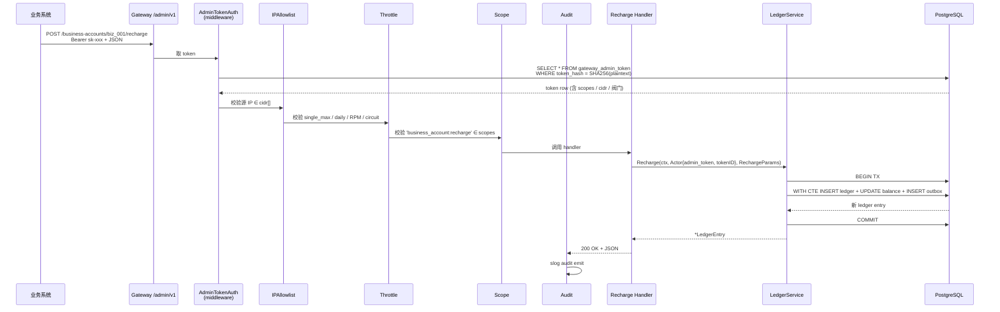
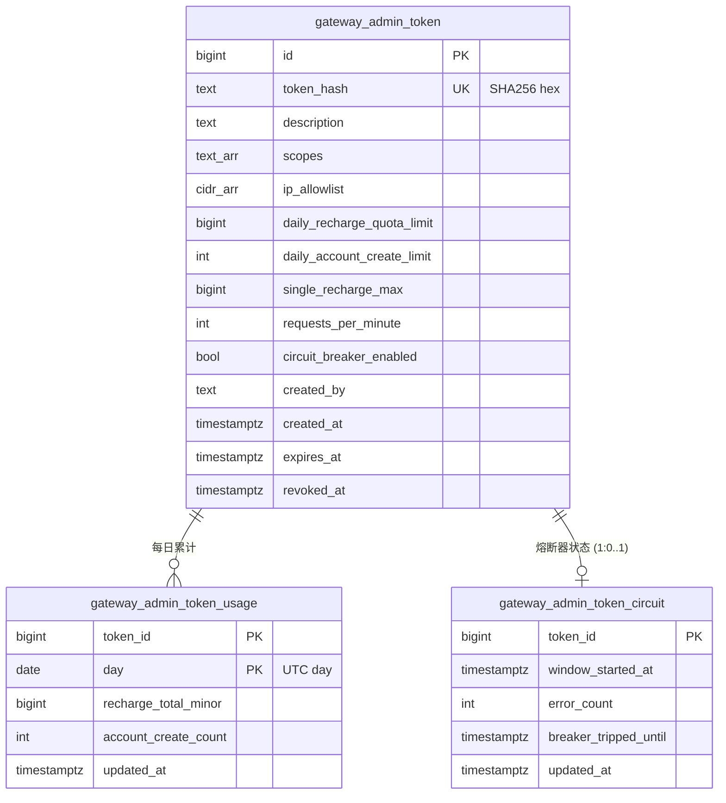

# Phase 2 工作流 D-min — 最小 Admin API

## Overview

实装网关对业务系统暴露的第一个 HTTP API 面：4 个 endpoint（开通账户 / 充值 / 退款 / 查余额），覆盖业务系统接入网关的最小闭环。

D-min 是 Phase 2 工作流 E（账本基础设施）的下游消费者：HTTP handler 不重新发明业务逻辑，直接 1:1 包装 `internal/ledger.Service` 的 4 个方法（`CreateAccount` / `Recharge` / `Refund` / `GetBalance`），并补齐三层安全防护（Bearer 鉴权 + scope + IP allowlist + 阀门）。

完整 D 工作流（webhook 订阅 CRUD / Token 管理 UI / suspend·resume·delete / outbox 拉取重放）按设计文档 §16 推 P1。

## Problem Frame

工作流 E 已让账本服务可用，但目前只有 `admin-cli` 一条接入路径，业务系统无法通过网络通道操作账户。要让外部业务系统真正开始接入，必须出第一个 HTTP API，且必须自带：

- **Bearer Token 鉴权**：不能裸奔
- **scope 细粒度**：生产环境不能拿一把通行 token 包打天下
- **IP allowlist**：泄露 token 后限定爆炸半径
- **阀门**（单笔上限 / 日上限 / RPM / 熔断器）：泄露 token 后限定金额爆炸半径
- **审计日志**：事故复盘的最后一道防线
- **充值幂等**：业务系统重试不能造成重复扣款

设计文档 §9bis.6 已锁定全部 5 件套；本计划是落地。

## Requirements Trace

- **R1.** 提供 **5 个 HTTP endpoint**：`POST /admin/v1/business-accounts` / `POST .../recharge` / `POST .../refund` / `GET .../balance` / **`GET /admin/v1/whoami`**（document-review 添加，业务系统自检 token 状态）。全部 JSON 入参 + JSON 出参。
- **R2.** Admin Token 通过 `Authorization: Bearer <token>` 头携带；明文不入库，仅 SHA-256 hash 存 `gateway_admin_token.token_hash`。
- **R3.** 每个 token 持有 scope 列表（如 `business_account:create`、`business_account:recharge`、`business_account:refund`、`business_account:read`）；缺少调用方所需 scope 时返回 403。
- **R4.** 每个 token 持有 CIDR 白名单（PG `cidr[]`，空数组 = 全 deny）；源 IP 不在白名单时返回 401，**不**消耗限流配额。
- **R5.** 每个 token 持有 **7 个阀门**（`single_recharge_max` / `daily_recharge_quota_limit` / `single_refund_max` / `daily_refund_quota_limit` / `daily_account_create_limit` / `requests_per_minute` / `circuit_breaker_enabled`）；命中后 429 + 告警 metric。Refund 维度阀门由 document-review 添加（缓解 leaked refund-scope token 一次清空 used_total 的攻击）。
- **R6.** 充值幂等：HTTP body 含 `external_ref` + `amount`，service 层用 sha256(canonical body) 比对 `business_account_ledger.canonical_body_sha256`；body 不一致时返回 409 `idempotency_conflict` + audit critical。
- **R7.** 退款幂等：同 `(business_account_id, correlation_id, entry_type='refund')` 复合 UNIQUE；同 correlation 重放返回原 entry。
- **R8.** 审计日志：每条 Admin API 请求 emit 一行结构化 JSON（`token_id` / `source_ip` / `method` / `path` / `request_hash` / `status` / `duration_ms` / `actor` / `tier`），**分层 sink**（决策 D3 升级）：
  - Tier1（refund / token lifecycle / idempotency_conflict / auth_failed bursts）走同步 O_APPEND+O_SYNC 写本地文件，HTTP 响应前 fsync；写失败 → 503 + bump `admin_audit_write_failed_total` + `/readyz` 关闸
  - Tier2（其他请求）走 slog stderr 异步 emit
  - 部署侧 log shipper 负责后续 retention；具体保留期由合规驱动（admin-api.md 标注依据）
- **R9.** `admin-cli` 提供 `token create` / `token list` / `token revoke` 三个子命令用于发首批 token 与生命周期管理；写库时 `actor_type=cli` / `actor_id=bootstrap`，**不**接受 `--created-by` flag。
- **R10.** 调 LedgerService 时 `Actor{Type: ActorTypeAdminToken, ID: <token_id>}` 必须显式传入（已在 `internal/ledger/actor.go` 预留）。
- **R11.** Outbox 事件（`account.created` / `account.recharged` / `account.refunded`）由 LedgerService 自动在同事务发布，handler 不需要手工 publish。
- **R12.** 错误返回体统一格式：`{"error":{"code":"<sentinel_code>","message":"<中文说明>","request_id":"<rid>"}}`。
- **R13.** Admin API 路由组挂在现有 Gin engine 的 `/admin/v1/*` 前缀下；与 `/healthz` / `/readyz` / `/metrics` 共享同一进程。
- **R14.** 提供 metrics：`admin_api_request_total{scope, status}` / `admin_api_quota_exceeded_total{quota_type, token_id}` / `admin_api_auth_failed_total{reason}` / `admin_api_request_duration_seconds`。

## Scope Boundaries

**P0 不做（推 P1）**：

- ❌ `POST /admin/v1/business-accounts/:id/suspend` / `.../resume` / `DELETE .../`（设计文档 D-min 原列出，但本计划最小化）
- ❌ Webhook 订阅 CRUD（`webhook_subscription` 表已建好但 P0 不暴露 API，业务系统回调 URL 走环境变量）
- ❌ outbox 拉取 / 重放接口（推 C-min outbox dispatcher 一起做）
- ❌ Admin Token 管理 UI（P0 全靠 admin-cli）
- ❌ business_account 列表 / 分页查询
- ❌ ledger entry 流水查询接口
- ❌ Admin Token 平滑轮换（同业务系统持 2 把活跃 token）
- ❌ mTLS / 强制 TLS 1.3（P0 不强制；生产部署侧通过 nginx / 负载均衡器解决）
- ❌ DB 表存 audit log（slog → file → log shipper 即可；P1 如监管要求再加表）

**P0 不实装但保留扩展点**：

- `webhook_subscription` 表在 Phase 1 migration 已建；D-min 不读写它
- `gateway_admin_token.expires_at` 字段在 Phase 1 已建；D-min 实装 expiry 校验但 CLI 创建命令默认不带 expiry（永久）

## Context & Research

### Relevant Code and Patterns

**LedgerService（已稳定，本工作流 1:1 复用）：**
- `internal/ledger/service.go` — Service 接口：CreateAccount / Recharge / Refund / GetBalance 四方法可直接对应 4 endpoint
- `internal/ledger/actor.go` — `Actor{Type: ActorTypeAdminToken, ID: <token_id>}` 已为 D-min 预留
- `internal/ledger/events.go` — account.created / recharged / refunded 事件常量与 payload struct 已定义，LedgerService 自动同事务 publish

**HTTP 框架与中间件链（沿用）：**
- `internal/httpapi/server.go` — Gin engine + 6 中间件 + `AddReadinessCheck` 已就绪
- `internal/httpapi/middleware/{recover,requestid,slog,otel,prom,cors}.go` — 公共中间件模式
- `internal/httpapi/middleware/slog.go` 是 access log 的样板，新 admin audit middleware 沿用其结构

**配置（沿用 + Unit 7 新增 5 字段）：**
- `internal/config/config.go` — 已有 `PGDSN` / `GatewayKEKV1` / `AdminTokenSigningKey`（保留扩展位） fail-fast
- **新增字段**（document-review + Unit 7）：`TrustedProxyCIDRs []string` / `GatewayEnv string` / `ListenTLS bool` / `FrontTLSAck bool` / `TLSCertPath string` / `TLSKeyPath string` / `TokenPepper []byte`（解码后存原始字节）

**Schema（已就绪）：**
- `migrations/0001_init.up.sql` `gateway_admin_token` 表完整（token_hash / scopes / ip_allowlist cidr[] / 5 个阀门字段 / expires_at / revoked_at）
- `migrations/0001_init.up.sql` `webhook_event_outbox` 已就绪，LedgerService 已会用它

**admin-cli 自举骨架：**
- `cmd/admin-cli/cmd/cli_wiring.go` — OpenServices + cliActor()，新增 token 子命令 reuse 之
- `cmd/admin-cli/cmd/token.go` — 当前是 Phase 1 占位，本计划替换为真实实装
- `cmd/admin-cli/cmd/account.go` — admin-cli account create / recharge 已实装，是 token 子命令的模板

**sqlc 模式：**
- `sql/queries/ledger.sql` / `business_account.sql` 是 sqlc 命名参数 + 复合查询的样板
- 注意：`-@param`（紧贴一元负号）有 bug，用 `(0::bigint - @amount)::bigint` 写法（已记录）

### Institutional Learnings

来自 Phase 2 工作流 E 已踩过的坑（适用本工作流）：

- **sqlc 命名规约**：query 文件名不要以 `_` 开头，否则 Go build 忽略生成文件
- **CHECK 约束防御**：账本不变量 + 阀门字段非负在 schema 已有 CHECK；D-min 写 admin_token_usage 表也应加 CHECK
- **pgxpool 配置**：用 `MaxConns/MinConns`，不是 `MaxOpenConns`（database/sql 写法）
- **测试并发**：100 goroutine 高并发 Reserve 调用方需自带重试预算；Admin API 的 retry 由业务系统侧负责，D-min handler **不**在 service 层重试 ErrVersionConflict（与 LedgerService 一致）
- **Windows 端口被占**：测试时检查 `netstat -ano` + `taskkill //PID`，进程名 `api-gateway.exe`

### External References

跳过外部研究 — 项目已有强本地 pattern（sqlc + pgx + Gin middleware + LedgerService），且设计文档 §9bis.6 已锁定 Admin Token 安全方案。需要时按 Go 标准库 `net/netip` / `crypto/sha256` / `crypto/rand` 文档即可（不引入新依赖）。

## Key Technical Decisions

### D1. Token 散列算法：HMAC-SHA-256 with server-side pepper（document-review 升级）

**决策**：token 明文 = 32 字节 CSPRNG（base64url 编码 ~43 字符），存储用 `HMAC-SHA-256(GATEWAY_TOKEN_PEPPER, token_bytes)` 的 hex 字符串（64 字符）入 `gateway_admin_token.token_hash`。

**Pepper 配置**：
- 新增 env `GATEWAY_TOKEN_PEPPER`（base64 或 hex 编码的 ≥ 32 字节随机串；与 `GATEWAY_KEK_V1` 性质相同）
- **fail-fast**：`config.Load.validate` 在所有环境（含 dev）下校验 pepper 长度 ≥ 32 字节有效原始字节；缺失 / 短于 32 字节即拒绝启动
- Pepper 与 KEK 分开存（不同密钥不同用途；KEK 用于 credentials envelope encryption，pepper 用于 token hash）
- Pepper 轮换路径推 P1（需要双 hash 字段过渡）

**理由**：

- SHA-256 适合**高熵**随机 token（≥ 256 bit 熵），rainbow table 攻击不成立；但 SQL 等值查 `WHERE token_hash = ?` 仍非 constant-time（btree 短路），高分辨率定时攻击在内网共置 VM 场景理论上能区分"hash 前缀命中 vs 不命中"
- **加 pepper 把攻击者拉到 256-bit 未知字段前**：即便 DB 全量泄露，攻击者拿到 hash 也无法离线穷举（必须先攻破 env / KMS 拿 pepper）
- 业界标准（GitHub PAT / Stripe API Key）做法：随机 token + HMAC-keyed hash
- bcrypt / argon2id 是为**低熵**密码设计的（慢 + 加盐），用在 256-bit 随机 token 上是过度工程，每请求 50-200ms 鉴权延迟无法接受；HMAC-SHA-256 与 SHA-256 速度相同
- schema 中 column comment 写的"bcrypt/argon2id"在 Unit 1 通过 `COMMENT ON COLUMN` 修订；新 comment 改为 "HMAC-SHA-256(GATEWAY_TOKEN_PEPPER, plaintext) hex"

**Why:** CLAUDE.md §四 #5 fail-closed + §六 稳定 > 优雅；DB 全量泄露是不可忽略的真实威胁（pg_dump 备份 / 备份盘失窃），pepper 把它从"立刻沦陷"降到"还需突破第二道密钥"。

**How to apply:**
- `internal/admintoken/postgres.go` 持有 pepper bytes（构造时 `config.GatewayTokenPepper` 解码注入；不暴露到日志）
- 鉴权热路径：`hmac.New(sha256.New, pepper).Write(token).Sum(nil)` 然后 `hex.EncodeToString` → 单 SQL `SELECT ... FROM gateway_admin_token WHERE token_hash = $1 AND revoked_at IS NULL AND (expires_at IS NULL OR expires_at > NOW())`
- Token create 路径相同公式，把 hash 写入 DB
- 启动期 fail-fast 校验 pepper 存在 + 长度 ≥ 32 字节
- 测试覆盖：同一 plaintext + 不同 pepper → 不同 hash；同一 plaintext + 同 pepper → 稳定 hash

### D2. 阀门数据后端：PostgreSQL（不引 Redis）

**决策**：

- **每日上限**（`daily_recharge_quota_limit` / `daily_account_create_limit`）：新表 `gateway_admin_token_usage`，主键 `(token_id, day)`，列 `recharge_total_minor bigint` / `account_create_count int`，用 INSERT ... ON CONFLICT UPDATE 原子累加
- **单笔上限**（`single_recharge_max`）：纯内存判断（请求 body amount 直接对比 token.single_recharge_max），无状态
- **熔断器**：新表 `gateway_admin_token_circuit`，列 `window_started_at` / `error_count` / `breaker_tripped_until`；阈值固定 1 小时 100 次 4xx/5xx
- **RPM**：进程内 `sync.Map[token_id] → []time.Time` 60s 滚动窗口（不持久化）

**理由**：

- 设计文档 §9bis.6 未指定 Redis；P0 本来就没有 Redis 依赖（按 [`docs/multimedia-gateway-design.md`](../multimedia-gateway-design.md) §技术栈 Redis 在 P1 引入 Asynq 时一起接）
- PG 原子 UPSERT 在 D-min 流量级（业务系统 ≤ 1000 RPM）性能足够（每写约 1ms 低争用；同 token 高并发下行锁串行化可达 5-50ms，详见 Unit 3 benchmark 任务）
- RPM 不持久化的代价：多实例部署时 RPM 限制按实例独立计数 —— P0 单实例部署可接受，写入计划"Operational Notes"明示
- P1 接 Redis 时把 throttle backend 抽象成接口替换即可

**Why:** 避免 D-min 提前引入 Redis 基础设施（CLAUDE.md §六 商业平台优先级：稳定 > 优雅）。

**How to apply:** `internal/admintoken/throttle.go` 定义 `Throttle` interface；P0 实现 `PostgresThrottle`（daily+circuit）+ `InProcessRPM`（rpm）；P1 重构成 `RedisThrottle`。

**关键语义（写计划时遗漏，document-review 补齐）**：

1. **Daily counter 累加时机**：counter 只在 LedgerService 写入**成功后**累加（不在请求进入时预占）。语义：`daily_recharge_quota_limit` 是「今日成功充值总额上限」而非「今日尝试次数上限」。Handler 流程为两步：
   - 步骤 A — `CheckDailyRecharge(token, amount)`：纯只读预检 `current + amount ≤ limit`，不副作用
   - 步骤 B — `RecordSuccessfulRecharge(tokenID, amount)`：LedgerService.Recharge 返回成功且**首次新写**（非幂等命中）后才累加；幂等命中时**不**累加（见决策 D11）
   - 失败模式：①若 LedgerService 失败前 Check 已通过 → 配额不变（safe）；②若 Record 失败（极少见，DB 暂断）→ 配额少计一笔，业务可能多充 1 笔（受 `single_recharge_max` 兜底）；③若 handler 不区分新写 vs 幂等命中而盲调 Record → 双重计数膨胀配额（D11 解决）
2. **NULL = 无限**：所有 5 个阀门字段 nullable；NULL 含义：
   - `single_recharge_max = NULL` → 单笔无上限
   - `daily_recharge_quota_limit = NULL` → 当日充值无上限
   - `daily_account_create_limit = NULL` → 当日创建账户数无上限
   - `requests_per_minute = NULL` → 不限 RPM
   - `circuit_breaker_enabled = false` → 不启用熔断器（注意此字段是 bool NOT NULL，DEFAULT false；fail-closed 时建议显式 SET true）
   - **fail-closed 例外**：`ip_allowlist` 数组为空 **= 拒全部**（不是「允许全部」），admin-cli token create 校验必须 ≥ 1 个 CIDR

### D11. LedgerService.Recharge / Refund 须区分「首次新写」与「幂等命中」（document-review 新增）

**决策**：LedgerService.Recharge **与 Refund** 返回值都增加幂等标识，让调用方区分对待（Refund 通过 correlation_id 复合 UNIQUE 同样存在幂等命中场景）。两种可选签名（Unit 2 实施时定）：

- **方案 A（推荐）**：返回值改 `(*LedgerEntry, ledger.WriteOutcome, error)`，其中 `WriteOutcome` 是枚举 `FreshlyWritten` / `IdempotentReplay`；同名枚举复用于 Recharge / Refund
- **方案 B**：在 `*LedgerEntry` 上加 `IsIdempotentReplay bool` 字段，调用方读字段判断

**理由**：

- 没有这个区分时，handler 在业务系统重试场景下会双重 RecordSuccessfulRecharge → 配额计数膨胀 → 误命中 daily_recharge_quota_limit 拒绝合法请求
- LedgerService 内部已通过 idempotency_key UNIQUE 在 service 层区分了两种路径，只是没暴露给上层
- 这是计划起步时未识别的盲点（document-review 由 adversarial-reviewer 发现），属"上游接口安全扩展"，不破坏已有调用方（admin-cli account recharge 默认丢弃该字段即可）

**How to apply:** Unit 2 实施前先在 `internal/ledger/service.go` 增加返回值；admin-cli 现有调用点（`cmd/admin-cli/cmd/account.go`）随之更新（无逻辑变化，仅 multiple-assign）。Unit 5 Recharge handler 仅当 `outcome == FreshlyWritten` 时调 `throttle.RecordSuccessfulRecharge`。

### D3. 审计日志后端：slog 分级 sink（高价值同步 O_SYNC + 低价值异步 stderr）

**决策**（document-review 升级 — 用户选 O_SYNC 同步落盘）：D-min audit log 按事件价值分两层：

- **Tier 1 — 高价值同步落盘（O_APPEND + O_SYNC）**：refund 成功/失败 / token create / token revoke / idempotency_conflict / auth_failed 在 1 分钟内 ≥ 5 次。这些事件 audit 行**必须**在 HTTP 响应返回前 fsync 到本地独立 append-only 文件（路径由 `ADMIN_AUDIT_HIGH_VALUE_LOG_PATH` env 指定，默认 `/var/log/api-gateway/admin-audit-hi.log`）；写失败 → HTTP 响应 503 + bump `admin_audit_write_failed_total`
- **Tier 2 — 低价值异步 stderr**：create account / recharge / balance read / auth_failed 单次。走标准 slog stderr，由部署侧 log shipper 转 long-term storage
- 两层共享同一 audit record schema，只是 sink 不同

**理由**：

- 入 DB 审计每个 Admin 请求至少 2 次写（auth + audit），P0 流量级浪费
- 高价值事件（refund / token lifecycle / 攻击信号）**不能容忍 best-effort 丢失**；事故复盘时如果"谁动了钱"无记录，监管 + 复盘双输
- 低价值事件（充值 / 读余额）量大，同步 fsync 会拖慢 p99；走 best-effort 可接受
- Linux fsync 单次 ~1-5ms，是高价值事件可接受的成本

**Why:** CLAUDE.md §六 稳定 > 性能；refund 是不可逆动作，audit 必须比 side effect 更耐久（数据库写已 commit）。

**How to apply:**
- `internal/audit/sink.go` 抽象：`type Sink interface { Emit(record AuditRecord) error }`
- 双实现：`SyncFileSink`（高价值，os.OpenFile with O_APPEND|O_SYNC，每写 + Sync()）+ `AsyncStderrSink`（低价值，slog.JSONHandler）
- `internal/audit/logger.go` 持有两个 sink，按 record.Tier 路由
- Unit 4 audit middleware 在 emit 前根据 path / status / event 类型决定 tier（如 path == `/refund` 即 Tier 1）
- 新增 metric `admin_audit_write_failed_total{tier, reason}`；该 metric > 0 让 readiness check 返回 503

### D4. Error → HTTP Status 映射表

| LedgerService Sentinel / 鉴权错误 | HTTP | error.code | error.message |
|---|---|---|---|
| Token 缺失 / 格式非法 | 401 | `unauthorized` | "Admin Token 缺失或格式非法" |
| Token 不存在 / 已 revoked / 已 expired | 401 | `unauthorized` | "Admin Token 无效" |
| 源 IP 不在 allowlist | 401 | `ip_not_allowed` | "源 IP 不在白名单内" |
| scope 不足 | 403 | `insufficient_scope` | "缺少所需 scope: <name>" |
| `ErrInvalidAmount` | 400 | `invalid_amount` | "金额必须大于 0" |
| 入参 JSON 解析失败 | 400 | `invalid_request_body` | "请求体不合法: <detail>" |
| `ErrAccountNotFound` | 404 | `account_not_found` | "业务账户不存在" |
| 创建账户重名 / UNIQUE 冲突 → 映射为 `ErrAccountAlreadyExists`（见 D12） | 409 | `account_already_exists` | "业务账户已存在" |
| `ErrIdempotencyConflict` | 409 | `idempotency_conflict` | "请求体与已记录操作不一致，无法重复处理" |
| `ErrAccountAlreadyExists` | 409 | `account_already_exists` | "业务账户已存在" |
| `ErrAccountFrozen` | 409 | `account_frozen` | "账户已冻结，请联系运营" |
| `ErrInsufficientUsed`（refund） | 409 | `insufficient_used` | "退款金额超过已结算金额" |
| `single_recharge_max` 命中 | 429 | `single_recharge_exceeded` | "单笔充值超过阀门" |
| `daily_recharge_quota_limit` 命中 | 429 | `daily_recharge_quota_exceeded` | "今日充值额度已用尽" |
| `single_refund_max` 命中 | 429 | `single_refund_exceeded` | "单笔退款超过阀门" |
| `daily_refund_quota_limit` 命中 | 429 | `daily_refund_quota_exceeded` | "今日退款额度已用尽" |
| `daily_account_create_limit` 命中 | 429 | `daily_create_exceeded` | "今日创建账户数超阀" |
| `requests_per_minute` 命中 | 429 | `rate_limited` | "请求过于频繁" |
| Circuit breaker 跳闸 | 429 | `circuit_open` | "Token 熔断中，请稍后重试" |
| `ErrVersionConflict` | 503 | `version_conflict` | "服务繁忙，请重试" |
| `ErrCommitExceedsReserved` / 其他 | 500 | `internal_error` | "服务内部错误" |

**Why:** 显式映射表避免 handler 散落 if-else；CLAUDE.md §四 #6 显式优于隐式。

**How to apply:** `internal/admin/errors.go` 提供 `MapError(err) (status int, body errorBody)` 函数集中映射。

### D5. CIDR 匹配算法：`net/netip`

**决策**：从 DB 读 `cidr[]` 反序列化为 `[]netip.Prefix`；用 `prefix.Contains(addr)` 校验。

**理由**：

- `net/netip` 是 Go 1.18+ 标准库新接口，比 `net.IPNet` 性能与可读性都更好
- 不引第三方依赖

**How to apply:** Token 鉴权返回 `*Token` 已含解析好的 `[]netip.Prefix`；middleware 取 `c.ClientIP()` 解析为 `netip.Addr` 后逐 prefix 调 `Contains`。

### D6. RPM 滚动窗口实现：进程内 sync.Map

**决策**：`map[int64 /* token_id */] *ringBuffer[time.Time]`，每个 token 一个 60-slot ring buffer，TTL 60s；超过 `requests_per_minute` 即拒绝。

**理由**：

- 单实例部署下精度足够
- 多实例部署 RPM 会按实例数倍放大；这是已知偏离，在 Operational Notes 标记
- P1 接 Redis 时换成 Lua 脚本原子 ZADD + ZREMRANGEBYSCORE 即可

**How to apply:** `internal/admintoken/throttle_rpm.go` 维护 `InProcessRPM` 类型；middleware 调 `throttle.CheckRPM(tokenID)`。

### D7. Admin-cli `token create` 输出明文一次性

**决策**：CLI stdout 输出 JSON `{"id":1,"plaintext":"sk-xxx...","scopes":[...]}`；明文仅打这一次，再无法找回；stderr 警告"请立即保存，离开本终端后无法恢复"。

**理由**：

- 与 GitHub / Stripe 业界惯例一致
- 强约束运营立即把 token 给到业务系统、不留 history

**How to apply:** `cmd/admin-cli/cmd/token.go` 替换占位实现；用 `cliActor()` 写 `created_by="cli:bootstrap"`。

### D8. 审计 Request Hash 算法

**决策**：`request_hash = sha256(method + " " + path + "?" + sorted_query + "\n" + body[:64KB]).hex` 前 **32 字符**（128 bit，碰撞概率在 1 年保留 × 100 req/s 量级下可忽略）；body 大于 64KB 时只 hash 前 64KB（避免内存爆），同时 audit 记录 `body_size_bytes`。

**理由**：

- 审计需要"同一请求"的强等价判别（追查重放攻击）
- 16 hex chars (64 bit) 在 1 年保留 ≥ 3B 请求量下达到生日碰撞阈值；改 32 hex chars (128 bit) 把碰撞概率压到事实上为零，成本仅 16 字节/记录
- 不入参 header（含 Bearer token 明文，会污染 audit）
- 配合 audit 记录的 `request_id`（全局唯一）+ `received_at` 时间戳，可区分"幂等重试 vs 攻击重放"：相同 request_hash 在窗口内 = 业务系统重试；相同 request_hash 在窗口外 = 攻击重放（LedgerService idempotency_key UNIQUE 兜底拒绝，但需 critical alert）

### D9. RPM 窗口与配额日窗口对齐到 UTC

**决策**：daily counter 的 "day" 字段按 UTC 时区（PostgreSQL `(NOW() AT TIME ZONE 'UTC')::date`）；不按业务系统所在时区。

**理由**：

- 多时区业务系统接入时避免歧义
- 网关运营在告警 dashboard 看到的"今日"统一
- 文档说明：业务系统 UTC+8 看到的"今日"与配额"今日"可能有 8h 差

**金额单位与货币上下文**（document-review 补齐）：

- 所有 `amount` / `*_max` / `*_limit` 字段单位是「最小货币单位（minor unit）」，**P0 暂只支持 CNY**：1 元 = 100 分，例如 `daily_recharge_quota_limit = 1_000_000` 表示 10000 元
- CONTEXT.md 增加术语 `minor unit`（CNY 分）；docs/api/admin-api.md 顶部声明「当前唯一支持货币：CNY」
- 多货币支持是 Phase 3+ 决策；引入时 schema 必须增 currency 字段，**禁止**复用同 `*_limit` 字段意义漂移

### D10. 不实装 `Authorization: Bearer` 之外的鉴权方式

P0 仅支持 `Authorization: Bearer <token>` 头；不支持 query string 传 token、不支持 cookie。明文 token 出现在 URL / 日志 / referer 头会引发泄漏。

### D12. CreateAccount UNIQUE 冲突映射为 sentinel（document-review 新增）

**决策**：在 `internal/ledger/errors.go` 增加 `ErrAccountAlreadyExists`；`PostgresService.CreateAccount` 在 UNIQUE 冲突时显式 detect SQLSTATE `23505` + ConstraintName `pk_business_account` 并返回该 sentinel。

**理由**：

- 当前 LedgerService.CreateAccount 在 UNIQUE 冲突时返 `fmt.Errorf("CreateBusinessAccount 失败: %w", err)`，包装裸 `*pgconn.PgError`
- D-min handler 用 `errors.Is(err, ledger.ErrAccountAlreadyExists)` 必须能匹配，否则映射表把它落到 `internal_error` → 返 500，业务系统幂等重试只会继续 500，闭环断裂
- 这是"上游 ledger 包安全扩展"（新增 sentinel + 错误检测路径），不破坏现有接口

**How to apply:** Unit 2 实施前先改 `internal/ledger/errors.go` + `postgres.go::CreateAccount`（最小 diff ~10 行）。改完跑现有 ledger 测试不应回退。

## Open Questions

### Resolved During Planning

- **Q1. token hash 算法用 SHA-256 还是 bcrypt？** → SHA-256（决策 D1）
- **Q2. 阀门后端用 Redis 还是 PG？** → PG（决策 D2）
- **Q3. audit log 入 DB 还是文件？** → slog → file/stderr（决策 D3）
- **Q4. RPM 是否多实例同步？** → 否，P0 进程内（决策 D6 + Operational Notes 标注）
- **Q6. Admin API 路由前缀是 `/admin/api` 还是 `/admin/v1/`？** → `/admin/v1/`（业界 API 版本化惯例；与 `/healthz` 同 engine）

> Q5 / Q7 原本在此（token 平滑轮换 / created_by 写什么）—— 经 document-review，二者均属 P1 范畴的预先决策，违反 YAGNI，已删除。token 轮换由 create + revoke 组合实现；created_by P0 全部写 `cli:bootstrap`，P1 接 UI 时再扩展。

### Deferred to Implementation

- **DI-1.** sqlc 生成代码字段精确名（如 `IpAllowlist` 还是 `IPAllowlist`）—— 实施时按 sqlc v1.30 输出为准
- **DI-2.** circuit breaker 跳闸后的"半开"重试策略（是否到点直接开 vs 需要一次成功才开）—— P0 最简单做法：到期直接关闸；P1 再加半开
- **DI-3.** 阀门触发后的告警通道（邮件 / webhook / 仅 metric bump）—— P0 仅 metric bump，告警接入到 Phase 2 C-min webhook dispatcher 一起做
- **DI-4.** Admin Token 在内存里的缓存策略（每请求查 DB vs 进程内 LRU）—— P0 每请求查 DB（数据量小、性能够）；P1 看压测决定是否加 cache
- **DI-5.** 错误信息中文是否要 i18n（业务系统是英文工程师团队？）—— P0 中文，与 CLAUDE.md §一 对齐；P1 看实际反馈再决定

## High-Level Technical Design

> *本图说明意图与组件关系，不是实现规范。实施者按各 Unit 的 Files / Approach 落地，不必照搬框架细节。*

### 组件交互（一次充值请求）



### 中间件链顺序（关键约束）

```
全局链: recover → requestid → slog → otel → prom → cors
         ↓ 路由组 /admin/v1/*
admin 链: AdminTokenAuth → AdminIPAllowlist → AdminThrottle → AdminScope("xxx") → AdminAudit → Handler
```

**为什么这个顺序**：
- `AdminTokenAuth` 最先：拿到 token 才能查 cidr / 阀门 / scope
- `AdminIPAllowlist` 第二：源 IP 不通过 → 401，**不**消耗限流（设计文档 §9bis.6 第 2）
- `AdminThrottle` 第三：通过 IP 校验才开始计算限流和阀门
- `AdminScope` 第四：handler 级 scope 校验（每个 handler 注册时指定）
- `AdminAudit` 最后（在 handler 前）：c.Next() 后才知道最终 status；audit 记录 status

### 数据模型增量



## Implementation Units

- [ ] **Unit 1: Schema 增量 + sqlc 查询（Admin Token 持久化层）**

**Goal:** 扩展 schema 增加阀门用 usage / circuit 两张辅助表 + 修订 token_hash 注释，并通过 sqlc 生成 Admin Token 全部 CRUD + 阀门查询代码。

**Requirements:** R2, R5

**Dependencies:** 无（Phase 1 schema 已就绪）

**Files:**
- Create: `migrations/0003_admin_token_usage_and_circuit.up.sql`
- Create: `migrations/0003_admin_token_usage_and_circuit.down.sql`
- Create: `sql/queries/admin_token.sql`
- Modify: `docs/db/schema.md`（追加 0003 演化）
- Test: 集成在 Unit 2 的 `internal/admintoken/postgres_test.go` 验证 query 正确性

**Approach:**
- 0003.up.sql：
  - `ALTER TABLE gateway_admin_token ADD COLUMN single_refund_max bigint NULL` + 同 CHECK 非负
  - `ALTER TABLE gateway_admin_token ADD COLUMN daily_refund_quota_limit bigint NULL` + 同 CHECK 非负
  - `CREATE TABLE gateway_admin_token_usage (token_id bigint, day date, recharge_total_minor bigint NOT NULL DEFAULT 0, refund_total_minor bigint NOT NULL DEFAULT 0, account_create_count int NOT NULL DEFAULT 0, updated_at timestamptz NOT NULL DEFAULT NOW(), PRIMARY KEY (token_id, day), FOREIGN KEY (token_id) REFERENCES gateway_admin_token(id) ON DELETE CASCADE, CHECK (recharge_total_minor >= 0 AND refund_total_minor >= 0 AND account_create_count >= 0))` + 索引 `(day)` 用于日常清理
  - `CREATE TABLE gateway_admin_token_circuit (token_id bigint PRIMARY KEY, window_started_at timestamptz NOT NULL DEFAULT NOW(), error_count int NOT NULL DEFAULT 0, breaker_tripped_until timestamptz, updated_at timestamptz NOT NULL DEFAULT NOW(), FOREIGN KEY (token_id) REFERENCES gateway_admin_token(id) ON DELETE CASCADE, CHECK (error_count >= 0))`
  - `COMMENT ON COLUMN gateway_admin_token.token_hash IS 'HMAC-SHA-256(GATEWAY_TOKEN_PEPPER, token_plaintext) 的 hex 字符串（64 char）；token 明文绝不入库；pepper 通过 env 注入，DB 泄露无 pepper 也无法离线穷举'`（修订 Phase 1 笔误）
  - `COMMENT ON COLUMN gateway_admin_token.single_refund_max IS '单笔退款金额上限（minor unit）；NULL = 无限制。Refund 阀门由 D-min document-review 添加'`
  - `COMMENT ON COLUMN gateway_admin_token.daily_refund_quota_limit IS '当日累计退款金额上限（minor unit, UTC day）；NULL = 无限制'`
- 0003.down.sql：DROP 两张新表（顺序：circuit → usage）+ `ALTER TABLE gateway_admin_token DROP COLUMN single_refund_max` + `... DROP COLUMN daily_refund_quota_limit`
- sql/queries/admin_token.sql：
  - `InsertAdminToken`：参数 token_hash / description / scopes / ip_allowlist / **7 阀门字段（5 原有 + single_refund_max + daily_refund_quota_limit）** / created_by / expires_at
  - `FindActiveAdminTokenByHash`：`WHERE token_hash = ? AND revoked_at IS NULL AND (expires_at IS NULL OR expires_at > NOW())`
  - `RevokeAdminToken`：`UPDATE ... SET revoked_at = NOW() WHERE id = ? AND revoked_at IS NULL`
  - `ListActiveAdminTokens`：列表查询（admin-cli token list 用，**不**返 token_hash）
  - `IncrementTokenUsage`：`INSERT INTO gateway_admin_token_usage AS u (token_id, day, recharge_total_minor, refund_total_minor, account_create_count) VALUES (?, (NOW() AT TIME ZONE 'UTC')::date, ?, ?, ?) ON CONFLICT (token_id, day) DO UPDATE SET recharge_total_minor = u.recharge_total_minor + EXCLUDED.recharge_total_minor, refund_total_minor = u.refund_total_minor + EXCLUDED.refund_total_minor, account_create_count = u.account_create_count + EXCLUDED.account_create_count, updated_at = NOW() RETURNING recharge_total_minor, refund_total_minor, account_create_count`
  - `GetTokenUsage`：单日用量（含 refund_total_minor）
  - `RecordCircuitError`：完整 UPSERT SQL（window 自动滚动重置 + error_count 累加，单语句原子）：
    ```sql
    INSERT INTO gateway_admin_token_circuit (token_id, window_started_at, error_count)
    VALUES (@token_id, NOW(), 1)
    ON CONFLICT (token_id) DO UPDATE
    SET error_count = CASE
            WHEN gateway_admin_token_circuit.window_started_at < NOW() - INTERVAL '1 hour'
            THEN 1
            ELSE gateway_admin_token_circuit.error_count + 1
        END,
        window_started_at = CASE
            WHEN gateway_admin_token_circuit.window_started_at < NOW() - INTERVAL '1 hour'
            THEN NOW()
            ELSE gateway_admin_token_circuit.window_started_at
        END,
        updated_at = NOW()
    RETURNING error_count, window_started_at;
    ```
  - `TripCircuitBreaker`：`UPDATE ... SET breaker_tripped_until = NOW() + INTERVAL '1 hour'` —— service 层在 RecordCircuitError 返回 error_count ≥ 100 时调
  - `GetCircuitState`：查 `breaker_tripped_until` 是否在未来；同时返回 `error_count` / `window_started_at` 供 metric 暴露
  - `ResetCircuitBreaker`：`UPDATE ... SET breaker_tripped_until = NULL, error_count = 0, window_started_at = NOW()` —— 运维手工解锁路径（admin-cli circuit-reset 子命令是否补，Open Question 中确认）

**Patterns to follow:**
- `migrations/0002_ledger_fields_extension.up.sql` 的注释风格 + 命名约定
- `sql/queries/ledger.sql` 的命名参数 + 复合 query 风格

**Test scenarios:** (落在 Unit 2 一起)

**Verification:**
- `make migrate-up && make migrate-down && make migrate-up` 双向幂等
- `make sqlc` 重新生成代码无 lint 报错
- `\d gateway_admin_token_usage` 看到 PK / FK / CHECK 三件套
- `COMMENT ON COLUMN gateway_admin_token.token_hash` 显示新注释

---

- [ ] **Unit 2: `internal/admintoken/` 领域服务**

**Goal:** Admin Token 的 CRUD + 鉴权校验（**含 IP 白名单**）封装到独立包，对上层提供 `Service` 接口；不涉及阀门（推 Unit 3）。

**Requirements:** R2, R3, R4, R10

**Dependencies:** Unit 1 + ledger 包 prerequisite（见 D12：`ErrAccountAlreadyExists` sentinel 添加 + CreateAccount UNIQUE 检测）

**Files:**
- **Pre-requisite edits（在 Unit 2 子任务的最前完成，独立小 commit）**：
  - Modify: `internal/ledger/errors.go` —— 增加 `ErrAccountAlreadyExists`
  - Modify: `internal/ledger/postgres.go::CreateAccount` —— UNIQUE 冲突时 `errors.As(*pgconn.PgError)` + 检测 SQLSTATE=`23505` 时返回 sentinel（结合 D12）
  - Modify: `internal/ledger/service.go::Recharge` 签名 —— 增加 `RechargeOutcome` 返回值（结合 D11）
  - Modify: `cmd/admin-cli/cmd/account.go` —— Recharge 调用点接住第三个返回值（丢弃，保持 admin-cli 行为不变）
- Create: `internal/admintoken/types.go`（Token / CreateParams / ValidationResult / 错误）
- Create: `internal/admintoken/service.go`（Service 接口 + 入参 DTO）
- Create: `internal/admintoken/postgres.go`（Postgres 实现）
- Create: `internal/admintoken/errors.go`（sentinel：ErrTokenNotFound / ErrTokenRevoked / ErrTokenExpired / ErrIPNotAllowed / ErrInsufficientScope）
- Test: `internal/admintoken/postgres_test.go`（dockertest 容器，复用 Phase 2 E 模式）

**Approach:**
- `Service` 接口方法（**注意：IP 校验内嵌于 ValidateByPlaintext，不暴露独立 CheckIP**）：
  - `Create(ctx, params CreateParams) (*Token, plaintext string, error)` —— 生成 32 字节 CSPRNG → base64url → SHA-256 hash → INSERT
  - `ValidateByPlaintext(ctx, plaintext string, clientIP netip.Addr) (*ValidationResult, error)` —— hash 查表 + revoked/expired 校验 + IP 白名单 CIDR 匹配（一次性返回所有错误，按优先级 ErrTokenInvalid > ErrIPNotAllowed > ErrInsufficientScope —— scope 由 handler 路径调 CheckScope 单独判）
  - `CheckScope(token *Token, requiredScope string) bool` —— 简单成员检查；middleware 在 ValidateByPlaintext 通过后单独按路由要求调
  - `Revoke(ctx, id int64) (alreadyRevoked bool, err error)` —— 返回是否之前已 revoked（让 CLI 给操作者不同 stderr 反馈，见 Unit 6）
  - `List(ctx) ([]*Token, error)`
- `Token` struct 字段映射 schema：id / description / scopes / allowedCIDRs []netip.Prefix（已解析） / 5 阀门 / created_at / expires_at / revoked_at
- 注意 `ValidationResult` 仅含必要 token meta（不暴露 hash）
- 鉴权热路径：`sha256.Sum256([]byte(plaintext))` → `hex.EncodeToString` → 单 query
- CIDR 解析：`netip.ParsePrefix(string(cidr))`，DB 读出 `[]string` 后逐个解析；解析失败的 token 视为损坏 → ErrTokenInvalid（不应发生但 defensive；Unit 7 启动期会 sweep 所有活跃 token 提前检出，见 Unit 7）
- 设计原则：service 接收 `*pgxpool.Pool`（与 LedgerService 一致）；DIP 不引入 tx 入参（Admin Token CRUD 无需跨 tx 协调）

**Patterns to follow:**
- `internal/ledger/service.go` 的接口 + DTO 风格
- `internal/ledger/postgres.go` 的 sqlc 调用 + 错误包装风格
- `internal/ledger/errors.go` 的 sentinel 命名 + 注释

**Test scenarios:**
- Happy path：Create → 返回 plaintext 长度 ≥ 32 字符 + ValidateByPlaintext 命中 + scope 通过
- Happy path：明文 token 的 SHA-256 等于存储的 token_hash
- Edge case：IP allowlist 为空数组时 ValidateByPlaintext 返回 ErrIPNotAllowed（fail-closed）
- Edge case：expires_at 为 NULL 时永不过期
- Error path：Revoke 已 revoked 的 token → 幂等成功（不报错）
- Error path：用 revoked token Validate → ErrTokenRevoked
- Error path：用 expired token Validate → ErrTokenExpired
- Error path：IP 不在白名单 → ErrIPNotAllowed
- Error path：token 不存在 → ErrTokenNotFound
- Integration：CreateParams 含 expires_at = past → INSERT 后立即 Validate → ErrTokenExpired
- Edge case：cidr[] 中含损坏 CIDR 字符串 → 请求时 ErrTokenInvalid + critical log + bump `admin_token_corrupt_total{reason}` metric（不让损坏数据 panic 整个进程；Unit 7 启动期 sweep 提前检出）
- Integration（pre-requisite）：完成 `ErrAccountAlreadyExists` 后跑现有 ledger 测试无回退；`CreateAccount` 重名时 `errors.Is(err, ledger.ErrAccountAlreadyExists)` 为 true
- Integration（pre-requisite）：完成 `RechargeOutcome` 后跑 admin-cli account recharge 旧路径仍正常；首次 = `FreshlyWritten`，同 idempotency_key 二次 = `IdempotentReplay`
- Error path：Revoke 已 revoked token → service 返回 `(alreadyRevoked=true, err=nil)`；DB revoked_at 不被覆盖（使用 `COALESCE(revoked_at, NOW())`，保留原 revoke 时间戳）
- Error path：Revoke 不存在 id → service 返回 ErrTokenNotFound（CLI 区分 stderr feedback）

**Verification:**
- `go test ./internal/admintoken/... -count=1` 全绿
- `go vet ./internal/admintoken/...` 通过
- 测试覆盖率 ≥ 85%（核心鉴权路径全覆盖）

---

- [ ] **Unit 3: `internal/admintoken/throttle.go` — 阀门 / 限流 / 熔断**

**Goal:** 5 个阀门（single_recharge_max / daily_recharge / daily_create / RPM / circuit_breaker）的实际计数与判定逻辑。

**Requirements:** R5

**Dependencies:** Unit 1, Unit 2

**Files:**
- Create: `internal/admintoken/throttle.go`（Throttle interface + 入参/结果 DTO）
- Create: `internal/admintoken/throttle_postgres.go`（daily + circuit 走 PG）
- Create: `internal/admintoken/throttle_rpm.go`（InProcessRPM ring buffer）
- Test: `internal/admintoken/throttle_test.go`

**Approach:**
- `Throttle` 接口：
  - `CheckSingleRecharge(token *Token, amount int64) error` —— 纯内存判断
  - `CheckDailyRecharge(ctx, token *Token, amount int64) error` —— **预检 + 提交分两步**：①预检 `current + amount ≤ limit` ②若通过，调 `RecordSuccessfulRecharge(ctx, tokenID, amount)` 真实累加。Handler 在 LedgerService.Recharge 返回**成功且 outcome=FreshlyWritten** 时才调 RecordSuccessfulRecharge（D11；避免空计数与双重计数）
  - `CheckSingleRefund(token *Token, amount int64) error` —— **document-review 新增**；纯内存判断 amount ≤ token.single_refund_max
  - `CheckDailyRefund(ctx, token *Token, amount int64) error` —— **document-review 新增**；两步式同 CheckDailyRecharge
  - `RecordSuccessfulRefund(ctx, tokenID int64, amount int64) error` —— **document-review 新增**
  - `CheckDailyCreate(ctx, token *Token) error` —— 同两步模式
  - `RecordSuccessfulRecharge(ctx, tokenID int64, amount int64) error`
  - `RecordSuccessfulCreate(ctx, tokenID int64) error`
  - `CheckRPM(token *Token) error` —— 进程内 ring buffer
  - `CheckCircuitBreaker(ctx, tokenID int64) error` —— 查 breaker_tripped_until
  - `RecordHandlerError(ctx, tokenID int64) error` —— 4xx/5xx 后调，累计错误；超阈值跳闸
- `Throttle` 接口由 Service 调用方注入（DIP）；middleware 持有 `Throttle` interface 引用，便于测试 mock
- **关键边界**：daily counter 是"成功充值后累加"还是"请求进入即累加"？决策：成功后累加（避免失败请求白白消耗配额）；语义：daily_recharge_quota_limit 是"今日成功充值总额上限"
- RPM 实现：`map[int64] *circularBuffer`，每 token 持有 60 个 time slot（每秒一个 bucket）；CheckRPM 时统计过去 60s 总 count
- Circuit breaker：当 `error_count > 100 / 1h` 跳闸，写 `breaker_tripped_until = NOW() + 1h`；下次 CheckCircuitBreaker 看见 `tripped_until > NOW()` 返 ErrCircuitOpen；到期自动闸合（直接关闸，不走半开）
- mutex/atomic 保护并发写（InProcessRPM 内部）
- **RPM 进程内实现细节明确**：
  - 数据结构：`sync.Map[tokenID int64] *tokenRPMState`；`tokenRPMState` 含 `sync.Mutex` + `[]int64`（按 timestamp 升序，单位 ns）
  - CheckRPM 流程：LoadOrStore + Lock + 二分裁掉 `< now-60s` 的 entry + 计数 + 追加 now + Unlock
  - 桶语义：**timestamp slice 而非固定 60 bucket**（避免按秒分桶在 500ms × 200 次 burst 测试场景误判）；hard cap slice 容量 = `requests_per_minute` 防止内存爆
  - GC goroutine：每 5 min 扫 sync.Map，删除 `len(timestamps) == 0` 或 `last_seen < now - 10min` 的条目；防止短期攻击 token 内存常驻
  - 进程启动时 emit `admin_throttle_rpm_cold_start_total{instance_id}` metric → 让运维通过 dashboard 看到进程重启即 RPM 计数清零（攻击者通过 OOM / liveness probe 失败循环重启绕过 RPM 的检测信号）

**Patterns to follow:**
- `internal/ledger/postgres.go` 的 sqlc 调用模式（IncrementTokenUsage 走 ON CONFLICT UPSERT）

**Test scenarios:**
- Happy path：CheckSingleRecharge amount < limit 通过
- Edge case：CheckSingleRecharge limit = NULL（无阀门）→ 永远通过
- Edge case：CheckDailyRecharge 跨 UTC 0 点：23:59 一次 + 00:01 一次都通过（不同 day 计数独立）
- Error path：CheckDailyRecharge current + amount > limit → ErrDailyRechargeExceeded
- Error path：单日依次充值至 limit-1 / +2 → 第二次拒绝
- Edge case：CheckRPM 100 次/分钟，第 100 次内通过，第 101 次拒绝
- Edge case：CheckRPM 跨秒（500 ms 间隔 200 次）→ 触发限流
- Integration：4xx 错误连续 100 次 → 第 101 次 CheckCircuitBreaker 返 ErrCircuitOpen；等 1h（test 用 1s 配置）后自动恢复
- Concurrent：100 goroutine 并发 CheckDailyRecharge 累加 1 → DB 表中最终 sum = 100（ON CONFLICT 原子性）

**Verification:**
- 并发测试稳定通过
- 没有 goroutine 泄漏（pprof / leakcheck）
- daily counter PG 表数据与 ledger entry SUM 在测试场景下吻合
- **Benchmark task（落实 D2 性能假设）**：在 dockertest 起容器后，跑同 token 100/500/1000 并发 UPSERT，记 p50 / p99 latency 入 `docs/benchmarks/d-min-throttle-pg-2026-05-27.md`；若 p99 > 50ms 在 100 并发下达成 → 提交 issue 标 P1 接 Redis 或重构 PG 路径（不阻塞本工作流落地）
- **添加 50 goroutine 并发 RecordCircuitError 同 token → error_count 最终 = 50** 验证 UPSERT 原子性

---

- [ ] **Unit 4: HTTP 中间件 5 件套（auth / ip / throttle / scope / audit）**

**Goal:** 把 Admin Token Service + Throttle 编排成 Gin middleware 链，挂在 `/admin/v1/*` 路由组下。

**Requirements:** R2, R3, R4, R5, R8, R13

**Dependencies:** Unit 2, Unit 3

**Files:**
- Create: `internal/httpapi/middleware/admin_body_limit.go`（**新增** —— MaxBytesReader 64KB，admin 链最前）
- Create: `internal/httpapi/middleware/admin_token_auth.go`
- Create: `internal/httpapi/middleware/admin_throttle.go`
- Create: `internal/httpapi/middleware/admin_scope.go`
- Create: `internal/httpapi/middleware/admin_audit.go`
- Create: `internal/audit/logger.go`（slog 包装 + tier router）
- Create: `internal/audit/sink.go`（Sink 接口 + SyncFileSink / AsyncStderrSink 双实现）
- **Modify**：`internal/httpapi/middleware/slog.go`（全局 access log）—— 增加 redactor，无条件 redact `Authorization` / `Cookie` / `Set-Cookie` / 任何 header 名 match `(?i)token|key|secret` 的值
- Test: `internal/httpapi/middleware/admin_middleware_test.go`

> ❌ 删除：原计划列的 `admin_ip_allowlist.go` —— IP 校验内嵌于 `ValidateByPlaintext`（决策见 Unit 2），不再独立 middleware

**Approach:**

**Admin 链顺序（修订后）**：

```
AdminBodyLimit (64KB) → AdminTokenAuth (含 IP 校验) → AdminThrottle (RPM + 熔断) → AdminScope("xxx") → AdminAudit → Handler
```

- `AdminBodyLimit`：`c.Request.Body = http.MaxBytesReader(c.Writer, c.Request.Body, 64*1024)` —— admin 链最前；超出时 413 `payload_too_large` + bump `admin_api_body_too_large_total{token_id}`；与 D8 audit hash 的 64KB cap 对齐
- `AdminTokenAuth(svc admintoken.Service)`：从 `Authorization: Bearer xxx` 取 plaintext → 调 `svc.ValidateByPlaintext(ctx, plaintext, c.ClientIP())`（**IP 校验内嵌**，不再独立 middleware）→ 失败按 sentinel 映射 401 `unauthorized` / 401 `ip_not_allowed`；成功后 `c.Set("admin_token", validation)`
- `AdminThrottle(thr admintoken.Throttle)`：
  - CheckRPM 第一（最快失败）
  - CheckCircuitBreaker 第二
  - 不在 middleware 内做 daily / single recharge 检查（这些需要 handler 知道 amount —— 推到 handler 内部预检）
  - 失败时 429 + emit 阀门 metric
- `AdminScope(required string)`：从 ctx 取 token → CheckScope(token, required) → 失败 403
- `AdminAudit(audit AuditLogger, thr admintoken.Throttle)`：
  - **必须用 `defer` 模式**（在 c.Next() 之前注册 defer）—— 否则 handler panic 时 audit 行会丢失（panic 跳过 c.Next() 之后的非 defer 代码）。骨架：
    ```go
    func AdminAudit(...) gin.HandlerFunc {
        return func(c *gin.Context) {
            start := time.Now()
            defer func() {
                // 这段在 handler panic / 正常返回 / abort 三种情况下都会执行
                audit.Emit(buildRecord(c, start))
                if c.Writer.Status() >= 400 {
                    _ = thr.RecordHandlerError(c.Request.Context(), tokenID(c))
                }
            }()
            c.Next()
        }
    }
    ```
  - request_hash 算法：见决策 D8
- `internal/audit/logger.go`：
  - 接口 `AuditLogger interface { Emit(record AuditRecord) error }`
  - `Logger` 持有 Tier1 + Tier2 两个 Sink；按 record.Tier 路由
  - **强制 JSON Handler**（建构时拒绝 TextHandler 注入）：audit 字段含 user-controlled 字符串（external_ref / account_id / reference_id），若用 text handler 攻击者可注入伪造日志行
  - record.Tier 决定路径：refund / token lifecycle / idempotency_conflict / auth_failed >= 5/min → Tier1；其他 → Tier2
- `internal/audit/sink.go`：
  - `Sink` 接口：`Emit(record) error`
  - `SyncFileSink`：`os.OpenFile(path, O_APPEND|O_CREATE|O_WRONLY, 0600)`；每条 `f.Write(jsonBytes) + f.Sync()` 同步 fsync；写失败立刻返 error；并发用 sync.Mutex 串行化
  - `AsyncStderrSink`：包 slog.JSONHandler，best-effort
  - 配置：`ADMIN_AUDIT_HIGH_VALUE_LOG_PATH` (Tier1) + 标准 stderr (Tier2)；lumberjack rotate 推 P1，P0 由部署侧 logrotate 兜底
- **全局 slog middleware 同步加 redactor**：`internal/httpapi/middleware/slog.go` 当前 emit access log 不含 header；本工作流改造时增加 sensitive-header redactor（即使现在不打 header，也防止未来扩展时回归）；redactor 是 `slog.Attr` 替换函数，对 key 命中 `(?i)authorization|token|key|secret|cookie` 的值替换为 `[REDACTED]`
- 注意：`c.ClientIP()` 受 Gin TrustedProxies 设置影响；**Unit 7 已落地 fail-fast 启动检查**（详见 Unit 7），本 Unit 测试需覆盖 trusted proxies 配置正常时 XFF 才被采纳的场景

**Patterns to follow:**
- `internal/httpapi/middleware/slog.go` 的 access log emit 模式
- `internal/httpapi/middleware/recover.go` 的 fail-closed 模式（异常时不放行）

**Test scenarios:**
- Happy path：Bearer + 合法 IP + scope 命中 → handler 被调用 + 200 + 一行 audit
- Error path：缺 Authorization 头 → 401 + audit 记录"unauthorized"
- Error path：Bearer 但 token 不存在 → 401 + audit 记录"unauthorized"
- Error path：合法 token + 错 IP → 401 ip_not_allowed + audit 记录 ip rejection（**不**消耗限流 counter）
- Error path：合法 token + 缺 scope → 403 insufficient_scope + audit 记录 scope_denied
- Error path：合法 token + RPM 超限 → 429 rate_limited + bump 阀门 metric
- Error path：circuit 跳闸 token → 429 circuit_open
- Edge case：c.ClientIP() 取值受 X-Forwarded-For 影响 → 测试既覆盖 RemoteAddr 也覆盖 XFF（trusted proxies 已设置时）
- Edge case：handler panic → recover middleware 兜底；audit 仍 emit（status=500）—— **必须用真实 panic-injecting handler 验证**，验证关键：audit 行存在 + RecordHandlerError 被调用（circuit error_count 增 1）
- Integration：完整 5 件套串联 + 真实 LedgerService（dockertest）→ 200 + ledger 真有 entry + audit 一行
- Audit content：request_hash 长度 32 hex chars；body > 64KB 时只 hash 前 64KB + 记录 `body_size_bytes`
- Audit content：audit 记录里**绝不**含 Authorization 头明文（regex assertion: `^(?!.*sk-[A-Za-z0-9_-]{20,}).*$`）
- Audit content：external_ref = `evil\n{"injected":true}` → audit emits 恰好一行 JSON；行解析后 external_ref string 含字面 `\n`（验证 JSON 转义 + 拒绝 text handler）
- Body limit：POST 充值 body 65KB → 413 `payload_too_large` + audit 一行 + ledger 无 entry
- Body limit：POST 充值 body 64KB - 1 byte → 200 / 正常处理
- Global slog redactor：手工构造请求 `Authorization: Bearer sk-xxxxx`，全局 access log 行用 grep 不应匹配 `sk-`
- 全局 slog redactor：headers map 含 `X-Custom-Token: foo`，access log 中该 key 的值被替换为 `[REDACTED]`

**Verification:**
- `go test ./internal/httpapi/middleware/... -count=1` 全绿
- middleware 顺序在 NewServer 装配时显式列出（与 OldServer 的 5 个公共 middleware 链同风格）
- audit log 一行包含全部 8 个字段，无明文 token

---

- [ ] **Unit 5: HTTP Handlers（4 endpoint）**

**Goal:** 实装 4 个 Admin API endpoint，调 LedgerService 完成业务逻辑，并把 sentinel error 映射成 HTTP 响应。

**Requirements:** R1, R6, R7, R10, R11, R12, R14

**Dependencies:** Unit 2, Unit 3, Unit 4

**Files:**
- Create: `internal/admin/business_account_handler.go`
- Create: `internal/admin/dto.go`（请求/响应 struct + JSON tag）
- Create: `internal/admin/errors.go`（MapError 函数 + 错误响应 struct）
- Test: `internal/admin/business_account_handler_test.go`

**Approach:**
- 入参验证（所有限长在 handler 入口做，超长 → 400 `invalid_request_body`）：
  - `CreateAccountRequest{ID string, IsolationRequired bool, Metadata json.RawMessage}` —— ID 必填，1 ≤ len(ID) ≤ 64，字符集 `[A-Za-z0-9_\-]`
  - `RechargeRequest{Amount int64, ExternalRef string, ReferenceType, ReferenceID, Metadata json.RawMessage}` —— `amount > 0` 且 `≤ math.MaxInt64/2`；`external_ref` 必填，1 ≤ len ≤ 128；reference_type / reference_id 可选，各 ≤ 64
  - `RefundRequest{Amount int64, CorrelationID string, ReferenceType, ReferenceID, Metadata json.RawMessage}` —— 同上，correlation_id 1 ≤ len ≤ 128
- **Handler 两步式配额模式（document-review 明示）**：
  - **Step 1 — Pre-check**：`throttle.CheckSingleRecharge` + `CheckDailyRecharge` 纯只读预检
  - **Step 2 — Ledger call**：调 LedgerService（CreateAccount / Recharge / Refund / GetBalance）
  - **Step 3 — Record if fresh**：仅当 LedgerService 返 outcome=FreshlyWritten 时调 `throttle.RecordSuccessful*`（D11 解决双重计数）
- Handler 流程（以 Recharge 为例）：
  1. 从 path 取 `:id`、bind JSON
  2. 入参校验失败 → 400 invalid_request_body
  3. **Step 1** — `throttle.CheckSingleRecharge(token, amount)` → 失败 429；`throttle.CheckDailyRecharge(token, amount)` → 失败 429
  4. 构造 `ledger.RechargeParams`：
     - `IdempotencyKey = externalRef`（字符串直接传，进 `business_account_ledger.idempotency_key` 复合 UNIQUE 列）
     - `CanonicalBody = &RechargeBody{AccountID: id, Amount: amount, ExternalRef: externalRef}`（LedgerService 内部 canonicalize + sha256 → `canonical_body_sha256` 列；同 IdempotencyKey 二次进入时由 LedgerService 比对 body sha256 一致性，不一致返 `ErrIdempotencyConflict`）
     - `CorrelationID = externalRef`（Recharge 不靠 correlation_id 幂等，但 schema 要求非空，复用 external_ref 便于反查；**未来若放宽幂等需同步放宽 (account, correlation, entry_type='recharge') UNIQUE 索引** —— 已记入 Risks 表）
     - `ReferenceType / ReferenceID = request.ReferenceType / .ReferenceID`（来自 HTTP body 可选字段）
  5. **Step 2** — 调 `ledger.Recharge(ctx, Actor{ActorTypeAdminToken, fmt.Sprintf("%d", token.ID)}, params)` 接住 `(*LedgerEntry, RechargeOutcome, error)`
  6. 失败：MapError → 返回对应 status（401 / 404 / 409 / 429 / 503 / 500）
  7. **Step 3** — 成功且 `outcome == ledger.FreshlyWritten` 时调 `throttle.RecordSuccessfulRecharge(ctx, token.ID, amount)`；`outcome == IdempotentReplay` 时**跳过** RecordSuccessful（已计数过）
  8. 返回 200 + entry JSON
- **CreateAccount handler 类似**：throttle.CheckDailyCreate → ledger.CreateAccount → 失败 `errors.Is(err, ledger.ErrAccountAlreadyExists)` 时 MapError 输出 409 `account_already_exists`；其他失败按映射；成功仅当首次创建（CreateAccount 无幂等概念，UNIQUE 冲突直接返 ErrAccountAlreadyExists）时调 `throttle.RecordSuccessfulCreate`
- **Refund handler**：与 Recharge 对称（document-review 锁定）：
  1. 入参校验（amount > 0 + correlation_id 必填）
  2. **Step 1** — `throttle.CheckSingleRefund(token, amount)` → 失败 429；`throttle.CheckDailyRefund(token, amount)` → 失败 429
  3. **Step 2** — 调 `ledger.Refund(...)`；失败按 MapError
  4. **Step 3** — 成功（Refund 通过 correlation_id 复合 UNIQUE 幂等；service 重放命中时返同一 entry）；handler 需读 LedgerService.Refund 返回值（**类似 Recharge 也加 RefundOutcome 字段，在 D11 一并设计**）；仅在 FreshlyWritten 时 `throttle.RecordSuccessfulRefund(ctx, token.ID, amount)`
  5. **Step 4** — 始终 emit critical-level audit（refund 是高危动作，与决策 D3 高价值事件分级一致）
- **GetBalance**：调 ledger.GetBalance；返回 BalanceResponse{Available, Reserved, UsedTotal, RechargeTotal, RefundTotal, Frozen, FrozenReason, Version, UpdatedAt}
- **Whoami 第 5 endpoint（document-review 添加）**：`GET /admin/v1/whoami`
  - 中间件链：完整 admin 链（含 AdminTokenAuth + AdminThrottle），**无** AdminScope 要求（任何已鉴权 token 可调用自检；handler 直接读 ctx 里的 token）
  - 返回 WhoamiResponse：
    ```json
    {
      "token_id": 1,
      "description": "creator-platform-prod",
      "scopes": ["business_account:read", "business_account:recharge"],
      "ip_allowlist_cidr_count": 2,
      "expires_at": null,
      "throttle_limits": {
        "single_recharge_max": 500000,
        "daily_recharge_quota_limit": 1000000,
        "single_refund_max": 500000,
        "daily_refund_quota_limit": 100000,
        "daily_account_create_limit": 10,
        "requests_per_minute": 600,
        "circuit_breaker_enabled": true
      },
      "today_usage_utc": {
        "recharge_total_minor": 350000,
        "refund_total_minor": 0,
        "account_create_count": 2
      },
      "circuit_state": {
        "open": false,
        "tripped_until": null,
        "error_count_in_window": 3
      },
      "server_time_utc": "2026-05-27T14:32:11Z"
    }
    ```
  - 不返回：token_hash / ip_allowlist 具体 CIDR 列表（防 token 泄露后嗅探精确网段配置）
  - 性能：所有数据已在 ctx 里（auth + throttle 已查），handler 仅做组装；额外 1 次 `gateway_admin_token_usage` 当日 SELECT
  - audit Tier2（read-only 无副作用）
- 错误响应统一格式：`{"error": {"code": "...", "message": "...", "request_id": "..."}}`
- metrics 由 prom middleware 自动覆盖；额外 emit `admin_api_quota_exceeded_total{quota_type, token_id}` / `admin_api_auth_failed_total{reason}` / `admin_api_body_too_large_total{token_id}` / `admin_api_idempotency_conflict_total{token_id}`（这些在 Unit 3 / 4 内部已 emit）
- CreateAccount handler 类似：throttle.CheckDailyCreate → ledger.CreateAccount → throttle.RecordSuccessfulCreate
- Refund handler：amount > 0 + correlation_id 必填；调 ledger.Refund 后无需 throttle.Record（refund 不计入 daily 充值上限）
- GetBalance：调 ledger.GetBalance；返回 BalanceResponse{Available, Reserved, UsedTotal, RechargeTotal, RefundTotal, Frozen, FrozenReason, Version, UpdatedAt}
- 错误响应统一格式：`{"error": {"code": "...", "message": "...", "request_id": "..."}}`
- metrics 由 prom middleware 自动覆盖；额外 emit `admin_api_quota_exceeded_total{quota_type, token_id}` / `admin_api_auth_failed_total{reason}`（这些在 Unit 3 / 4 内部已 emit）

**Patterns to follow:**
- `cmd/admin-cli/cmd/account.go` 的入参校验风格（中文错误 + 早退）
- `internal/ledger/service.go` 的 Service 接口入参 DTO 风格
- `internal/httpapi/server.go` 的路由注册风格（`s.engine.POST(...)`）

**Test scenarios:**
- Happy path: POST /business-accounts → 201 + ledger 有 account.created entry + outbox 有 account.created 事件
- Happy path: POST .../recharge with amount=1000 → 200 + balance.available = 1000 + outbox 有 account.recharged
- Happy path: POST .../recharge 同 external_ref + 同 body 二次 → 200 返回原 entry（幂等）+ outbox 不重复入
- Happy path: POST .../refund 部分退款 → 200 + balance.used_total - amount + balance.refund_total + amount
- Happy path: GET .../balance → 200 + 完整 6 字段
- Happy path: GET /admin/v1/whoami → 200 + token_id / scopes / 阀门快照 / 今日用量 / circuit 状态；不暴露 token_hash / CIDR 具体值
- Happy path: GET /admin/v1/whoami 不需要任何 scope 即可调用（任一已鉴权 token 都可）
- Edge case: GET /admin/v1/whoami 用 expired token → 401 unauthorized（与其他 endpoint 一致）
- Edge case: POST .../recharge amount = 0 → 400 invalid_amount
- Edge case: POST .../recharge body 缺 external_ref → 400 invalid_request_body
- Edge case: 创建账户 id 长度 > 64 → 400 invalid_request_body
- Edge case: GetBalance frozen 账户 → 200 + frozen=true + frozen_reason
- Edge case: POST .../recharge 完全相同 external_ref + 完全相同 body 两次 → 第二次命中幂等，返回原 entry（验证 LedgerService 比对 canonical_body_sha256）+ **daily counter 仅累加一次**（验证 D11 RechargeOutcome 区分）
- Error path: 同 external_ref + 不同 amount → 409 idempotency_conflict + critical audit log
- Error path: 不存在的账户 recharge → 404 account_not_found
- Error path: 创建已存在的账户 → 409 account_already_exists
- Error path: 退款金额 > used_total → 409 insufficient_used
- Error path: single_recharge_max=500 + amount=1000 → 429 single_recharge_exceeded（不写 ledger）
- Error path: daily_recharge_quota_limit=1000 + 已用 600 + amount=500 → 429 daily_quota_exceeded（不写 ledger）
- Error path: frozen 账户 recharge → 409 account_frozen
- Integration: 一次成功充值后 daily_usage 表 recharge_total_minor 增加 amount；下次同账户充值仍受同一 daily quota 制约
- Integration: 高并发 50 goroutine 同 token recharge 不同账户 → daily counter 最终 = SUM(成功)，无丢失更新

**Verification:**
- `go test ./internal/admin/... -count=1` 全绿
- 4 endpoint 在 httptest 跑通 happy path + 主要错误路径
- 错误响应体格式与 errors 表完全一致（test assertion 严格比对 code 字段）
- audit log 含每次请求一行 + content assertion

---

- [ ] **Unit 6: admin-cli `token` 子命令真实实装**

**Goal:** 把 `cmd/admin-cli/cmd/token.go` 从 Phase 1 占位升级为真实实装；提供 token create / list / revoke 三个子命令完成自举闭环。

**Requirements:** R9

**Dependencies:** Unit 2

**Files:**
- Modify: `cmd/admin-cli/cmd/token.go`（替换占位实现）
- Modify: `cmd/admin-cli/cmd/cli_wiring.go`（OpenServices 增加 admintoken.Service 字段）
- Test: `cmd/admin-cli/cmd/token_test.go`（与 cmd_test.go 同风格，dockertest）

**Approach:**
- `token create --description=<desc> --scope=<s1,s2,...> --ip-allowlist=<cidr1,cidr2,...> [--single-recharge-max=<n>] [--daily-recharge-limit=<n>] [--single-refund-max=<n>] [--daily-refund-limit=<n>] [--daily-create-limit=<n>] [--rpm=<n>] [--circuit-breaker] [--expires-in=<duration>] [--out <file>|--encrypt-to <age-recipient>]`
  - 必填：description、scope（≥ 1 个）、ip-allowlist（≥ 1 个 CIDR）
  - **输出模式（互斥三选一，document-review 锁定）**：
    - **默认（无 --out / --encrypt-to）**：stdout 输出含 plaintext 的 JSON + stderr 醒目反模式警告（"⚠️ 切勿粘贴到 chat / IM / 邮件；切勿重定向到无 0600 权限的文件；shell history 可能记录本命令"）
    - **`--out <file>`**：plaintext 写入指定文件（创建时直接 `os.OpenFile(path, O_WRONLY|O_CREATE|O_EXCL, 0600)` —— EXCL 防覆盖已有文件）；stdout 只输出 id + metadata（不含 plaintext）；stderr 提示"已写入 <file>（仅 owner 可读）"
    - **`--encrypt-to <age-recipient>`**：调 age 库（`filippo.io/age` 标准库实现）用 recipient 公钥加密 plaintext 后 base64 输出到 stdout；运维通过 age 私钥解密；适合通过 chat / email 传输（密文公开无害）；依赖增加 `filippo.io/age` 一个；接受 `age1...` 公钥或 `ssh-ed25519 ...` SSH 公钥两种格式
  - 输出 stdout 默认 JSON：`{"id": 1, "plaintext": "sk-xxxx...", "scopes": [...], "ip_allowlist": [...]}`；--out 模式去掉 plaintext 字段；--encrypt-to 模式 JSON 含 `ciphertext_age` 字段
  - 退出码：成功 0；失败非零 + 中文错误到 stderr
- `token list`：列表 stdout JSON 数组，每条含 id / description / scopes / created_at / expires_at / revoked_at（**不**含 token_hash）；**含 refund scope 的 token 在 stderr 输出醒目警告行**："⚠️ 以下 token 持有 refund scope，请确认是否需要：id=<list>"
- `token revoke <id>`：（**document-review 修订：区分操作者反馈**）
  - 不存在 id → 退出码 2 + stderr "token <id> 不存在"
  - 首次 revoke 成功 → 退出码 0 + stderr "token <id> 已吊销"
  - 已 revoked → 退出码 0 + stderr **醒目**"⚠️ token <id> 早在 <timestamp> 已吊销（本次操作无影响）"（让运维在 incident 下能立即识别"我是否吊销了正确的 token"）
- **token create 的 scope 入参校验**：
  - 不接受空 scope（CLI 必填校验已有）
  - `--scope` 含 `business_account:refund` 时**必须**额外加 `--i-understand-refund-risk` 否则拒绝并 stderr 警告（参考 GitHub `gh repo delete` 的二次确认模式）
  - `--scope` 超过 3 个时 stderr 警告"已创建 multi-scope token，建议拆分到独立 token 实现 least privilege"
- 全部子命令通过 OpenServices() 拿 admintoken.Service；与 LedgerService 共用 *pgxpool.Pool
- cliActor 不需要扩展：Admin Token 的 created_by 直接写 `"cli:bootstrap"`（hard-coded），与 ledger actor 模型平行（admin_token 不写 ledger）

**Patterns to follow:**
- `cmd/admin-cli/cmd/account.go` 的子命令结构 + RunE + JSON encoder
- `cmd/admin-cli/cmd/cli_wiring.go` 的 OpenServices 风格

**Test scenarios:**
- Happy path: `token create --description=ci --scope=business_account:read --ip-allowlist=10.0.0.0/8` 成功 → stdout JSON 含 plaintext + DB 有一行 + plaintext SHA-256 == token_hash
- Edge case: 不指定 scope → 退出码非零 + stderr 中文错误
- Edge case: 指定非 CIDR 格式（如 `10.0.0.1`）→ 退出码非零 + 错误说明
- Edge case: 指定 `--expires-in=24h` → DB 中 expires_at = NOW() + 24h
- Edge case: `token list` 空数据库 → stdout `[]`
- Edge case: `token list` 含一条已 revoked → 列表中包含但带 revoked_at
- Happy path: `token revoke <id>` → DB revoked_at 写入，退出码 0，stderr 行 "token <id> 已吊销"
- Edge case: `token revoke <id>` 已 revoked → 退出码 0，stderr **醒目警告**"⚠️ token <id> 早在 <ts> 已吊销"
- Error path: `token revoke 99999` 不存在 → 退出码 2 + stderr 中文错误"token 99999 不存在"
- Refund scope 守护：`token create --scope=business_account:refund ...`（无 --i-understand-refund-risk）→ 退出码 2 + 拒绝
- Refund scope 守护：加上 `--i-understand-refund-risk` → 成功创建，含 refund scope
- Multi-scope 警告：`token create --scope=business_account:read,business_account:recharge,business_account:refund,business_account:create --i-understand-refund-risk` → 创建成功 + stderr warning 行
- Integration: create → list → revoke 全流程通过 dockertest

**Verification:**
- `go test ./cmd/admin-cli/... -count=1` 全绿
- `make build` → `./bin/admin-cli token --help` 显示 3 个子命令（去除 Phase 1 占位文案）
- 手工跑一遍 create → list → revoke 闭环

---

- [ ] **Unit 7: `main.go` 装配 + readiness check 注册 + 路由组挂载**

**Goal:** 把 admintoken.Service / Throttle / Audit + admin handlers 装配进现有进程；新增 `/admin/v1/*` 路由组共享同一 Gin engine。

**Requirements:** R13, R14

**Dependencies:** Unit 2, Unit 3, Unit 4, Unit 5

**Files:**
- Modify: `internal/config/config.go` —— **新增字段 `TrustedProxyCIDRs []string` + 启动期 fail-closed 校验（详见 Approach）**
- Modify: `main.go`（构造 admintoken.Service、admin handlers、注册路由）
- Modify: `internal/httpapi/server.go`（暴露 RegisterAdminRoutes 入口或允许调用方拿 Engine() 自己注册；**装配时调 engine.SetTrustedProxies**）
- Modify: `internal/obs/metrics.go`（新增 admin_api 相关 metrics）
- Test: `internal/httpapi/server_test.go` 增加 admin smoke case（不接真 DB，可挂 stub admintoken.Service）；增加 trusted-proxies 配置矩阵测试

**Approach:**

**1. TrustedProxies + TLS fail-fast 启动校验（P0 必须 — document-review 锁定）**：

- 新增 env：`GATEWAY_TRUSTED_PROXIES`（CSV CIDR 列表，如 `10.0.0.0/8,192.168.0.0/16,127.0.0.1/32`）
- 新增 env：`GATEWAY_ENV`（`production` / `dev` / `test`，默认 dev）
- 新增 env：`GATEWAY_LISTEN_TLS`（bool，true 表示进程自己 listen TLS 端口，需配合 `GATEWAY_TLS_CERT_PATH` / `GATEWAY_TLS_KEY_PATH`）
- 新增 env：`GATEWAY_FRONT_TLS_ACK`（bool，true 表示运维明示前端反代已 TLS 终止，本进程接受 HTTP 接收）
- 新增 env：`GATEWAY_TOKEN_PEPPER`（base64 或 hex 编码 ≥ 32 字节随机串；token hash 用 HMAC-SHA-256 加 pepper —— 见 D1）
- 校验逻辑（`internal/config/config.go::validate`）：
  - 若 `GATEWAY_ENV=production` AND `GATEWAY_TRUSTED_PROXIES` 未设或含 `0.0.0.0/0` / `::/0` → **拒绝启动**，stderr critical："生产模式必须显式配置 GATEWAY_TRUSTED_PROXIES 为反代实际 CIDR；当前配置会导致 X-Forwarded-For 可被任意伪造，IP allowlist 形同虚设"
  - 若 `GATEWAY_ENV=production` AND `GATEWAY_LISTEN_TLS != true` AND `GATEWAY_FRONT_TLS_ACK != true` → **拒绝启动**，stderr critical："生产模式必须确保 TLS：要么进程自带 TLS（GATEWAY_LISTEN_TLS=true + cert/key），要么明示前端反代已 TLS 终止（GATEWAY_FRONT_TLS_ACK=true）"
  - 若 `GATEWAY_ENV=production` AND `GATEWAY_LISTEN_TLS=true` AND（cert / key path 缺失或文件不可读）→ **拒绝启动**
  - **所有环境（含 dev/test）下**：`GATEWAY_TOKEN_PEPPER` 必须存在且解码后 ≥ 32 字节；缺失 / 短 → 拒绝启动 + critical 提示"生成 32 字节 pepper：`openssl rand -hex 32`"
  - 若 `GATEWAY_ENV=dev/test` 且其他 TLS / TrustedProxies 项缺失 → warn-only 通过（pepper 仍硬要求，因为 dev DB 也可能泄露）
- 装配（`server.go::NewServer`）：始终调 `engine.SetTrustedProxies(cfg.TrustedProxyCIDRs)`；空切片时 Gin 仅信任 c.Request.RemoteAddr（**fail-closed**，不读 XFF）
- 装配（main.go）：若 `GATEWAY_LISTEN_TLS=true` → 调 `s.StartTLS(cert, key)` 替代 `s.Start()`；否则普通 HTTP listen（前端反代终止 TLS）
- HSTS header：所有 `/admin/v1/*` 响应**始终**带 `Strict-Transport-Security: max-age=63072000; includeSubDomains`（无论 TLS 终止在哪一层；浏览器只在 HTTPS 连接下接受 HSTS，但写它对 nginx 终止 + 后端 HTTP 通信无害）
- 新增 metric `admin_api_xff_rejected_total{reason}`（请求源 IP ≠ trusted proxy 但携带 XFF 头时累加，让运维看到误配置征兆）

**1.5 Audit write-failed → /readyz 关闸（document-review 锁定）**：

- main.go 注册 readiness check：`AddReadinessCheck("admin_audit_health", func(ctx) error { if metrics.AuditWriteFailedTotal.Get() > 0 { return errors.New("audit Tier1 write failures present, see logs") }; return nil })`
- 当任一 Tier1 同步写失败发生 → `/readyz` 立刻返 503；运维 / k8s readinessProbe 即时摘流
- metric 由部署侧手工 reset（重启进程 或调 admin-cli `reset-audit-health` 命令，**可推 P1**）

**2. main.go 顺序（更新后）**：

1. `config.Load` → 含 `GATEWAY_TRUSTED_PROXIES` / `GATEWAY_ENV` 校验
2. pgxpool 创建
3. `obs.NewMetrics / NewLogger / NewTracer`
4. `ledger.NewPostgresService` + reconciler（已有）
5. **新增**：`admintoken.NewPostgresService(pool, logger)`
6. **新增 — Token CIDR 启动期 sweep**（落实 document-review security #14）：
   - `SELECT id, ip_allowlist FROM gateway_admin_token WHERE revoked_at IS NULL`
   - 对每个 token 调 `netip.ParsePrefix` 验证；失败者 emit critical log + bump `admin_token_corrupt_total{token_id}`
   - sweep 不阻塞启动（这是诊断信号，不是 hard gate；schema 已有 cidr 类型保证不应发生）
7. **新增**：`admintoken.NewPostgresThrottle(pool)` + `admintoken.NewInProcessRPM()`
8. **新增**：`audit.NewSlogAuditLogger(...)`
9. **新增**：`admin.NewHandler(ledgerSvc, throttle, audit)` → 注册到 `engine.Group("/admin/v1")`
10. 启动 server + 注册 readinessCheck

**3. internal/httpapi/server.go 改造**：

- `NewServer` 增加 `cfg.TrustedProxyCIDRs []string` 参数（已含在 cfg 内）
- 装配 engine 后立即调 `engine.SetTrustedProxies(cfg.TrustedProxyCIDRs)` —— **必做**，否则 Gin 默认信任全部 proxy
- 保持 NewServer 与 admin handlers 解耦；admin handlers 通过 `s.Engine().Group("/admin/v1")` 自注册

**4. metrics 新增到 obs.Metrics**：

- `admin_api_quota_exceeded_total{quota_type, token_id}`
- `admin_api_auth_failed_total{reason}`
- `admin_api_body_too_large_total{token_id}`
- `admin_api_idempotency_conflict_total{token_id}`
- `admin_api_xff_rejected_total{reason}`
- `admin_token_corrupt_total{token_id, reason}`
- `admin_throttle_rpm_cold_start_total{instance_id}`
- request_duration / total 复用现有 prom middleware

**5. （可选 / 强烈建议）App builder 抽象**：

- 抽 `internal/app/app.go` 提供 `func New(cfg Config, deps Deps) (*App, error)` 装配整套依赖图；main.go 退化为 ~20 行
- 收益：装配逻辑可单测（`internal/app/app_test.go` 用 mock pool 验证 metrics 注册唯一性 + 依赖图非空），main.go 不再是 "god init"；可单元化检验各组件初始化顺序
- **document-review 建议但不强制**；如时间紧可推到下次 plan（与 C-min 一起做）。决定推迟则在此 Approach 注释里加 TODO 引用本评审报告

**6. readiness check**：不新增（admintoken Service 依赖 pool，已被现有 pool ping 覆盖）

**Patterns to follow:**
- `main.go` 现有装配顺序 + defer cleanup
- `internal/obs/metrics.go` Prometheus 注册模式

**Test scenarios:**
- Smoke: `make build && ./bin/api-gateway` 启动不 panic + `/healthz` 返 200 + `/admin/v1/business-accounts/x/balance` 不携 token 时返 401
- Integration: dockertest 起进程 → 用 admin-cli 创 token → curl 创建账户 → curl 充值 → curl 查余额 全闭环
- 注：完整端到端 integration 测试放在 `tests/` 目录或 server_test.go 扩展
- **Trusted proxies fail-fast 矩阵**：
  - `GATEWAY_ENV=production` + `GATEWAY_TRUSTED_PROXIES=` 空 → 启动 panic / non-zero exit + 中文 critical 错误
  - `GATEWAY_ENV=production` + `GATEWAY_TRUSTED_PROXIES=0.0.0.0/0` → 同上
  - `GATEWAY_ENV=production` + `GATEWAY_TRUSTED_PROXIES=10.0.0.0/8` + 任一 TLS 标记 → 正常启动
  - `GATEWAY_ENV=dev` + 空 → 正常启动 + warn 日志一行
- **TLS fail-fast 矩阵**：
  - `GATEWAY_ENV=production` + 无 `GATEWAY_LISTEN_TLS` + 无 `GATEWAY_FRONT_TLS_ACK` → 拒绝启动
  - `GATEWAY_ENV=production` + `GATEWAY_LISTEN_TLS=true` + cert/key 文件不存在 → 拒绝启动
  - `GATEWAY_ENV=production` + `GATEWAY_FRONT_TLS_ACK=true` → 启动 + 普通 HTTP listen + 响应带 HSTS
  - `GATEWAY_ENV=production` + `GATEWAY_LISTEN_TLS=true` + 合法 cert/key → 启动 + TLS listen + 响应带 HSTS
- **Pepper fail-fast 矩阵**：
  - 任何环境 + `GATEWAY_TOKEN_PEPPER=` 空 → 拒绝启动
  - 任何环境 + `GATEWAY_TOKEN_PEPPER=<32 字节合法 base64/hex>` → 正常启动
  - 任何环境 + `GATEWAY_TOKEN_PEPPER=<短于 32 字节>` → 拒绝启动
- **Token hash 一致性**：
  - 同 plaintext + 同 pepper → hash 字节级稳定（关键 round-trip 测试）
  - 同 plaintext + 不同 pepper → 不同 hash（pepper 真起作用）
  - DB 中 hash 不应等于裸 SHA-256(plaintext)（assertion，验证未漏 pepper）
- **Audit + readiness 联动**：
  - Tier1 sink 模拟写失败（如 fsync 返 ENOSPC）→ `admin_audit_write_failed_total += 1` + `/readyz` 立刻返 503 + log critical
  - Tier1 sink 恢复后 → `/readyz` **不自动恢复**（metric 一旦 > 0 持续）；需要重启进程或运维手工 reset，符合"audit 失败即停服"的严苛要求
- **XFF 行为测试**：
  - trusted proxies = `127.0.0.1/32`，请求源 IP 127.0.0.1 + `X-Forwarded-For: 1.2.3.4` → `c.ClientIP()` 返 `1.2.3.4`
  - trusted proxies = `127.0.0.1/32`，请求源 IP 5.6.7.8 + `X-Forwarded-For: 1.2.3.4` → `c.ClientIP()` 返 `5.6.7.8`（不信任非 proxy 的 XFF）+ bump `admin_api_xff_rejected_total`
- **CIDR sweep**：DB 插入一个 `ip_allowlist = '{}'::cidr[]` token + 一个含合法 CIDR；启动后 corrupt_total = 0；手工 `UPDATE` 把 ip_allowlist 改为含非法 entry（PG cidr 类型应阻止，但可绕过测试）→ corrupt_total += 1 + critical log

**Verification:**
- `make build` 通过
- `make test` 全绿
- 进程启动 → 4 endpoint 返回正确 HTTP code
- `/metrics` 暴露新增 admin_api_* 指标

---

- [ ] **Unit 8: API 文档 + Schema 文档 + CONTEXT 术语**

**Goal:** 落地 D-min 的对外契约文档（API spec + error code list + 部署约束）+ 更新 schema 演化 + CONTEXT.md 补术语。

**Requirements:** （文档单元，不直接对应需求 ID，但是 R1-R14 全部需要被反映在文档中）

**Dependencies:** Unit 1-7（按落地反向写）

**Files**（document-review 收敛：5 → 3 文件；dev-setup 与 README 推后续 docs sync PR）：
- Create: `docs/api/admin-api.md`（API spec — 业务系统接入的契约源）
- Modify: `docs/db/schema.md`（追加 0003 演化 + token_hash COMMENT 修订）
- Modify: `CONTEXT.md`（补术语）

**Approach:**
- `docs/api/admin-api.md` 内容：
  - 鉴权说明（Bearer + scope + IP + 阀门 + audit）
  - 4 个 endpoint 的：URL / Method / Headers / Request Body / Response Body / Error Code 表
  - 充值幂等说明（external_ref + canonical body）
  - **金额与货币声明**：当前唯一支持货币 CNY；所有 amount / limit 字段以分（minor unit）计；多货币是 Phase 3+ 决策
  - **UTC 日窗口语义**：daily 阀门按 UTC 计算；CN+8 业务方"今日"与配额"今日"可有 8h 偏差；包含一张时区对照图
  - 部署约束（TrustedProxies / TLS / log retention，与 Operational Notes 互链）
  - **Audit retention 合规依据**：明示当前 ≥ 1 年是"工程实践 + 网安法第二十一条 ≥ 6 个月安全边际"，**非**硬监管要求；正式合规由部署侧上游决定
  - 业务系统接入 quickstart（curl 示例 + 错误响应解读 + 重试策略建议）
- `docs/db/schema.md` 增加 0003 演化：
  - 新增表 schema 与 comment（usage / circuit）
  - **token_hash COMMENT 修订记录**：明示 Phase 1 schema 注释 "bcrypt/argon2id" 是笔误，D-min 改为 SHA-256，理由见决策 D1
- `CONTEXT.md` 增加术语：
  - Admin Token / scope / IP allowlist / 阀门（throttle）/ 熔断器（circuit breaker）/ canonical body hash / **minor unit（CNY 分）**
- 文档语言：中文（与 CLAUDE.md §一对齐）；endpoint URL / JSON field name 保持英文

> ❌ 推后到 D-min PR 合并后的 docs sync 任务：dev-setup.md（admin-cli token 示例）/ README.md（API 章节链接）。原因：Unit 8 范围已 deeped 进 admin-api.md，dev-setup / README 是次级文档，可在落地后单独 PR。

**Patterns to follow:**
- `docs/db/schema.md` 现有结构
- `CONTEXT.md` 术语表风格
- `docs/dev-setup.md` 运维场景示例风格

**Test scenarios:** none —— 纯文档单元

**Test expectation: none —— 文档单元无可执行行为。**

**Verification:**
- 4 endpoint spec 完整覆盖（含 happy path 与所有 error code）
- 业务系统接入 quickstart 能照抄跑通（手工验证一次）
- CONTEXT.md 5 个新术语都有定义 + 反向链接到设计文档
- `markdownlint docs/api/admin-api.md` 通过（如项目有）

## System-Wide Impact

- **Interaction graph:**
  - Admin handlers → admintoken.Service → PG `gateway_admin_token` / `gateway_admin_token_usage` / `gateway_admin_token_circuit`
  - Admin handlers → ledger.Service → PG ledger / balance / outbox（已有路径）
  - Audit middleware → slog → 独立 sink → 部署侧 log shipper
  - 新增 metrics 进 obs.Metrics → /metrics endpoint
  - 中间件链注入：全局 6 个 + admin 路由组 5 个；总链 11 层
- **Error propagation:**
  - LedgerService sentinel → admin.MapError → HTTP status + error body
  - admintoken sentinel → middleware emit 401/403 → audit log + metric
  - throttle sentinel → middleware emit 429 → audit log + metric
  - DB 连接断 → readiness check fail → /readyz 503
- **State lifecycle risks:**
  - daily counter 与 ledger entry 解耦：成功充值后再累加 daily counter；如 RecordSuccessfulRecharge 失败（DB 暂断），可能造成 daily 计数少 → 边缘案例：用户最多多充一笔（人为放宽阀门 ≤ single_recharge_max），生产可接受；记录在 deferred items
  - circuit breaker 跳闸期间所有请求 429：deployment 切流到备用 token / 联系运营关闸
  - RPM 进程内 buffer：进程重启清零（攻击者重启进程绕 RPM？无 —— 进程重启需运维操作）
- **API surface parity:**
  - `admin-cli token create` 与未来 `/admin/v1/tokens/POST`（P1）应输出同样 JSON 形状（提前对齐）
  - admin API 错误响应格式必须与 P1 的更多 endpoint 一致（统一 `error.code/message/request_id`）
- **Integration coverage:**
  - middleware 链 + LedgerService + outbox 三层联动必须有 dockertest 测试
  - 幂等链路：HTTP idempotency key → ledger canonical_body_sha256 一致性 → outbox dedup
  - 阀门链路：4xx/5xx → throttle.RecordHandlerError → circuit window 累加 → 跳闸
- **Unchanged invariants:**
  - LedgerService 接口签名不变（Unit 2-5 仅消费）
  - 账本不变量 `available + reserved + used_total = recharge_total` 由 DB CHECK 保障，D-min 不引入新 CHECK
  - ledger 不可变 trigger（0002 migration）不被 D-min 触发
  - 现有全局 middleware 链顺序（recover → requestid → slog → otel → prom → cors）不变

## Risks & Dependencies

| 风险 | 影响 | 缓解 |
|---|---|---|
| Token 泄露（HTTP 抓包 / 日志侧漏） | 任意人可代业务系统消费余额 | IP allowlist + 阀门 + 单笔上限 + 审计；deploy 强制 TLS（部署侧） |
| Token 明文交付泄漏（CLI stdout → shell history / Slack DM / tmux scrollback / ssh log） | 攻击者从泄漏渠道取明文 token | **document-review 锁定 P0 处理**：admin-cli token create 提供 `--out <file>`（0600 文件 + O_EXCL 防覆盖）与 `--encrypt-to <age-recipient>`（age 加密 stdout 输出，密文可走 chat 安全传递）两种安全模式；默认仍 stdout 输出但 stderr 明示反模式警告 |
| DB 被 pg_dump / 备份盘失窃导致 token_hash 全量泄露 | 攻击者离线穷举可能拿回明文 token（虽然 256-bit 熵很难，但理论可能） | **document-review 锁定 P0 处理**：token hash 由 SHA-256 升级为 HMAC-SHA-256(GATEWAY_TOKEN_PEPPER, plaintext)；pepper 通过 env 注入，DB 泄露但 env 未泄时 hash 无法离线穷举（攻击者需先突破 pepper） |
| Pepper 丢失（运维换机 / 误删 env） | 所有 token 立刻失效，业务系统全断 | Pepper 与 KEK 一起列入 SOP 关键密钥目录；备份策略与 KEK_V1 对齐；P1 加 pepper 轮换路径（双 hash 字段过渡） |
| Authorization 头被全局 access log / OTel span 记录明文 | 日志侧泄漏 → 类似 Token 泄露 | 全局 slog middleware 装载 sensitive-header redactor；OTel span attribute 同步抑制 `http.request.header.authorization`；测试有 assertion |
| Refund 端点 leaked token 滥用 | 业务账户 used_total 被攻击者批量清空 | **document-review 锁定 P0 处理**：`single_refund_max` + `daily_refund_quota_limit` 两阀门加入 schema（0003 migration）+ admin-cli 创 refund-scope token 需 `--i-understand-refund-risk` 二次确认；每次 refund emit Tier1 critical audit（同步 fsync）+ 告警阈值低（任一 token 单分钟 ≥ 5 笔 refund → page） |
| 请求体过大引发 OOM | 服务被 DoS | admin 链最前 `MaxBytesReader 64KB`；超出 413 + bump body_too_large metric |
| daily_usage 表 ON CONFLICT 高并发抢占慢 | 业务系统高并发时充值延迟 | 单 token 流量 ≤ 1000 RPM，PG UPSERT 单行低争用 ≤ 1ms 性能足够；Unit 3 含 benchmark task 在 100/500/1000 并发下验证；p99 > 50ms 时上 Redis（P1） |
| Recharge 业务系统重试 → handler 二次调 RecordSuccessfulRecharge 造成 daily 计数双重累加 | 配额被攻击者通过强制重试膨胀，合法请求被误拒 429 | LedgerService.Recharge 增加 RechargeOutcome 区分 FreshlyWritten / IdempotentReplay；handler 仅在 FreshlyWritten 时累加（D11） |
| Recharge correlation_id 复用 external_ref 引入隐式索引依赖 | 未来放宽 idempotency 时 (account, correlation, entry_type) UNIQUE 误触发 | 在 Unit 5 文档明示；schema 注释说明该耦合；migration 0002 不动 |
| 多个监控/告警/runbook 关联的 metrics 未提前定义命名 | 部署期临时改 metric name，dashboard 与 alert rule 漂移 | metrics 命名集中列在 Unit 7 metrics block + 单元测试断言注册唯一性 |
| RPM 进程内 counter 多实例失效 | 多副本部署 RPM 限制按实例数倍放大 | P0 单实例部署；P1 接 Redis；deploy doc 写明 |
| Audit log 文件丢失 | 监管追溯失败 | Operational Notes 明示 log shipper 必须采集 stderr，本地至少保留 7 天 |
| 充值幂等冲突 false positive | 业务系统重试时 409 阻塞流程 | LedgerService 已有 canonical body sha256 比对；body 一致返回原 entry，不返 409 |
| circuit breaker 误跳闸 | 临时 4xx 风暴导致 token 全部跳闸 | 阈值 100 / 1h 配置；token-level 不影响其他 token；可手工 SQL UPDATE breaker_tripped_until 解锁 |
| schema comment 修订（token_hash bcrypt → SHA-256）让查 schema 的工具混淆 | 误导新开发者用 bcrypt | 0003.up.sql COMMENT ON COLUMN 显式修订；同时 docs/db/schema.md 记录变更 |
| Admin Token expires_at 校验疏漏 | expired token 还能调用 | Unit 2 测试覆盖 expired 路径；fail-closed |
| CIDR allowlist 空数组语义混淆 | 部分实现把空数组当"允许全部" | 决策：空数组 = fail-closed（拒全部）；admin-cli token create --ip-allowlist 必填校验 ≥ 1 项 |
| LedgerService Recharge 返 ErrVersionConflict | 业务系统看到 503 困惑 | error 表明确 503 + "请重试"；业务系统 SDK 应自带重试预算（设计文档 §3ter.5） |
| `c.ClientIP()` 被伪造 | IP allowlist 绕过 | 部署文档明确要求 `engine.SetTrustedProxies` 列出已知反代；测试覆盖 XFF 路径 |

## Documentation / Operational Notes

- **部署约束**：
  - **TLS 强制**（document-review 锁定）：生产模式下 `GATEWAY_LISTEN_TLS=true` 或 `GATEWAY_FRONT_TLS_ACK=true` 二选一必填，否则进程拒绝启动；前者要求 cert/key 路径合法，后者意味着运维明示前端反代已 TLS 终止；**所有响应始终带 HSTS 头**
  - **`GATEWAY_TRUSTED_PROXIES` 必须按部署实际反代 CIDR 配置**；生产模式下未配 / 含 `0.0.0.0/0` 时进程拒绝启动（Unit 7 fail-fast）
  - audit log Tier1 必须**本机磁盘** + log shipper 转走（不直接对 stdout：fsync 才是真同步）；Tier2 走 stderr 即可；retention 周期与具体合规要求挂钩（**文档 admin-api.md 中显式标注合规依据来源**：网络安全法 / PCI-DSS / GDPR / 工程实践），不在本计划锁定具体值（避免 docs 与 ground truth 漂移）
  - **Audit Tier1 写失败即 /readyz 关闸**：metrics `admin_audit_write_failed_total > 0` → /readyz 返 503，自动从负载均衡器摘流；恢复需重启进程
  - P0 单实例部署；多实例时 RPM 限制不准（已知偏离）。K8s 部署若启用自动重启 / HPA 会重置 RPM 计数 → 实际防护降级到 daily 阀门 + circuit breaker；deploy YAML 显式设 `replicas: 1` + 关闭 OOM 自动重启循环
- **运维 SOP**：
  - 业务系统接入：admin-cli token create → 把 stdout JSON **通过加密通道**（age / 1Password CLI / Vault）交付业务系统（明文一次）→ 业务系统配置 token 后开始调用。**严禁** chat / wiki / email 粘贴
  - Token 紧急吊销：`admin-cli token revoke <id>` —— 新请求立即生效，**已通过 auth 的 in-flight 请求会执行完毕**（典型窗口 50-200ms，最坏 = HTTP 请求超时 30s）；要绝对包含，等一个请求超时周期后再宣布"已隔离"
  - Token revoke 错位识别：stderr 的"早在 <ts> 已吊销"警告必须读，否则可能错把已 revoked 视为新 revoke
  - Circuit breaker 手工解锁：`UPDATE gateway_admin_token_circuit SET breaker_tripped_until = NULL, error_count = 0, window_started_at = NOW() WHERE token_id = ?`（也可走 admin-cli `circuit-reset` 子命令，见 Open Question）
  - Daily counter 重置（误判时）：SQL `DELETE FROM gateway_admin_token_usage WHERE token_id = ? AND day = ?`
- **监控告警建议**：
  - `admin_api_auth_failed_total` 暴涨告警（疑似攻击）
  - `admin_api_quota_exceeded_total{quota_type='daily_recharge'}` 告警（阀门设置偏小或异常充值）
  - **`admin_api_idempotency_conflict_total > 0 within 5min` → page on-call**，runbook：(1) 立即 admin-cli token revoke 涉及 token；(2) 查 audit log 获取 account_id；(3) 对比 business_account_ledger 中冲突的 amount —— 大幅不一致 → 怀疑 token 妥协；接近 → 怀疑业务系统侧 bug
  - **`admin_api_xff_rejected_total > 0` → warning**（非 trusted proxy 携 XFF，可能配置漂移或攻击探测）
  - `admin_api_body_too_large_total{token_id}` → 暴增告警（DoS 探测或集成 bug）
  - `admin_throttle_rpm_cold_start_total` 在非预期时间点 += 1 → warning（进程外部重启，检查 OOM / liveness）
  - **Refund 告警**：单 token 单分钟 ≥ 5 笔 refund → page on-call（与 daily_refund_quota_limit 阀门互补；阀门阻断恶意攻击，告警识别异常运营）
  - **`admin_audit_write_failed_total > 0` → critical page**（audit Tier1 同步落盘失败；/readyz 已 503 自动摘流，但需运维介入查磁盘 / 权限 / inode）
  - `admin_token_corrupt_total > 0` → critical（CIDR sweep 检出损坏 token；可能 DB 被手工 tamper）
  - `admin_api_request_duration_seconds` p99 > 500ms 告警（DB 慢查询）
- **未来扩展**：
  - P1：Admin Token 平滑轮换 / Token 管理 UI / outbox 拉取 API / suspend/resume / DB 审计表
  - P1：Redis 接入后把 throttle 后端切到 Redis（接口不变）
  - P1：mTLS（高安全场景）

## Sources & References

- **设计文档**：
  - [`docs/multimedia-gateway-design.md`](../multimedia-gateway-design.md) §9bis.6（Admin Token 安全 5 件套）
  - [`docs/multimedia-gateway-design.md`](../multimedia-gateway-design.md) §9bis.7（business_account / gateway_admin_token / webhook_subscription 表 schema）
  - [`docs/multimedia-gateway-design.md`](../multimedia-gateway-design.md) §16（D-min 任务清单 v1.2 P0 简化版）
- **ADR**：
  - [`docs/adr/0001-reimplement-only-no-fork-new-api.md`](../adr/0001-reimplement-only-no-fork-new-api.md)（不复制 new-api 代码）
  - [`docs/adr/0003-sqlc-instead-of-gorm.md`](../adr/0003-sqlc-instead-of-gorm.md)（sqlc 而非 GORM）
- **前置工作流**：
  - [`docs/plans/2026-05-26-001-feat-phase-1-skeleton-and-migrations-plan.md`](2026-05-26-001-feat-phase-1-skeleton-and-migrations-plan.md)（schema 来源）
  - [`docs/plans/2026-05-26-002-feat-workflow-e-ledger-infrastructure-plan.md`](2026-05-26-002-feat-workflow-e-ledger-infrastructure-plan.md)（LedgerService 接口 + actor + outbox 模型）
- **术语与开发宪法**：
  - [`CLAUDE.md`](../../CLAUDE.md)（中文产物 + 七条第一性原理 + 设计原则 #5 fail-closed + 设计原则 #6 显式优于隐式）
  - [`CONTEXT.md`](../../CONTEXT.md)（business_account / Admin Token / ledger entry type 术语）
- **关键代码引用**（实施期参考）：
  - `internal/ledger/service.go` — Service 接口 + DTO
  - `internal/ledger/actor.go` — Actor 模型（ActorTypeAdminToken 已预留）
  - `internal/ledger/events.go` — account.created / recharged / refunded 事件
  - `internal/httpapi/server.go` — Gin engine 装配
  - `internal/httpapi/middleware/*.go` — middleware 样板
  - `migrations/0001_init.up.sql` — gateway_admin_token / webhook_subscription 表
  - `cmd/admin-cli/cmd/account.go` — admin-cli 子命令样板

---

## Document-Review 深化记录

**评审日期**：2026-05-27（与 plan 同日）
**评审 personas**：coherence / feasibility / security-lens / scope-guardian / adversarial-document（5 个并行 reviewer）
**原始 findings**：47 条 → 去重合并后 ~32 条
**自动应用**：30+ 处编辑（bug 修复 + safety enrichment + 文案精化）
**用户决策**（PRODUCT_QUESTIONS，2 轮 AskUserQuestion）：

| 决策项 | 用户选择 | 落地 |
|---|---|---|
| Refund 阀门 | 加 schema + 阀门（高保护） | 0003 migration 加 `single_refund_max` / `daily_refund_quota_limit` 列；Unit 3 加 throttle 路径；Unit 6 加 CLI flag |
| Scope 5 件套 | 全部保留（不收缩） | Unit 3 RPM + circuit_breaker 保持 |
| TLS 启动 fail-fast | 加（GATEWAY_LISTEN_TLS 或 FRONT_TLS_ACK 二选一必填） | Unit 7 config 校验 + main.go listen 分支 |
| Audit log 耐久性 | 分层 sink（高价值 O_SYNC 同步） | D3 升级；新增 internal/audit/sink.go 双 sink；/readyz 关闸联动 |
| Token 明文交付 | 加 `--out` + `--encrypt-to` | Unit 6 token create 加 flag；新依赖 `filippo.io/age` |
| /whoami 端点 | 加为第 5 个 P0 endpoint | R1 / Unit 5 增加 GET /admin/v1/whoami |
| Token pepper | P0 加 HMAC pepper | D1 升级为 HMAC-SHA-256 + pepper；新增 GATEWAY_TOKEN_PEPPER env fail-fast |
| Sentinel + App builder | 两者均不做 | Unit 2 保留 5 sentinel；Unit 7 保留 main.go 装配（App builder 标记 TODO 推后） |

**未应用的次级建议（已记入 deferred）**：
- Audit log 1 年 retention 的合规依据具体citation → 在 docs/api/admin-api.md 落地时由作者根据具体监管要求填
- Pepper 轮换路径推 P1
- multi-instance RPM 通过 Redis 解决推 P1
- App builder 抽取与 C-min PR 一起做
