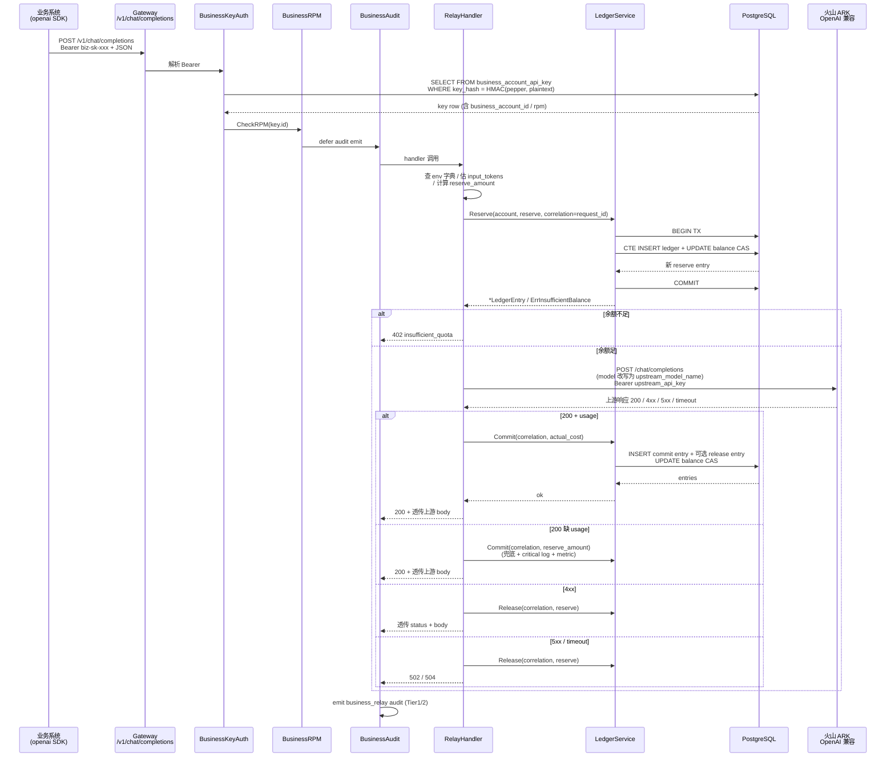
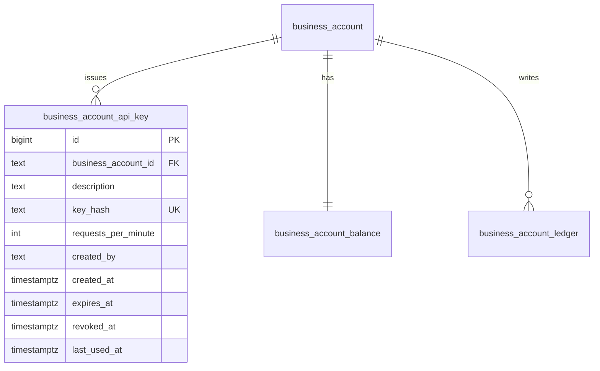

# Phase 2 工作流 F-min — 首个 provider 接入（OpenAI 兼容同步 Relay）

## Overview

接入网关第一个上游 provider（火山引擎 ARK，OpenAI 兼容协议），打通业务系统接入 → KeyAuth → Reserve → 调上游 → Settle 扣费 → 透传响应的完整闭环。MVP 限定**同步非流式 chat completions only**，硬编码 1 条 model 字典（env 配置）。

D-min（Admin API）让运维能给业务系统发凭据 + 充值，但网关"能收钱花不出去"。F-min 让网关真正具备"花钱"能力，验证 ledger.Reserve/Commit/Release 在 relay 路径下的端到端正确性，同时为未来扩展（流式 / 异步 task / 多 channel 路由 / billingexpr DSL）奠定 provider adapter 抽象基础。

## Problem Frame

D-min 落地后业务系统能接入网关但调用网关 = 调用一个不会调用任何上游的空壳。要让网关有真业务价值，必须接入至少 1 个上游 provider。

**为什么选 OpenAI 兼容同步**：
- **OpenAI chat completions schema 是行业标准**，业务方可直接用 openai-python / openai-node SDK 改 base_url 即接入，零学习成本
- **同步非流式最简可验证闭环**：Reserve → HTTP call → Settle 单次请求完成；流式 SSE 边 stream 边 token 累计计费的复杂度推 P1+
- **国内 provider 选 ARK**：豆包 1.5/1.6 系列 OpenAI 兼容；国内可访问；同家未来扩展异步视频（seedance）可复用凭据 envelope encryption 设计
- **硬编码 1 条字典最小化基础设施**：先证明 catalog → adapter → relay 抽象可行，再扩到多条（YAML）或 DB 表 + admin-cli CRUD

**为什么不选异步任务 / Channel CRUD / billingexpr DSL 起步**：
- 异步任务（火山 seedance）涉及 task 状态机 + outbox webhook + polling 全链路，最少 4-5 周
- Channel CRUD HTTP + admin-cli channel 子命令 + envelope encryption 是 D-min admin token 量级的独立工作流
- billingexpr DSL（v1/v2/vp 版本）是设计文档 §9 重头戏，至少 2 周
- 三者全推 P1+，本 MVP 用 env 单字典 + 硬编码 input/output × token 公式撑住

## Requirements Trace

- **R1.** 业务系统通过 `Authorization: Bearer <biz-key>` 调 `POST /v1/chat/completions`，请求体 JSON 符合 OpenAI chat completions schema
- **R2.** 网关 BusinessKeyAuth 中间件：解析 plaintext → `HMAC-SHA-256(pepper, plaintext)` hex 查 `business_account_api_key` 表 → 注入 `business_account_id` + `api_key_id` 到 ctx；失败 401 OpenAI 兼容错误
- **R3.** 网关按 env 字典查 model 元数据（业务可见名 / 上游 base_url / 上游 model 名 / input/output 单价 / max_context_tokens）；MVP 仅 1 条
- **R4.** 接 LedgerService.Reserve：预估 `reserve = ceil((input_tokens × input_price + max_tokens × output_price) / 1_000_000)` minor；余额不足 → 402 `insufficient_quota`
- **R5.** HTTP 客户端（net/http，timeout 60s）调上游 ARK `POST /chat/completions`：body 改写 `model` → upstream_model_name；header 注入 upstream Authorization；其他 OpenAI 兼容字段（messages / temperature / tools / etc.）透传
- **R6.** 上游响应处理：
  - 200 + 含 usage → `actual_cost` 按 usage 实算 → `LedgerService.Commit(correlation_id=request_id, actual_cost)`（ledger 自动 release 多余 reserve）
  - 200 但**无** usage → 兜底 commit reserve 全额 + critical log + bump metric
  - 4xx → `LedgerService.Release(correlation_id, reserve)` + 透传上游 status + body
  - 5xx / 网络错 → Release + 502
  - timeout → Release + 504
- **R7.** 上游响应整体 JSON body 透传给业务（含 usage / id / choices / etc.）；网关不修改字段命名
- **R8.** 业务 audit：Tier2 默认；status 401 / 402 / 5xx → Tier1；**不**记 messages body（PII / prompt 敏感）；记 business_account_id / api_key_id / gateway_model / upstream_model / input_tokens / output_tokens / cost_minor / status / upstream_status / duration_ms / request_id
- **R9.** admin-cli `business-key create / list / revoke` 三子命令；与 admin-cli token 命令同形态（一次性 plaintext + --out 文件 0600 + 三态 revoke）
- **R10.** schema：`business_account_api_key` 表（id / business_account_id FK / description / key_hash / requests_per_minute / created_by / created_at / revoked_at / last_used_at）；key_hash UNIQUE
- **R11.** 业务 RPM 限速（key.id 维度，进程内 ring buffer，模仿 admintoken.InProcessRPM）；body 1 MiB 上限
- **R12.** 错误响应统一 OpenAI 兼容 `{"error":{"message","type","code"}}` 形状；业务 SDK 能正常解析
- **R13.** 流式请求（`stream: true`）显式拒 400 `streaming_not_supported`（不静默改为 false）
- **R14.** 新增 metric：`gateway_relay_request_total{model, upstream_status}` / `gateway_relay_reserve_failed_total{reason}` / `gateway_relay_settle_failed_total{phase, reason}` / `gateway_relay_token_cost_minor_total{model}` / `gateway_relay_upstream_duration_seconds` / `gateway_relay_upstream_missing_usage_total` / `gateway_business_api_auth_failed_total{reason}` / `gateway_business_api_rate_limited_total{key_id}` / `gateway_business_api_body_too_large_total`

## Scope Boundaries

**P0 不做（推 P1+）**：

- ❌ **流式 SSE**（`stream: true` 边 stream 边计费 token）—— MVP 显式拒 400；P1 需要独立工作流（涉及 SSE 协议解析 + token 累计 + 客户端断开 Settle 策略）
- ❌ **异步 task**（火山 seedance / Kling / Midjourney 等）—— 涉及 task 状态机 + outbox webhook + TaskFinancialSnapshot；独立工作流
- ❌ **Channel CRUD HTTP API + admin-cli channel 子命令**（含 envelope encryption 上游凭据）—— MVP 用 env 单字典；P1 接第二个 provider 时一起做
- ❌ **多条 model 字典**（YAML 文件 / DB 表）—— MVP 1 条 env；P1 升级
- ❌ **channel_routing_rule + fallback policy**（条件表达式路由 / strict / next_rule / global_pool / legacy 4 套）—— MVP 单 channel 无需路由；P1 多 channel 时做
- ❌ **billingexpr DSL**（v1/v2/vp 版本）—— MVP 硬编码 input × in_price + output × out_price 公式；P1 接入复杂计费时做
- ❌ **isolation_required 路由**（企业隔离 channel）—— MVP 单 channel 不分隔离
- ❌ **outbox 事件**（同步 relay 业务方已在 HTTP response 拿到结果，不需要 webhook 回调）—— P1 异步 task 时启用
- ❌ **Idempotency-Key 头**（业务侧请求级幂等）—— OpenAI 也不支持；MVP 不做，业务方应在自己侧实现
- ❌ **业务侧 Key 的 scope / IP allowlist**（admintoken 那套细粒度）—— MVP 一个 key 全权限；与 OpenAI / DeepSeek 风格一致
- ❌ **业务 Key HTTP API**（暴露给运营 UI）—— MVP admin-cli only
- ❌ **Reserve 自动 expire**（孤儿 reserve 自动 release）—— MVP 运维 SOP 兜底；P1 加 expire job
- ❌ **业务侧 body header / IP 转发给上游**（PII 防护）—— 永久不做
- ❌ **token 精确估算**（tiktoken / 上游 tokenizer）—— MVP 用 `len(serialized JSON) / 4` 上界估算；P1 视精度反馈决定是否引依赖（需 ADR）

**P0 不实装但保留扩展点**：

- `business_account_api_key.requests_per_minute` 字段已加；MVP middleware 强制执行
- `business_account_api_key.last_used_at` 字段已加；鉴权命中 best-effort 异步更新（不阻塞主路径；MVP 实现细节）

## Context & Research

### Relevant Code and Patterns

**LedgerService（已稳定，本工作流 1:1 复用）：**
- `internal/ledger/service.go` — `Reserve(ctx, actor, ReserveParams)` / `Commit(ctx, actor, CommitParams)` / `Release(ctx, actor, ReleaseParams)` / `GetBalance(ctx, accountID)` 已稳定
- `internal/ledger/postgres.go` — Reserve 含 CAS frozen=false AND available>=amount；Commit 同事务可能产 commit + release 两条 entry（自动 release 多余 reserve）；Release 不查 frozen（管理动作允许）
- `internal/ledger/actor.go` — `Actor{Type: ActorTypeAdminToken, ID}` 已为 relay 路径预留；本工作流引入 `ActorTypeBusinessKey` 新枚举值

**admintoken 包（business 对称镜像）：**
- `internal/admintoken/service.go` / `postgres.go` — Service 接口 + CRUD + HMAC pepper hash；business 包 1:1 镜像设计
- `internal/admintoken/throttle_rpm.go` — InProcessRPM（sync.Map + timestamp slice + GC + cold-start hook）；business RPM 1:1 复制代码不强行抽象 generic
- `internal/admintoken/errors.go` — sentinel 命名风格
- `internal/admintoken/testutil.go` — 测试 helpers 风格

**HTTP middleware（admin 链对称参考）：**
- `internal/httpapi/middleware/admin_body_limit.go` — MaxBytesReader 模式；business 调大到 1 MiB
- `internal/httpapi/middleware/admin_token_auth.go` — Bearer 提取 + IP 校验 + sentinel 映射；business 简化掉 IP 校验
- `internal/httpapi/middleware/admin_throttle.go` — RPM + circuit 二级 throttle；business MVP 只做 RPM（无 circuit）
- `internal/httpapi/middleware/admin_audit.go` — defer panic-safe + request_hash + Tier router；business 复制结构 + 调整 Tier 决策规则

**audit 包（业务 audit 直接复用）：**
- `internal/audit/sink.go` / `logger.go` — Sink interface + Tier1 SyncFileSink + Tier2 AsyncStderrSink；business audit 共用同一 logger / sink

**admin-cli 子命令（business-key 对称参考）：**
- `cmd/admin-cli/cmd/token.go` — 输出模式互斥 / refund 守护 / 三态 revoke / exitCoder 接口；business-key 复用 stdout/--out 模式（不需要 refund 守护）
- `cmd/admin-cli/cmd/cli_wiring.go` — OpenServices + CLIServices 注入风格

**配置与 metrics：**
- `internal/config/config.go::validate` — fail-fast 链式校验；本 plan 加 8 个 RELAY_* env 验证
- `internal/obs/metrics.go` — 集中 Metrics struct + reg.MustRegister 模式

**schema 迁移：**
- `migrations/0001_init.up.sql` 中 business_account 表已存在；本 plan 加 0004 引用其 PK 作 FK
- `migrations/0003_admin_token_usage_and_circuit.up.sql` — 多表 + 外键 + CHECK 风格模板

### Institutional Learnings

来自 Phase 2 工作流 D-min 已踩过的坑（适用本工作流）：

- **sqlc 命名规约**：query 文件名不要以 `_` 开头
- **pgxpool 配置**：用 `MaxConns / MinConns`；并发测试 100 goroutine 时 pool size = 30 足够（PG 默认 max_connections=100，多包并行测试时合理共享）
- **测试隔离**：每个测试用唯一 description / accountID 前缀，cleanup 用 LIKE 删除；不 TRUNCATE 全表（与其他包并行测试不打架）
- **slog redactor 副作用**：`(?i)key|token|secret|cookie|authorization` regex 会误中 `advisory_lock_key` / `upstream_api_key` 等内部字段；P0 接受 false positive；P1 视需要收紧 pattern
- **CAS 冲突**：50 goroutine 写同账户余额会大量 503 version_conflict；handler 不内部重试 ErrVersionConflict（与 LedgerService 一致）；测试用"不同账户"验证 daily counter 原子性
- **fail-fast 启动校验**：production 模式所有 secret / TLS / pepper 缺失即拒启动（决策 D1 + D5 in D-min）；本 plan 同套模式扩展到 RELAY_* env

### External References

跳过外部 deep research：
- **OpenAI chat completions schema** 是公开行业标准，参考 https://platform.openai.com/docs/api-reference/chat（不强依赖任何 docs，请求字段透传即可）
- **火山引擎 ARK** OpenAI 兼容端点 `https://ark.cn-beijing.volces.com/api/v3` 由用户提供凭据后实测验证；模型 ID 示例 `doubao-1-5-pro-32k-250115`
- **token 估算** MVP 用 `len(serialized JSON) / 4` 上界估算；不引入 `github.com/pkoukk/tiktoken-go`（数据文件 ~50MB；与豆包实际 BPE 也不同源；over-estimate 由 settle 真实 usage 退回）

## Key Technical Decisions

### D1. Reserve 计算公式

**决策**：
```
reserve_amount_minor = ceil(
    (input_tokens_estimate × price_input_per_1m_minor
     + max_tokens_or_default × price_output_per_1m_minor)
    / 1_000_000
)
```

- `input_tokens_estimate = len(json.Marshal(messages)) / 4`（保守上界；中文每字符 ≈ 1 token，英文每 4 字符 ≈ 1 token；除 4 对中文过保守但合理）
- `max_tokens_or_default`：业务请求 `max_tokens` 字段，缺失时取字典 `max_context_tokens`
- 单位 minor（CNY 分）；ceil 向上取整（少花钱不允许）

**Why**：上界估算让 reserve 永远 ≥ actual_cost，避免"Reserve 通过但 Settle 时 ledger 报余额不足"（不可能发生，因 Commit ≤ Reserve 是 ledger 入口校验）。商业平台稳定 > 优雅（CLAUDE.md §六）。

**Why not tiktoken**：50MB 数据文件膨胀镜像 + 豆包用 ByteDance 自家 BPE 与 OpenAI cl100k 不同源 → 即便引入也估算不准；MVP 由 settle 真实 usage 退回多余 reserve 已足够。

**How to apply**：`internal/relay/handler.go::estimateReserve(req, modelEntry) → int64` 单一函数集中公式；改 1 行即可换算法。

### D2. Settle 时机与 commit 失败重试

**决策**：

| 上游响应 | 动作 |
|---|---|
| 200 + 含 usage | `actual_cost` 按 usage 真实算 → `Commit(correlation_id, actual_cost)` |
| 200 + **缺** usage | log critical + bump `relay_upstream_missing_usage_total` + `Commit(correlation_id, reserve_amount)` 兜底 |
| 4xx | `Release(correlation_id, reserve_amount)` + 透传上游 status + body |
| 5xx / 网络错 / 连接拒绝 | `Release(correlation_id, reserve_amount)` + 返 502 |
| timeout（60s 客户端）| `Release(correlation_id, reserve_amount)` + 返 504 |

**Commit / Release 重试策略**：3 次指数退避（100ms / 300ms / 1s）应对 CAS 冲突或瞬时 DB 故障；永久失败 → critical log + bump `relay_settle_failed_total{phase, reason}` + **不**向业务返错（业务已收到 HTTP 响应；可能 orphan reserve 由运维 SOP 兜底）。

**Why "上游 200 无 usage 兜底 commit 全 reserve"**：
- ARK / OpenAI / DeepSeek 标准响应都含 usage；缺失即 provider bug
- 兜底 over-charge 比 orphan reserve 安全（绝不让客户"花了网关算力但 ledger 没扣钱"）
- bump metric 让运维知晓异常

**Why 重试 3 次而不内部重试 ErrVersionConflict**：
- CAS 冲突在 Settle 阶段实际罕见（reserve 已锁定该账户对应 row；唯一冲突源是其他 reserve / freeze 操作并发）
- 3 次足够覆盖瞬时冲突；永久失败说明 DB 层有更深问题
- 与 D-min admin handler 不重试 ErrVersionConflict 的策略一致（business 重试由业务方负责），但此处 Settle 是网关内部 housekeeping 而非业务请求级别，允许重试

**Why 永久失败不返业务错误**：
- 业务方已收到上游响应；返错让业务方困惑（看到 200 内容但 status=500）
- Orphan reserve 是网关内部 bookkeeping 问题，业务方无处理路径
- 运维通过 metric + SOP 处理

**How to apply**：`internal/relay/handler.go::settle(ctx, outcome) error` 内部循环重试；导出 metric `gateway_relay_settle_failed_total{phase, reason}` 让运维告警。

### D3. 请求与响应透传规则

**决策**（OpenAI 兼容协议；网关只做必要改写）：

**入口请求改写**：
- 解析 body 为 `map[string]any`（保留所有字段，不做 typed struct）
- 强制读 `model` (string)、`stream` (bool, 默认 false)、`max_tokens` (int, 可选)
- **改写**：`model` 字段值替换为字典 `upstream_model_name`
- **保留**：messages / temperature / top_p / tools / tool_choice / response_format / 等所有其他 OpenAI 兼容字段
- **拒绝**：`stream: true` 直接 400 `streaming_not_supported`（MVP 不静默改 false）
- **拒绝**：`max_tokens > max_context_tokens` 直接 400 `invalid_request_error code=max_tokens_exceeds_context`

**入口 header 处理**：
- 接收 Bearer biz-key 后**不**转发给上游
- 上游 Authorization 用字典 `upstream_api_key` 重写
- 业务侧其他 header（X-Forwarded-For / User-Agent / Cookie / 等）**不**转发给上游（PII 防护 / 减少上游攻击面）
- 仅向上游发：`Authorization: Bearer <upstream_api_key>` + `Content-Type: application/json`

**响应透传**：
- 上游 JSON body 整体透传给业务（含 id / choices / usage / created / model / object / system_fingerprint / 等）
- 上游 status 透传（4xx 不重写）
- **不**透传上游 header（包括 `x-request-id` 等）；仅响应网关自己的 `X-Request-Id`

**Why 不 typed struct 入口**：
- OpenAI 协议字段每月可能新增（tool_use / json_mode / parallel_tool_calls / etc.）；strict struct 会让网关无法透传新字段
- `map[string]any` + 必读字段提取 + map 重赋值是最稳定的 forward-compatible 写法

**Why header 不透传**：
- 业务方 IP / UA / Cookie 含 PII 信息；网关无理由暴露给上游
- 上游侧 rate limit / 防滥用应针对网关全局凭据，而非业务方个体 IP

**How to apply**：`internal/relay/openai_compat.go::buildUpstreamRequest(*ChatRequest, modelEntry) *http.Request` 集中改写；不在 handler 散落逻辑。

### D4. 业务侧 API Key 鉴权

**决策**：
- Bearer header `Authorization: Bearer biz-sk-xxx`（与 admin token 一致）
- plaintext 32 字节 CSPRNG → base64url 编码（~43 字符）
- 存储：`HMAC-SHA-256(GATEWAY_TOKEN_PEPPER, plaintext)` hex（64 字符）
- 失败 401 OpenAI 兼容错误 `type: invalid_api_key, code: invalid_api_key`
- **不实装 scope**（MVP 一个 key 全权限，与 OpenAI / DeepSeek 一致）
- **不实装 IP allowlist**（业务系统通常多 region 接入；MVP 简化；P1 视反馈加）
- **复用 GATEWAY_TOKEN_PEPPER**（不新增 BUSINESS_KEY_PEPPER）：少一个运维负担 + 两套 hash 命名空间天然区分（一个查 admin token 表，一个查 business key 表）；P1 视反馈分离

**Why no scope**：OpenAI / DeepSeek 风格；业务系统每个 key 通常代表一个完整接入身份。如要细粒度（"这个 key 只能调 model X"），P1 加 scope 字段。

**Why no IP allowlist**：admin 是运维偶尔操作，IP 来源固定（运维办公室 / jump host），allowlist 有意义；业务 API 是高频自动化调用，IP 可能来自任意 region，强制 allowlist 反而增加运维负担。

**Why 复用 pepper**：
- ✅ 少一个 env 配置 + 备份 SOP 项
- ✅ 两套表 hash 不冲突（同 plaintext 出同 hash，但只有 admin 表查 admin 路径、business 表查 business 路径）
- ❌ 若 admin pepper 因泄漏被轮换，business 全部 key 同时失效（运维 SOP 应明示）
- 决策：MVP 复用；P1 加 BUSINESS_KEY_PEPPER env，向后兼容（不设即 fallback 到 GATEWAY_TOKEN_PEPPER）

**How to apply**：`internal/businesskey/postgres.go::hashKey(plaintext) → hex` 复用 admintoken 同算法。

### D5. business_account_api_key schema

**决策**：

| 字段 | 类型 | 说明 |
|---|---|---|
| `id` | bigserial PK | 自增 |
| `business_account_id` | text NOT NULL FK | → business_account(id) ON DELETE CASCADE（账户删除时 key 一起失效）|
| `description` | text NOT NULL | 运营标签，如 "creator-platform-prod-key-1" |
| `key_hash` | text NOT NULL UNIQUE | HMAC-SHA-256(pepper, plaintext) hex (64 char) |
| `requests_per_minute` | int NULL | NULL = 不限速 |
| `created_by` | text NOT NULL | "cli:bootstrap" 硬编码（MVP）|
| `created_at` | timestamptz NOT NULL DEFAULT NOW() | |
| `revoked_at` | timestamptz NULL | revoke 时写入；查询 query 含 WHERE revoked_at IS NULL |
| `last_used_at` | timestamptz NULL | 鉴权命中时 best-effort 异步更新（不阻塞主路径）|
| `updated_at` | timestamptz NOT NULL DEFAULT NOW() | |

- UNIQUE `(key_hash)` —— 鉴权热路径单 row lookup
- INDEX `(business_account_id) WHERE revoked_at IS NULL` —— 运维查"账户 X 有几个 key 在用"
- FK `business_account_id → business_account(id) ON DELETE CASCADE`

**Why FK CASCADE**：删账户时 key 自动失效，避免"账户删了但 key 还能 auth"的安全漏洞。

**Why `last_used_at` 异步更新**：
- 鉴权热路径每次 update 都打到 DB 会成为瓶颈
- 策略：使用一个 sync.Map 缓存"最近更新过的 key_id"，每 5 分钟批量 UPSERT 一次；写失败不阻塞
- 用途：运维清理"长期未用的 key"（如 `WHERE last_used_at < NOW() - INTERVAL '90 days'`）

**Why no scope / IP allowlist 字段**（D4 决策）：MVP 不存；P1 加（向后兼容 ADD COLUMN）。

### D6. 路由 path & engine 装配

**决策**：
- Path：`POST /v1/chat/completions`（OpenAI 兼容根路径）
- 路由组：`engine.Group("/v1")` 与 `engine.Group("/admin/v1")` 平级
- 业务方 SDK 配置：`base_url=https://gateway.example.com/v1`
- 不在 admin 路由组下（业务流量与运维流量隔离 metric label / audit Tier 决策不同）

**Why /v1**：业务方直接复用 openai-python / openai-node SDK 默认 base url 形态。

**How to apply**：main.go 装配 `g := engine.Group("/v1"); g.POST("/chat/completions", ...)`；business middleware 仅装在 g 上。

### D7. 业务侧 RPM 实现

**决策**：新写 `internal/businesskey/throttle_rpm.go`，**1:1 复制** `internal/admintoken/throttle_rpm.go` 的 InProcessRPM 实现，按 `key.id` 维度计数。

**Why 复制不抽象 generic**（CLAUDE.md §六 稳定 > 优雅）：
- generic InProcessRPM 需要 type parameter (tokenID vs keyID)，单元测试要双倍
- admin / business 未来可能各自演化（admin 加 IP 维度 / business 加 account 维度），抽离后会有方向冲突
- 代码 ~150 行复制成本远低于抽象维护成本
- 文件并列让 reviewer 一眼看出"两套独立"

**Differences from admintoken RPM**：
- 字段名 `keyID` 替换 `tokenID`
- cold-start metric 名 `gateway_business_throttle_rpm_cold_start_total`
- 其他逻辑（sync.Map / timestamp slice / 二分裁窗 / GC / cold-start hook / Check 方法）字符级一致

### D8. Audit Tier 决策规则

**决策**（区别于 admin 的 path-based 规则）：

| 触发条件 | Tier |
|---|---|
| status == 401（auth 失败）| Tier1（攻击信号）|
| status == 402（余额不足）| Tier1（资金信号）|
| status >= 500（系统错 / 上游 5xx / 超时）| Tier1（故障信号）|
| status == 400 / 413 / 429 / 上游 4xx 透传 | Tier2（高频低安全意义）|
| 2xx | Tier2 |

**Why 400 / 413 / 429 走 Tier2**：恶意业务方可能高频发非法请求；若每条都同步 fsync 会拖慢 p99；这些事件本身无安全意义（误配置 / 限速）。

**审计 record 内容**（**不**记 messages body）：

```json
{
  "event": "business_relay",
  "tier": 2,
  "request_id": "...",
  "timestamp_utc": "...",
  "business_account_id": "tenant-001",
  "api_key_id": 42,
  "gateway_model": "gw-default",
  "upstream_model": "doubao-1-5-pro-32k-250115",
  "upstream_provider_type": "openai_compat",
  "input_tokens": 123,
  "output_tokens": 456,
  "reserve_amount_minor": 1500,
  "cost_minor": 1023,
  "status": 200,
  "upstream_status": 200,
  "duration_ms": 1234,
  "upstream_duration_ms": 987,
  "outcome_code": "ok"
}
```

**Why 不记 messages body**：
- 含用户 prompt / PII / 敏感信息
- audit retention 周期长（≥ 1 年），存这些会膨胀存储 + 增加合规风险
- 业务方应在自己侧记 prompt（如有审计需求）

**How to apply**：`internal/httpapi/middleware/business_audit.go::resolveTier(status int) audit.AuditTier`。

### D9. 错误响应 OpenAI 兼容映射

**决策**：完整映射表

| 内部 sentinel / 触发场景 | HTTP | error.type | error.code |
|---|---|---|---|
| Bearer header 缺失 / 格式非法 / 空 token | 401 | `invalid_api_key` | `missing_api_key` |
| key plaintext hash 不存在 / 已 revoked | 401 | `invalid_api_key` | `invalid_api_key` |
| `ledger.ErrAccountNotFound` | 401 | `invalid_api_key` | `account_not_found` |
| `ledger.ErrAccountFrozen` | 402 | `insufficient_quota` | `account_frozen` |
| `ledger.ErrInsufficientBalance` | 402 | `insufficient_quota` | `insufficient_quota` |
| body parse fail / 缺 model / messages 空 | 400 | `invalid_request_error` | `invalid_request` |
| `stream: true` | 400 | `invalid_request_error` | `streaming_not_supported` |
| `max_tokens > max_context_tokens` | 400 | `invalid_request_error` | `max_tokens_exceeds_context` |
| body > 1 MiB | 413 | `invalid_request_error` | `payload_too_large` |
| RPM 超阀门 | 429 | `rate_limit_exceeded` | `rate_limit_exceeded` |
| 上游 4xx | passthrough status | `upstream_error` | `upstream_<status>` |
| 上游 5xx | 502 | `upstream_error` | `upstream_5xx` |
| 上游 timeout (60s) | 504 | `upstream_timeout` | `upstream_timeout` |
| 上游 connection refused / DNS fail | 502 | `upstream_error` | `upstream_unreachable` |
| `ledger.ErrVersionConflict` | 503 | `server_error` | `temporarily_unavailable` |
| Reserve 其他 / settle 失败 / panic | 500 | `api_error` | `internal_error` |

**Why 4xx 上游 status 透传**：业务方根据 4xx 反应（修改请求参数 / 不重试）；网关重写会丢失上游具体提示。

**Why 5xx 上游 → 502 不透传**：5xx 透传会让业务方误解为网关自己错；502 明示"上游网关错"，与 HTTP 规范一致。

**How to apply**：`internal/relay/errors.go::MapError(c, err) / MapUpstreamStatus(c, status, upstreamBody)` 集中映射。

### D10. HTTP 客户端配置

**决策**：

- 标准库 `net/http`；不引第三方依赖
- 复用全局 `http.Client`（main.go 装配时构造单实例）；避免每请求建连
- `Timeout: 60 * time.Second`（总超时；包含 DNS + connect + TLS + write + read）
- `Transport: &http.Transport{...}` 显式配置：
  - `MaxIdleConns: 100` / `MaxIdleConnsPerHost: 20`
  - `IdleConnTimeout: 90 * time.Second`
  - `TLSHandshakeTimeout: 10 * time.Second`
  - `ResponseHeaderTimeout: 30 * time.Second`（保护慢上游 stall）
  - `ExpectContinueTimeout: 1 * time.Second`
- `Context cancel 传播`：业务方断开连接 → c.Request.Context() canceled → http.Client.Do 收到 ctx canceled → 上游连接断开 → Release reserve

**Why 60s 总超时**：豆包 1.5 pro 长上下文 + 长输出场景可能接近 30-45s；60s 兜底；P1 视实测调整。

**Why ResponseHeaderTimeout 30s**：避免上游 connect 后 stall 不发响应（DDoS-like）。

**How to apply**：`internal/relay/openai_compat.go::NewClient() *http.Client` 工厂；main.go 注入到 OpenAICompatAdapter。

### D11. Model 字典 env 字段精确

**决策**：

| Env | 类型 | 必填 | 示例 |
|---|---|---|---|
| `GATEWAY_RELAY_MODEL_NAME` | string | 是 | `gw-default` |
| `GATEWAY_RELAY_UPSTREAM_PROVIDER_TYPE` | string | 是 | `openai_compat`（MVP 唯一合法值；fail-fast 校验）|
| `GATEWAY_RELAY_UPSTREAM_BASE_URL` | string | 是 | `https://ark.cn-beijing.volces.com/api/v3`（不含尾 `/chat/completions`）|
| `GATEWAY_RELAY_UPSTREAM_API_KEY` | string | 是 | `<volcano-ark-key>`（明文 env；P1 envelope encryption）|
| `GATEWAY_RELAY_UPSTREAM_MODEL_NAME` | string | 是 | `doubao-1-5-pro-32k-250115` |
| `GATEWAY_RELAY_PRICE_INPUT_PER_1M_MINOR` | int64 | 是 | `800`（¥8/M tok）|
| `GATEWAY_RELAY_PRICE_OUTPUT_PER_1M_MINOR` | int64 | 是 | `2000`（¥20/M tok）|
| `GATEWAY_RELAY_MAX_CONTEXT_TOKENS` | int32 | 是 | `32768` |

**Fail-fast 校验**（`internal/config/config.go::validateRelay`）：
- 所有字段非空
- `UPSTREAM_PROVIDER_TYPE` 枚举校验：MVP 唯一合法值 `openai_compat`；非法值拒启动 + 错误提示扩展点
- `UPSTREAM_BASE_URL` 通过 `url.Parse` 校验 + scheme ∈ {http, https}
- 价格字段 > 0（0 = 免费会让 reserve 永远为 0，触发"无 reserve 直接 relay"的不安全路径）
- `MAX_CONTEXT_TOKENS` ∈ [1, 1_000_000]（防 typo）
- production 模式额外校验 scheme = https（防明文上游连接）

**Why 唯一硬编码 1 条**：MVP 验证 catalog 抽象；P1 升级到 `RELAY_CATALOG_FILE=/path/to/catalog.yaml` 多条；P2 升级到 DB 表 + admin-cli。

### D12. correlation_id 用 request_id

**决策**：
- LedgerService Reserve / Commit / Release 三个调用都用 `c.GetString(middleware.CtxKeyRequestID)` 作 correlation_id
- request_id 是 UUIDv7（middleware.RequestID 已分配；时间序）
- ledger schema 已含复合 UNIQUE `(business_account_id, correlation_id, entry_type)` 保证幂等

**Why request_id**：
- 全请求唯一 + 时间序便于排查
- Reserve→Settle 自然同一 correlation_id
- 业务方 retry 时拿到新 request_id → 新 Reserve（不会误命中已 commit 的 entry）—— 业务方应自己实现请求级幂等（如需）

**Why 不让业务方传 Idempotency-Key**：OpenAI 不支持；MVP 不做；业务方有需要时自己侧记录 request 状态。

### D13. Reserve 失败 / 不足走 402

**决策**：余额不足返 OpenAI 兼容 `{"error":{"type":"insufficient_quota","code":"insufficient_quota","message":"..."}}` + HTTP 402。

**Why 402 不 429**：
- OpenAI 自己用 429 type=insufficient_quota；但 429 语义混淆"超 rate limit 暂时不可用"vs"余额永久不足"
- HTTP 402 Payment Required 是 RFC 标准用法；语义最准确
- 业务方解析 type=insufficient_quota 即可识别

**Why message 不暴露具体余额数字**：泄漏账户金额给攻击者；只返"账户余额不足，请联系运营充值"。

### D14. CLI business-key 与 admin token 子命令的差异

**决策**：基于 `cmd/admin-cli/cmd/token.go` 复制 + 简化：

| 项 | admin token | business-key |
|---|---|---|
| 必填 flag | description / scope / ip-allowlist | description / business-account-id |
| scope 守护 | refund scope 二次确认 + multi-scope 警告 | **无 scope 概念**，不需要 |
| ip-allowlist | 必填 ≥ 1 CIDR | **无 IP allowlist**，不需要 |
| 阀门 flag | 7 个（recharge / refund / create / rpm / circuit）| 仅 `--rpm`（MVP 业务侧只有 RPM）|
| 输出模式 | stdout / --out / --encrypt-to | 同 |
| revoke 三态 | 不存在 / 首次 / 已 revoked | 同 |
| created_by | "cli:bootstrap" 硬编码 | 同 |

**子命令**：
- `admin-cli business-key create --description=<d> --business-account-id=<id> [--rpm=<n>] [--out=<file>]`
- `admin-cli business-key list [--business-account-id=<id>]`
- `admin-cli business-key revoke <id>`

**Why no scope / IP allowlist flag**（D4）：MVP 不存这些字段，CLI 也不暴露。

## Open Questions

### Resolved During Planning

- **Q1. 流式 SSE 是否本期做？** → 否（明确推 P1+ 独立工作流）
- **Q2. 业务侧 key 是否复用 admin pepper？** → 是（决策 D4）；P1 视需要分离
- **Q3. correlation_id 怎么生成？** → 用 middleware.RequestID UUIDv7（决策 D12）
- **Q4. 上游 200 但缺 usage 如何处理？** → 兜底 commit reserve 全额 + critical log + metric（决策 D2）
- **Q5. token 估算算法？** → MVP `len/4` 上界（决策 D1）；P1 视精度反馈决定是否引 tiktoken（需 ADR）
- **Q6. 业务方 header 是否转发上游？** → 否（PII 防护，决策 D3）
- **Q7. business-key 是否需要 IP allowlist / scope？** → MVP 都不需要（决策 D4 / D14）
- **Q8. RPM 实现复用 admintoken InProcessRPM 还是 generic？** → 复制不抽象（决策 D7）

### Deferred to Implementation

- **DI-1.** ARK 实际响应 shape 是否 100% OpenAI 兼容？如有 quirks（如 model 字段实际接受 endpoint_id vs model_name），需在 openai_compat_test.go 用真上游 smoke 验证
- **DI-2.** `last_used_at` 异步更新的批量间隔（5min / 10min）— 实施时按 metric 反馈调
- **DI-3.** Commit 失败重试的精确退避时间（100ms / 300ms / 1s 是初值，实施时按 CAS 冲突率调）
- **DI-4.** sqlc 生成代码字段精确名（实施时按 sqlc v1.30 输出为准）
- **DI-5.** ARK 是否需要特定 user-agent 或 region header？实施时若发现 401 看 ARK 文档增补

## High-Level Technical Design

> *本图说明意图与组件关系，不是实现规范。实施者按各 Unit 的 Files / Approach 落地，不必照搬框架细节。*

### 完整 relay 流程



### 中间件链顺序（关键约束）

```
全局链: recover → requestid → slog → otel → prom → cors
         ↓ 路由组 /v1/*
business 链: BusinessBodyLimit(1MB) → BusinessKeyAuth → BusinessRPM → BusinessAudit → RelayHandler
```

**为什么这个顺序**（参考 admin 链对称）：
- BodyLimit 最先：恶意大 body 在解析前拦截
- KeyAuth 第二：拿到 key 才能查 rpm / business_account_id
- RPM 第三：通过 auth 才计入限速
- Audit 最后：defer 模式保证 panic/abort 时也 emit；c.Next 后才知道 final status

### 数据模型增量（mermaid ER）



### 上游响应决策矩阵

| 上游 status | usage 字段 | ledger 动作 | 业务返回 status | 业务返回 body |
|---|---|---|---|---|
| 200 | 含 | Commit(actual_cost) | 200 | 透传上游 body |
| 200 | 缺 | Commit(reserve_amount) + critical log + metric | 200 | 透传上游 body |
| 4xx | n/a | Release(reserve) | 上游 status 透传 | 上游 body 透传（已是 OpenAI 兼容错误形状）|
| 5xx | n/a | Release(reserve) | 502 | `{"error":{"type":"upstream_error","code":"upstream_5xx",...}}` |
| timeout 60s | n/a | Release(reserve) | 504 | `{"error":{"type":"upstream_timeout",...}}` |
| connection refused / DNS fail | n/a | Release(reserve) | 502 | `{"error":{"type":"upstream_error","code":"upstream_unreachable",...}}` |
| ctx canceled (业务断开) | n/a | Release(reserve) | n/a（业务已断开）| n/a |

## Implementation Units

- [ ] **Unit 1: Schema 增量 + sqlc 查询（business_account_api_key 持久化层）**

**Goal:** 落地 `business_account_api_key` 表 schema + 生成 sqlc CRUD 代码。

**Requirements:** R10

**Dependencies:** 无（Phase 1 business_account 表已就绪）

**Files:**
- Create: `migrations/0004_business_account_api_key.up.sql`
- Create: `migrations/0004_business_account_api_key.down.sql`
- Create: `sql/queries/business_account_api_key.sql`
- Modify: `docs/db/schema.md`（追加 0004 演化）
- Test: 集成在 Unit 2 的 `internal/businesskey/postgres_test.go` 验证 query 正确性

**Approach:**
- 0004.up.sql：
  - `CREATE TABLE business_account_api_key`（字段见 D5 决策表）
  - UNIQUE on `key_hash`
  - INDEX `idx_business_account_api_key_account_active(business_account_id) WHERE revoked_at IS NULL` —— 运维查"账户 X 有几个 key 在用"
  - FK `business_account_id → business_account(id) ON DELETE CASCADE`
  - `COMMENT ON COLUMN business_account_api_key.key_hash IS 'HMAC-SHA-256(GATEWAY_TOKEN_PEPPER, plaintext) hex；与 admin token 共享同 pepper（D-min F-min 决策 D4）'`
- 0004.down.sql：`DROP TABLE business_account_api_key`
- sql/queries/business_account_api_key.sql：
  - `InsertBusinessKey`：入参 business_account_id / description / key_hash / requests_per_minute / created_by；RETURNING 全字段
  - `FindActiveBusinessKeyByHash`：`WHERE key_hash = ? AND revoked_at IS NULL`（鉴权热路径）
  - `FindBusinessKeyByID`：`WHERE id = ?`（不过滤 revoked，运维 / audit 用）
  - `RevokeBusinessKey`：`UPDATE ... SET revoked_at = COALESCE(revoked_at, NOW()) WHERE id = ? RETURNING id, revoked_at`
  - `ListActiveBusinessKeysByAccount`：`WHERE business_account_id = ? AND revoked_at IS NULL ORDER BY created_at DESC`；**不**返 key_hash
  - `ListAllActiveBusinessKeys`：（全 account 列表，admin-cli list 用）；同样**不**返 key_hash
  - `TouchBusinessKeyLastUsed`：`UPDATE ... SET last_used_at = NOW() WHERE id = ?`（best-effort batch 用）

**Patterns to follow:**
- `migrations/0003_admin_token_usage_and_circuit.up.sql` 风格与命名
- `sql/queries/admin_token.sql` 命名参数 + 复合查询

**Test scenarios:** （落到 Unit 2 一起）

**Verification:**
- `make migrate-up && make migrate-down && make migrate-up` 双向幂等
- `make sqlc` 重新生成代码无 lint 报错
- `\d business_account_api_key` 看到 UNIQUE / FK CASCADE / 索引
- COMMENT 显式记录 pepper 复用决策

---

- [ ] **Unit 2: `internal/businesskey/` 域服务 + RPM**

**Goal:** Business API Key 的 CRUD + 鉴权校验 + RPM 限速封装到独立包；admintoken 包的 1:1 镜像（简化版）。

**Requirements:** R2, R10, R11

**Dependencies:** Unit 1

**Files:**
- Create: `internal/businesskey/types.go`（Key / CreateParams / ValidationResult）
- Create: `internal/businesskey/service.go`（Service 接口）
- Create: `internal/businesskey/errors.go`（sentinel：ErrKeyNotFound / ErrKeyRevoked / ErrRPMExceeded / ErrInvalidParam）
- Create: `internal/businesskey/postgres.go`（PostgresService 实现 + HMAC pepper hash + last_used_at 异步批量更新）
- Create: `internal/businesskey/rowmap.go`（sqlc Row → Key 转换）
- Create: `internal/businesskey/throttle_rpm.go`（InProcessRPM；1:1 复制 admintoken 同名文件）
- Create: `internal/businesskey/testutil.go`（mustOpenTestPool / cleanupKeys / newTestService）
- Test: `internal/businesskey/postgres_test.go`（CRUD + hash 一致性 + revoked / last_used_at）
- Test: `internal/businesskey/throttle_rpm_test.go`（RPM ring buffer / GC / cold-start）

**Approach:**
- `Service` 接口方法：
  - `Create(ctx, params CreateParams) (*Key, plaintext string, error)` —— 32 字节 CSPRNG → base64url → HMAC pepper → INSERT
  - `ValidateByPlaintext(ctx, plaintext string) (*ValidationResult, error)` —— hash 查表 → 返回 ValidationResult（不含 hash）
  - `Revoke(ctx, id int64) (alreadyRevoked bool, err error)` —— COALESCE 保留首次 timestamp
  - `ListByAccount(ctx, accountID string) ([]*Key, error)` / `ListAll(ctx) ([]*Key, error)`
  - `GetByID(ctx, id int64) (*Key, error)` —— 含已 revoked（运维 / audit 用）
  - `TouchLastUsed(ctx, id int64) error` —— 异步路径调用
- `Key` struct：与 schema 字段对齐；BusinessAccountID / Description / RequestsPerMinute *int32 / CreatedAt / RevokedAt *time.Time / LastUsedAt *time.Time
- `ValidationResult{Key *Key}`（不暴露 hash 给上层）
- PostgresService 持有 `pgxpool.Pool` + `pepper []byte` + slog.Logger；**复用 GATEWAY_TOKEN_PEPPER**（main.go 传入；fail-fast 校验在 Unit 7 config 中）
- `last_used_at` 异步更新策略：
  - `pendingTouches sync.Map[keyID int64] time.Time`
  - 鉴权热路径 `ValidateByPlaintext` 命中后调 `s.markTouched(key.ID)` —— 非阻塞，只写 sync.Map
  - 后台 goroutine `go s.flushTouchesLoop(ctx)` 每 5 分钟扫 sync.Map → batch UPDATE
  - PostgresService 提供 `Close()` 触发 flush 一次 + 停 goroutine
- RPM：1:1 复制 `internal/admintoken/throttle_rpm.go`，仅改命名（tokenID → keyID）和 cold-start metric 名

**Patterns to follow:**
- `internal/admintoken/service.go` / `postgres.go` 全套
- `internal/admintoken/throttle_rpm.go`（字符级复制）
- `internal/admintoken/testutil.go`（测试 helpers 形态）

**Test scenarios:**
- Happy: Create → plaintext 长度 ≥ 32 + DB key_hash = HMAC(pepper, plaintext)
- Happy: ValidateByPlaintext 命中正确 key → 返 ValidationResult.Key.BusinessAccountID 正确
- Edge: plaintext 经 admintoken 同 pepper 算出的 hash 与本包算出**完全相同**（验证 pepper 复用）
- Error: 未知 plaintext → ErrKeyNotFound
- Error: revoked key → ErrKeyNotFound（query 含 WHERE revoked_at IS NULL）
- Revoke 三态：首次成功 / 已 revoke 幂等返 alreadyRevoked=true / 不存在 → ErrKeyNotFound
- Revoke 二次保留首次 timestamp（COALESCE 验证）
- ListByAccount: 含 active 不含 revoked；不返 key_hash
- last_used_at 异步更新：触发 5 个 Validate → flush 后 DB 中 last_used_at 全部更新
- last_used_at flush 失败：不影响 main 路径（best-effort）
- FK CASCADE: 删 business_account → key 一并删
- Constructor panic: nil pool / pepper < 32 字节 / nil log
- RPM（throttle_rpm_test.go）：复用 admintoken 测试模式，仅换 keyID

**Verification:**
- `go test ./internal/businesskey/... -count=1` 全绿
- 覆盖率 ≥ 85%
- 与 admintoken 同 plaintext 算出同 hash（hex 字节级一致）

---

- [ ] **Unit 3: `internal/relay/` catalog + provider adapter（OpenAI 兼容）**

**Goal:** Model 字典 env 加载 + Provider Adapter 接口抽象 + OpenAI 兼容 adapter 实现。

**Requirements:** R3, R5

**Dependencies:** 无（独立于 ledger / businesskey；Unit 5 handler 才把它们 wire 一起）

**Files:**
- Create: `internal/relay/types.go`（ChatCompletionRequest / Response / Usage / ModelEntry struct）
- Create: `internal/relay/catalog.go`（CatalogLoader：从 config 加载 1 条 ModelEntry；P1 升级到多条接口不变）
- Create: `internal/relay/provider_adapter.go`（ProviderAdapter interface + Factory）
- Create: `internal/relay/openai_compat.go`（OpenAICompatAdapter 实现 + buildUpstreamRequest 改写 + parseUpstreamResponse）
- Create: `internal/relay/errors.go`（ErrUpstreamTimeout / ErrUpstreamUnreachable / ErrUpstreamMissingUsage 等 sentinel + OpenAI 兼容错误格式化函数 `WriteErrorJSON(c, status, type, code, message)`）
- Test: `internal/relay/catalog_test.go`（env 加载 + fail-fast 校验）
- Test: `internal/relay/openai_compat_test.go`（mock 上游 httptest server：happy / 4xx / 5xx / timeout / 缺 usage）

**Approach:**

- `ModelEntry` struct（字典记录）：
  ```
  GatewayModelName        string
  UpstreamProviderType    string
  UpstreamBaseURL         string
  UpstreamAPIKey          string
  UpstreamModelName       string
  PriceInputPer1MMinor    int64
  PriceOutputPer1MMinor   int64
  MaxContextTokens        int32
  ```
- `Catalog` 接口（为 P1 扩展预留）：
  ```
  Lookup(gatewayModelName string) (*ModelEntry, bool)
  DefaultEntry() *ModelEntry  // MVP：业务传任何 model 都返这条
  All() []*ModelEntry         // 运维查询用
  ```
- `EnvCatalog` 实现：构造时持有 1 条 ModelEntry；`Lookup` 与 `DefaultEntry` 都返同一条（MVP 业务传 model 字段被 handler 忽略，但传错也不报错）
- `ProviderAdapter` 接口：
  ```
  type ProviderAdapter interface {
      ChatCompletion(ctx context.Context, modelEntry *ModelEntry, req *ChatCompletionRequest) (*ChatCompletionResponse, *http.Response, error)
  }
  ```
  - 返回 `*http.Response` 让 handler 能拿到 upstream status + 透传 body 给业务
- `OpenAICompatAdapter`：
  - 持有 `*http.Client`（main.go 注入）
  - `buildUpstreamRequest`：克隆 map[string]any body → 改 `model` 为 upstream_model_name → 重新 marshal → 用 modelEntry.UpstreamBaseURL + "/chat/completions" 构造 POST 请求 → 注入 Authorization Bearer upstream_api_key + Content-Type
  - 调用 client.Do(ctx)；解析 response body 为 `ChatCompletionResponse`（含 usage / choices）
  - 错误分类：
    - errors.Is(err, context.DeadlineExceeded) → ErrUpstreamTimeout
    - net.Error + Timeout() → ErrUpstreamTimeout
    - errors.Is(err, syscall.ECONNREFUSED) 等连接错 → ErrUpstreamUnreachable
    - status >= 500 → 返 nil response + nil error（handler 看 http.Response.StatusCode 决定行为）
    - status >= 400 → 同上（透传给业务）
    - status == 200 但解析失败（非 JSON）→ ErrUpstreamMalformed
    - status == 200 + usage 缺失 → 不在 adapter 内报错；返 response（包括缺 usage 的 raw body），handler 决策
- 工厂：`NewAdapter(providerType string, client *http.Client) (ProviderAdapter, error)`；MVP 唯一支持 `openai_compat`；未知值返 error（fail-fast）

**Patterns to follow:**
- `internal/audit/logger.go` 的 interface + impl 风格
- `internal/admintoken/postgres.go` 的 Constructor fail-fast 风格

**Test scenarios:**
- Catalog: env 全字段加载 → ModelEntry 字段精确匹配
- Catalog: env 字段缺失 → NewEnvCatalog 返 error（fail-fast）
- Catalog: UPSTREAM_PROVIDER_TYPE 非 openai_compat → error
- Catalog: UPSTREAM_BASE_URL 非 http/https → error
- Catalog: 价格字段 = 0 → error
- OpenAICompatAdapter：mock upstream 返 200 + 标准 usage → response 正确解析；body 完整
- OpenAICompatAdapter：mock upstream 返 200 但缺 usage 字段 → 不报错；handler 拿到 response.Usage = nil 决策
- OpenAICompatAdapter：mock upstream 返 400 + OpenAI 错误 body → 返 200<status<300 false；http.Response 含 4xx + body
- OpenAICompatAdapter：mock upstream 返 503 → 同上 5xx
- OpenAICompatAdapter：mock upstream sleep 70s + client timeout 1s → ErrUpstreamTimeout
- OpenAICompatAdapter：mock upstream port closed → ErrUpstreamUnreachable
- OpenAICompatAdapter：mock upstream 返 200 + 非 JSON → ErrUpstreamMalformed
- buildUpstreamRequest: 业务 body {"model":"gw-default","messages":[...]} → 上游 body model 字段值 = upstream_model_name；messages 完全透传
- buildUpstreamRequest: 业务 body 含 tools / temperature / top_p → 全字段透传到上游
- buildUpstreamRequest: 上游 header 只含 Authorization + Content-Type，无业务侧 header

**Verification:**
- `go test ./internal/relay/... -count=1`（不含 handler）全绿
- 覆盖率 ≥ 80%
- 不引第三方 HTTP 依赖（standard library only）

---

- [ ] **Unit 4: HTTP 业务中间件 4 件套（body_limit / key_auth / rpm / audit）**

**Goal:** 把 businesskey.Service / InProcessRPM + audit.Logger 编排成 Gin middleware 链，挂在 `/v1/*` 路由组下。

**Requirements:** R2, R8, R11

**Dependencies:** Unit 2

**Files:**
- Create: `internal/httpapi/middleware/business_body_limit.go`（MaxBytesReader 1 MiB）
- Create: `internal/httpapi/middleware/business_key_auth.go`（Bearer 提取 + Validate + ctx 注入）
- Create: `internal/httpapi/middleware/business_rpm.go`（CheckRPM by key.id）
- Create: `internal/httpapi/middleware/business_audit.go`（defer + Tier 决策 + record 构造）
- Test: `internal/httpapi/middleware/business_middleware_test.go`

**Approach:**

- 链顺序：`BusinessBodyLimit → BusinessKeyAuth → BusinessRPM → BusinessAudit → RelayHandler`

- `BusinessBodyLimit`：MaxBytesReader 包装 `c.Request.Body` 限到 1 MiB；超出 413 OpenAI 兼容 `type=invalid_request_error, code=payload_too_large` + bump `gateway_business_api_body_too_large_total`

- `BusinessKeyAuth(svc businesskey.Service, authFailedCounter *prometheus.CounterVec)`：
  - 从 `Authorization: Bearer xxx` 取 plaintext（复用 admin 的 extractBearerToken 逻辑或独立写）
  - svc.ValidateByPlaintext → 失败 401 OpenAI 兼容错误（按 D9 映射表）
  - 成功 → `c.Set(CtxKeyBusinessKey, vr)` + `c.Set(CtxKeyBusinessAccountID, vr.Key.BusinessAccountID)` + 异步触发 svc.TouchLastUsed（非阻塞 goroutine）

- `BusinessRPM(rpm *businesskey.InProcessRPM, rateLimitCounter *prometheus.CounterVec)`：
  - 从 ctx 拿 ValidationResult → CheckRPM(key) → 失败 429 + bump metric

- `BusinessAudit(logger audit.AuditLogger, auditWriteFailedCounter *prometheus.CounterVec)`：
  - **必须 defer 模式**（含 recover panic → emit Tier1 → re-panic 让 Recover 兜底）
  - record schema 按 D8 详列
  - Tier 决策：status ∈ {401, 402} OR status >= 500 → Tier1；其他 Tier2
  - 写失败 → bump `gateway_admin_audit_write_failed_total{tier, reason}` —— 复用 D-min 同 metric（统一 readiness 路径）
  - business audit 与 admin audit 共用 `audit.Logger`（注入同一实例；sink Tier1 SyncFileSink 同文件）

- 与 admin 链对称的设计要点：
  - 都是"BodyLimit → Auth → Throttle → Audit"骨架
  - business 简化：无 Scope（每 key 全权限）；无 Circuit（仅 RPM）
  - audit Tier 决策规则不同（D8 vs admin path-based）

**Patterns to follow:**
- `internal/httpapi/middleware/admin_body_limit.go` / `admin_token_auth.go` / `admin_audit.go` 全套结构（每文件 ~100-200 行）
- defer + recover + re-panic 模式（admin_audit.go 已实现）

**Test scenarios:**
- BodyLimit：1 MiB-1 字节 body → 200；1 MiB+1 字节 → 413 OpenAI 错误格式 + metric +1
- KeyAuth：missing header → 401 missing_api_key；bad scheme → 401；未知 plaintext → 401 invalid_api_key；revoked key → 401
- KeyAuth：合法 → ctx 注入 ValidationResult + business_account_id；handler 能读到
- KeyAuth：异步 TouchLastUsed 不阻塞 main 路径（即便 svc.TouchLastUsed 阻塞，handler 仍快速返回）
- RPM：rpm=2 → 第 3 次 429 OpenAI 错误格式 + metric +1
- RPM：rpm=nil → 100 次都通过
- Audit happy：emit 1 行 Tier2 record；含 business_account_id / api_key_id / 不含 messages body 字段
- Audit auth_failed：未带 Bearer → emit 1 行 Tier1（status 401）
- Audit 5xx：handler panic → defer recover → Tier1 emit (status 500) → re-panic → Recover middleware 写 500
- Audit 4xx 非 401/402：handler 返 400 invalid_request → Tier2（避免 fsync 拖慢）
- 全链路 smoke：BodyLimit + KeyAuth + RPM + Audit + 简单 fake handler → 200 + audit 1 行 + 无报错

**Verification:**
- `go test ./internal/httpapi/middleware/... -count=1` 全绿
- 覆盖率 ≥ 85%
- 业务 audit record JSON 无 messages body / 无 Bearer 明文（regex 断言）

---

- [ ] **Unit 5: `internal/relay/handler.go` Relay Handler（Reserve → Relay → Settle）**

**Goal:** 实装 `POST /v1/chat/completions` handler，整合 catalog + adapter + ledger 三层完成端到端 relay 闭环。

**Requirements:** R1, R3, R4, R5, R6, R7, R12, R13, R14

**Dependencies:** Unit 2, Unit 3, Unit 4

**Files:**
- Create: `internal/relay/handler.go`（RelayHandler struct + ChatCompletion method）
- Create: `internal/relay/token_estimate.go`（estimateInputTokens 简化算法 + 单元测试）
- Create: `internal/relay/handler_metrics.go`（HandlerMetrics struct + 注入 obs.Metrics 子集）
- Test: `internal/relay/handler_test.go`（mock upstream + 真 PG + 真 ledger）
- Test: `internal/relay/token_estimate_test.go`

**Approach:**

- `RelayHandler` struct：
  ```
  type RelayHandler struct {
      catalog   Catalog
      adapter   ProviderAdapter
      ledger    ledger.Service
      metrics   *HandlerMetrics
      logger    *slog.Logger
  }
  ```

- `ChatCompletion(c *gin.Context)` 流程：
  1. **入参解析**：bind body 为 `map[string]any`（保所有字段）；提取 `model` (string) / `stream` (bool) / `max_tokens` (int, 可选) / `messages` ([]any)
  2. **stream=true 拒绝**：400 streaming_not_supported
  3. **空 messages 拒绝**：400 invalid_request
  4. **查字典**：`catalog.DefaultEntry()`（MVP 唯一）
  5. **max_tokens 校验**：传入 > entry.MaxContextTokens → 400
  6. **估 input tokens**：`estimateInputTokens(messages)`
  7. **计算 reserve**：`reserveAmount = ceil((input_est × in_price + max_tokens_or_default × out_price) / 1_000_000)`
  8. **取 actor + correlation_id**：`actor = ledger.Actor{Type: ActorTypeBusinessKey, ID: strconv.FormatInt(api_key_id, 10)}`；correlation_id = c.GetString(CtxKeyRequestID)
  9. **Reserve**：`ledger.Reserve(ctx, actor, ReserveParams{AccountID: business_account_id, Amount: reserve, CorrelationID: correlation_id})` → ErrInsufficientBalance / ErrAccountFrozen → MapError 返 402；ErrAccountNotFound → 401
  10. **调上游**：`adapter.ChatCompletion(ctx, entry, req)` 返回 (resp, httpResp, err)
  11. **响应分流**：
      - err == ErrUpstreamTimeout → Release + 504
      - err == ErrUpstreamUnreachable → Release + 502
      - httpResp.StatusCode >= 500 → Release + 502（透传 status 不行因为 5xx 透传会让业务方误解；按 D9 改 502）
      - httpResp.StatusCode >= 400 → Release + 透传 status + body
      - 200 + usage 缺失 → Commit(reserve_amount) 兜底 + critical log + bump metric → 透传上游 body
      - 200 + usage → actual_cost = ceil((usage.prompt_tokens × in_price + usage.completion_tokens × out_price) / 1_000_000) → Commit(correlation_id, actual_cost) → 透传上游 body
  12. **响应透传**：直接 c.Writer.Write(httpResp.Body)；status / Content-Type 同上游
  13. **audit metadata**：在响应前调 `SetAuditOutcomeCode(c, code)` + 注入 input_tokens / output_tokens / cost_minor 到 ctx 供 audit middleware 读

- **Commit / Release 3 次重试**：
  ```
  for attempt := 0; attempt < 3; attempt++ {
      err := ledger.Commit(...) / Release(...)
      if err == nil { return }
      if errors.Is(err, ledger.ErrVersionConflict) {
          time.Sleep(retryBackoff[attempt])
          continue
      }
      // 其他 error 立即 critical log + bump metric + 返
      return
  }
  // 3 次都失败 → critical log + bump metric + 返（不阻塞业务响应）
  ```
  - retryBackoff = [100ms, 300ms, 1s]
  - metric：`gateway_relay_settle_failed_total{phase="commit"|"release", reason}`

- **estimateInputTokens(messages)** 算法：
  - serialize messages JSON → `len(json) / 4`
  - 单元测试覆盖：英文长 prompt / 中文长 prompt / 混合 / 空 messages / 含 tools field

- **HandlerMetrics**（依赖注入，便于测试）：
  - RequestTotal *prometheus.CounterVec{model, upstream_status}
  - ReserveFailedTotal *prometheus.CounterVec{reason}
  - SettleFailedTotal *prometheus.CounterVec{phase, reason}
  - TokenCostMinor *prometheus.CounterVec{model}  —— 累计花费
  - UpstreamDuration *prometheus.HistogramVec{model, status}
  - UpstreamMissingUsage *prometheus.CounterVec{model}

**Patterns to follow:**
- `internal/admin/business_account_handler.go` 的两步式（pre-check → ledger call → record-if-fresh）结构
- `internal/admin/handler.go::Whoami` 的简单 ledger 调用风格
- `internal/admin/errors.go::MapError` 集中错误映射风格

**Test scenarios:**

**Happy path（mock 上游）：**
- Mock upstream 200 + usage {prompt_tokens: 100, completion_tokens: 200} → Commit(actual_cost) → 业务返 200 + 完整上游 body；DB balance.available 减 actual_cost；ledger 有 reserve + commit + 可选 release entry
- Mock upstream 200 + 大 max_tokens reserve 远高于 actual usage → Commit 自动 release 多余 → balance.available 正确（reserve - actual_cost）
- 业务传任意 `model` 字段 → handler 改写为 upstream_model_name；mock upstream 验证收到 upstream_model_name

**Edge cases：**
- 业务 body 缺 messages → 400 invalid_request
- 业务 body messages = [] → 400 invalid_request
- 业务 body 缺 model → 400 invalid_request（OpenAI 协议必需）
- 业务 body stream=true → 400 streaming_not_supported
- 业务 body max_tokens = entry.MaxContextTokens → 200（边界允许）
- 业务 body max_tokens = entry.MaxContextTokens + 1 → 400 max_tokens_exceeds_context
- 业务 body 缺 max_tokens → reserve 用 entry.MaxContextTokens 默认

**Error path：**
- ErrAccountNotFound → 401 + 透传 OpenAI 兼容错误 type=invalid_api_key, code=account_not_found；ledger 无 reserve entry（reserve 直接失败）
- ErrAccountFrozen → 402 account_frozen
- ErrInsufficientBalance → 402 insufficient_quota
- Mock upstream 400 + OpenAI 错误 body → Release reserve + 业务返 400 + 透传上游 body（让业务 SDK 报错）
- Mock upstream 401 → Release + 业务返 401（上游凭据问题，运维侧）+ critical log（这是配置错误信号）
- Mock upstream 429（上游限速）→ Release + 透传 429
- Mock upstream 500 → Release + 502 upstream_5xx
- Mock upstream sleep 70s + client timeout 1s → Release + 504 upstream_timeout
- Mock upstream port closed → Release + 502 upstream_unreachable
- Mock upstream 200 + 缺 usage → Commit(reserve_amount) 兜底 + bump UpstreamMissingUsage metric + 业务返 200 + 透传上游 body

**Concurrent / settle 重试：**
- 同账户 50 goroutine 并发 relay 不同 correlation_id（每个 request 独立 request_id）→ 全部 200；ledger 累计 entries 数量正确；balance.available 最终 = recharge - SUM(actual_cost)
- Mock ledger.Commit 强制 1 次 ErrVersionConflict 然后成功 → handler 自动重试；audit emit 一行 normal Tier2（不暴露重试细节给业务）

**Settle 永久失败（mock ledger 强制 3 次失败）：**
- handler 不向业务返错（仍 200 + 透传上游 body）
- critical log 含 correlation_id / error
- bump `gateway_relay_settle_failed_total{phase="commit", reason="version_conflict"}`
- DB 中有 reserve 但无 commit/release entry（orphan reserve）

**透传断言：**
- 业务 body 含 tools / tool_choice / temperature / top_p / response_format → 全字段透传到上游
- 上游响应含 system_fingerprint / created / object → 全字段透传到业务
- 上游响应 header（如 x-request-id）**不**透传给业务
- 业务请求 header X-Forwarded-For / Cookie / User-Agent → **不**转发给上游
- 上游 Authorization 用 entry.UpstreamAPIKey，非业务 Bearer

**Audit 联动：**
- 业务 happy → audit record Tier2，含 input_tokens / output_tokens / cost_minor / upstream_status=200
- 业务 余额不足 → audit record Tier1（status=402），含 reserve_failed reason
- 上游 500 → audit record Tier1（status=502），含 upstream_status=500

**Verification:**
- `go test ./internal/relay/... -count=1 -timeout=180s` 全绿（含 handler + adapter + catalog）
- 覆盖率 ≥ 80%
- Reserve/Commit/Release 三方端到端一致：ledger.GetBalance 与 SUM(entries) 一致

---

- [ ] **Unit 6: admin-cli `business-key` 子命令**

**Goal:** 把 admin-cli token 模式镜像到 business-key；提供 create / list / revoke 三命令完成业务 key 自举。

**Requirements:** R9

**Dependencies:** Unit 2

**Files:**
- Create: `cmd/admin-cli/cmd/business_key.go`
- Modify: `cmd/admin-cli/cmd/cli_wiring.go`（CLIServices 加 BusinessKey 字段）
- Modify: `cmd/admin-cli/cmd/root.go`（注册 newBusinessKeyCmd）
- Test: `cmd/admin-cli/cmd/business_key_test.go`

**Approach:**

- `business-key create --description=<d> --business-account-id=<id> [--rpm=<n>] [--out <file>]`
  - 必填：description / business-account-id
  - 输出模式：默认 stdout（含 plaintext）+ stderr 反模式警告；--out 文件 0600 + O_EXCL 防覆盖；plaintext 仅一次性
  - stdout JSON：`{"id":1, "business_account_id":"...", "description":"...", "rpm":600, "created_by":"cli:bootstrap", "plaintext":"sk-..."}`
- `business-key list [--business-account-id=<id>]`
  - 可选 filter；stdout JSON 数组（不含 hash）
- `business-key revoke <id>`
  - 三态：不存在 exit 2 + stderr "key <id> 不存在"
  - 首次 exit 0 + stderr "✓ key <id> 已吊销"
  - 已 revoked exit 0 + stderr 醒目 "⚠️ key <id> 早在 <ts> 已吊销（本次操作无影响）"

- 与 admin-cli token 复用：`exitCoder` 接口（main.go 已识别）；`mustMarkFlagRequired` helper

**Patterns to follow:**
- `cmd/admin-cli/cmd/token.go` 全套结构（输出模式 / 三态 revoke / mustMarkFlagRequired）
- `cmd/admin-cli/cmd/cli_wiring.go::OpenServices` 注入新字段

**Test scenarios:**
- Happy: business-key create 必填齐全 → stdout JSON 含 plaintext + DB 一行；plaintext SHA256-HMAC = DB key_hash
- Happy: --out 模式 → stdout 不含 plaintext；文件含 plaintext；权限 0600（Unix）
- Edge: --out 文件已存在 → 退出码非零 + stderr 含 O_EXCL 错误
- Edge: business-account-id 不存在（FK 失败）→ 友好中文错误（不是裸 PG error）；exit code 非零
- Edge: rpm = 0 → 解析为 NULL（无限制）
- list: 含一个 active + 一个 revoked → 列表仅含 active；不含 hash
- list --business-account-id=X：仅返 X 的 keys
- revoke 三态：测试 cmd_test.go 同模式
- 与 admintoken 同 plaintext 算出 hash 一致（验证 pepper 复用，cross-package smoke）

**Verification:**
- `go test ./cmd/admin-cli/... -count=1` 全绿
- `./bin/admin-cli business-key --help` 显示 3 个子命令
- 手工跑 create → list → revoke 闭环

---

- [ ] **Unit 7: `config` + `obs.Metrics` + `main.go` 装配**

**Goal:** 把 catalog + businesskey + relay + business middleware 装配进现有进程；新增 `/v1/*` 路由组；扩 config fail-fast 校验；新增 relay_* metrics。

**Requirements:** R1, R3, R14

**Dependencies:** Unit 2, Unit 3, Unit 4, Unit 5

**Files:**
- Modify: `internal/config/config.go` —— 8 个 RELAY_* env 字段 + fail-fast 校验
- Modify: `internal/config/config_test.go` —— RELAY_* fail-fast 矩阵
- Modify: `internal/obs/metrics.go` —— 新增 relay_* / business_api_* 指标
- Modify: `internal/ledger/actor.go` —— 增加 `ActorTypeBusinessKey ActorType = "business_key"` 常量
- Modify: `main.go` —— 装配 businesskey.Service + InProcessRPM + relay.Catalog + relay.Adapter + relay.Handler + 业务路由组 + cleanup
- Test: `internal/httpapi/business_smoke_test.go` —— 类似 admin_smoke_test 的 /v1 路由 smoke
- Test: `cmd/admin-cli/cmd/cmd_test.go` —— setupPGEnv 加 RELAY_* env

**Approach:**

**1. config 扩展**：
- 新增 8 个常量 keyRelay*
- Config struct 加 8 个字段
- defaults：`UPSTREAM_PROVIDER_TYPE = "openai_compat"`（其他必填）
- validate：
  - 所有 8 字段非空（用 strings.TrimSpace）
  - UPSTREAM_PROVIDER_TYPE ∈ {"openai_compat"}
  - UPSTREAM_BASE_URL: url.Parse + scheme ∈ {http, https}
  - PRICE_INPUT/OUTPUT > 0
  - MAX_CONTEXT_TOKENS ∈ [1, 1_000_000]
  - production 模式 UPSTREAM_BASE_URL.Scheme == "https"（防明文上游）

**2. ledger.Actor 扩展**：
- 加 `ActorTypeBusinessKey ActorType = "business_key"` 常量
- 在 sqlc 的 actor_type enum 中也加（migrations 0001 可能已枚举；如果是 enum 类型需 ALTER TYPE）
- **如果 ledger.Actor 用了 sqlc enum**：需要新 migration 0005_add_business_key_actor_type
- **如果是普通 text 列 + 应用层校验**：仅改 Go 常量即可

**3. obs.Metrics 扩展**：新增以下指标
- `gateway_relay_request_total{model, upstream_status}` CounterVec
- `gateway_relay_reserve_failed_total{reason}` CounterVec
- `gateway_relay_settle_failed_total{phase, reason}` CounterVec
- `gateway_relay_token_cost_minor_total{model}` CounterVec（计费累计）
- `gateway_relay_upstream_duration_seconds{model, status}` HistogramVec
- `gateway_relay_upstream_missing_usage_total{model}` CounterVec
- `gateway_business_api_auth_failed_total{reason}` CounterVec
- `gateway_business_api_rate_limited_total{key_id}` CounterVec
- `gateway_business_api_body_too_large_total` Counter
- `gateway_business_throttle_rpm_cold_start_total{instance_id}` CounterVec

**4. main.go 装配顺序**（在 D-min 之后追加）：
```
... (D-min 已有装配) ...
// F-min Unit 7 装配
catalog, err := relay.NewEnvCatalog(cfg.Relay)
upstreamClient := relay.NewUpstreamClient()  // 60s timeout
defer upstreamClient.CloseIdleConnections()
adapter, err := relay.NewAdapter(cfg.Relay.UpstreamProviderType, upstreamClient)

businessKeySvc := businesskey.NewPostgresService(pool, cfg.TokenPepperBytes, logger)
defer businessKeySvc.Close()  // 触发 last_used_at 最终 flush + 停 goroutine
businessRPM := businesskey.NewInProcessRPM(logger, func() {
    metrics.BusinessThrottleRPMColdStartTotal.WithLabelValues(instanceID).Inc()
})
defer businessRPM.Close()

relayMetrics := &relay.HandlerMetrics{...}  // 从 obs.Metrics 注入子集
relayHandler := relay.NewHandler(catalog, adapter, ledgerSvc, relayMetrics, logger)

// 注册 /v1 路由组
v1 := srv.Engine().Group("/v1")
v1.Use(
    middleware.BusinessBodyLimit(metrics.BusinessAPIBodyTooLargeTotal),
    middleware.BusinessKeyAuth(businessKeySvc, metrics.BusinessAPIAuthFailedTotal),
    middleware.BusinessRPM(businessRPM, metrics.BusinessAPIRateLimitedTotal),
    middleware.BusinessAudit(auditLogger, metrics.AdminAuditWriteFailedTotal),
)
v1.POST("/chat/completions", relayHandler.ChatCompletion)
```

**5. 健康检查扩展**（可选）：
- 新增 readiness check "relay_upstream"：可选项 P0 不加（添加会让 /readyz 依赖外部网络，反而降低可用性）
- 文档说明 relay 不影响 /readyz

**Patterns to follow:**
- `main.go::registerAdminRoutes` 风格
- D-min Unit 7 config validate 链式风格
- D-min Unit 7 obs.Metrics 注册风格

**Test scenarios:**
- config: 8 字段全填 + 合法 → cfg.Relay 字段正确
- config: 缺任一 RELAY_* → fail-fast 错误
- config: UPSTREAM_PROVIDER_TYPE = "unknown" → fail-fast + 错误提示
- config: UPSTREAM_BASE_URL = "not-a-url" → fail-fast
- config: UPSTREAM_BASE_URL = "ftp://x" → fail-fast（scheme 非 http/https）
- config: PRICE_INPUT = 0 → fail-fast
- config: MAX_CONTEXT_TOKENS = 0 / 10_000_000 → fail-fast
- config: production + UPSTREAM_BASE_URL = http://x → fail-fast（要求 https）
- config: dev + UPSTREAM_BASE_URL = http://x → 允许（开发本地 mock）
- smoke：进程启动不 panic + /v1/chat/completions 不带 Bearer → 401 OpenAI 兼容错误
- smoke：/v1/chat/completions Bearer not-real → 401 invalid_api_key
- metrics：/metrics 包含所有 relay_* / business_api_* 指标

**Verification:**
- `make build` 通过
- `make test` 全绿
- 启动进程后 curl /v1/chat/completions 无 token → 401
- 启动进程后 curl /metrics | grep relay_ → 看到 6 个新指标
- 启动日志含 "relay catalog 加载: model=gw-default upstream=https://ark.cn-beijing.volces.com/api/v3 ..."

---

- [ ] **Unit 8: 文档（business-api.md + schema 0004 + CONTEXT 术语）**

**Goal:** 落地 F-min 的对外契约文档（业务接入 spec） + schema 演化 + CONTEXT 补术语。

**Requirements:** （文档单元；R1-R14 全部反映在文档中）

**Dependencies:** Unit 1-7（按落地反向写）

**Files:**
- Create: `docs/api/business-api.md`（业务系统接入文档）
- Modify: `docs/db/schema.md`（追加 0004 演化）
- Modify: `CONTEXT.md`（补术语）

**Approach:**

**`docs/api/business-api.md` 内容**（模仿 admin-api.md 形态）：

- §1 综述：业务系统接入入口；OpenAI 兼容；MVP 范围（同步非流式 chat completions）
- §2 鉴权：Bearer biz-key + 与 OpenAI SDK 集成方式（`OpenAI(base_url='...', api_key='biz-sk-xxx')`）
- §3 通用契约：请求 schema 透传规则 + 错误响应 OpenAI 兼容 + 错误码完整映射表（D9 + 上游 status 透传 + 5xx/timeout 改写）
- §4 endpoint 详细规约：`POST /v1/chat/completions` 单个；request body 字段（必填 model / messages；可选 max_tokens / temperature / tools / etc.）；response body（透传 OpenAI 兼容 shape）
- §5 计费与配额：reserve 公式 + token 估算策略 + actual usage settle + UTC daily quota（与 admin-api.md 对齐）
- §6 限速：RPM 概念 + 业务方退避建议
- §7 重试策略：504/502/503 何时重试；4xx 不重试；402 如何升级（充值后再试）
- §8 quickstart：Python openai SDK + curl 两种示例（含完整 import / 鉴权 / 调用 / 错误处理样例）
- §9 不支持的 OpenAI 字段（MVP）：stream=true / function calling 兼容性说明
- §10 部署约束：上游 TLS / 业务连接 TLS / monitoring 建议

**`docs/db/schema.md` 0004 演化** 追加：
- 新表 `business_account_api_key` 字段表 + FK CASCADE + UNIQUE + 索引
- pepper 复用 GATEWAY_TOKEN_PEPPER 说明（决策 D4 + COMMENT）
- last_used_at 异步更新语义

**`CONTEXT.md` 新增术语**：
- **relay（中继）** —— 网关接收业务请求 → 调上游 provider → 透传响应的核心动作
- **provider adapter** —— 抽象上游 provider 协议差异的接口；MVP 唯一实现 OpenAICompatAdapter
- **model catalog（模型字典）** —— 业务可见的 gateway_model_name → 上游 (provider / base_url / model / pricing) 映射；MVP env 1 条；P1+ 升 YAML / DB
- **business API key** —— 业务系统对外身份；与 admin token 共享 HMAC pepper；admin-cli `business-key` 子命令管理
- **reserve / commit / release**（如已存在则补 relay 路径用法）—— relay 流程的两步式扣费

**Patterns to follow:**
- `docs/api/admin-api.md` 完整结构
- `docs/db/schema.md` 0003 演化风格
- `CONTEXT.md` 术语条目风格

**Test scenarios:** none —— 纯文档单元

**Test expectation: none —— 文档单元无可执行行为。**

**Verification:**
- business-api.md 完整覆盖 1 endpoint + 错误码 + quickstart
- Python openai SDK 示例能照抄跑通（手工验证一次）
- CONTEXT.md 5 个新术语都有定义 + 链接到设计文档 / 本 plan

## System-Wide Impact

- **Interaction graph:**
  - Business HTTP → BusinessKeyAuth → businesskey.Service → PG `business_account_api_key`
  - Business HTTP → BusinessAudit → audit.Logger（与 admin audit 共用同 sink）
  - RelayHandler → ledger.Service → PG ledger / balance（复用 D-min 同路径，但 actor 为 ActorTypeBusinessKey）
  - RelayHandler → relay.Adapter → 上游 ARK HTTP
  - 新 metrics 进 obs.Metrics → /metrics endpoint
  - 中间件链：业务路由组 4 个；admin 路由组 5 个；全局 6 个

- **Error propagation:**
  - 上游错误透传 4xx；改写 5xx → 502；timeout → 504
  - ledger sentinel → relay.MapError → OpenAI 兼容错误响应
  - audit Tier1 写失败 → bump metric → /readyz 关闸（与 D-min 同路径）
  - Settle Commit/Release 失败 → 重试 + 永久失败 → critical log + metric（不返业务错）
  - DB 断 → readiness check fail → /readyz 503

- **State lifecycle risks:**
  - Orphan reserve（Commit/Release 永久失败）→ 文档 + SOP 兜底；P1 加 expire job
  - last_used_at 异步 flush 失败 → 不影响主路径；运维通过监控发现
  - 上游响应缺 usage → 兜底全 reserve commit；over-charge but safe
  - 业务方断开连接（ctx canceled）→ http.Client 取消 → 上游连接断 → handler 走 timeout 分支 → Release reserve

- **API surface parity:**
  - 业务 API（`/v1/chat/completions`）OpenAI 兼容；P1 添加 endpoint 应保持兼容
  - 错误响应 shape 必须保持 OpenAI 兼容（业务 SDK 解析依赖）
  - 计费单位（minor unit / UTC day）与 admin API 一致

- **Integration coverage:**
  - 中间件链 + adapter + ledger 三层联动必须有端到端测试（mock 上游）
  - Reserve → Commit 完整 cost 一致性：handler 测试验证
  - 透传完整性：业务 body 字段保持 / 上游响应透传 / 不含 PII / 不含 Bearer

- **Unchanged invariants:**
  - LedgerService 接口签名不变（Unit 5 仅消费 Reserve/Commit/Release）
  - 账本不变量 `available + reserved + used_total = recharge_total`（DB CHECK + Trigger）
  - 现有 admin 路由 + middleware 链不变
  - admin audit Tier policy 不变
  - GATEWAY_TOKEN_PEPPER 仍是 admin token + business key 共用密钥

## Risks & Dependencies

| 风险 | 影响 | 缓解 |
|---|---|---|
| ARK 上游凭据被泄漏（env plaintext） | 攻击者代网关消费上游账户 | MVP env；P1 envelope encryption（同 admin_token_signing_key 路径，复用 KEK_V1） |
| 业务侧 biz-key 泄漏（同样 plaintext 交付链） | 攻击者代业务系统消费余额 | RPM 阀门 + 充值上限（admin token 充值阀门兜底）；revoke 立即生效 |
| Orphan reserve（Commit / Release 永久失败） | 业务账户余额"被锁住"运维需手工 release | metric `gateway_relay_settle_failed_total` 监控；Operational Notes 提供 SQL 查询 + manual release SOP；P1 加 expire job |
| 业务方刷大量 401 拖慢 fsync | Tier1 audit 同步落盘成本累积 | D8 决策：仅 401/402/5xx → Tier1；400/413/429 走 Tier2 |
| token 估算过保守 → reserve 拒绝合法请求 | 业务方"余额够但调不通" | 文档明示 reserve 是上界；whoami 暴露今日已用；P1 视精度反馈引 tiktoken（ADR） |
| 上游返回 200 但格式异常（无 usage / 非 JSON） | 解析失败 / 兜底过 commit | 缺 usage 兜底 commit reserve；非 JSON → 500 + Release（不污染业务）+ critical log |
| 上游协议变更（ARK 添加非 OpenAI 字段） | adapter 不识别 → 透传失败 | adapter 用 map[string]any 透传所有字段；OpenAI 协议向后兼容是 industry norm |
| 业务方传 `stream: true` 期望流式 | MVP 拒 400 → 业务困惑 | 错误 message 明确"streaming_not_supported, set stream:false"；文档章节明示 P1 + 路线 |
| Context cancel 在 Reserve 后 Settle 前发生 | reserve 已写但 Settle 跳过 → orphan reserve | handler 用 background ctx 做 Settle（即便业务 ctx 取消也完成）—— **关键设计点**：Settle 不传 c.Request.Context()，而是新建 `context.Background()` 派生短 timeout (5s) ctx |
| 业务方期望 idempotency 但无 header 支持 | 504 后业务 retry 创建新 request_id → 双 reserve | 文档明示 MVP 不支持 Idempotency-Key；业务方自己侧记录 request 状态；P1 加 |
| 上游凭据无效 / 配额耗尽 | 所有业务请求 401 / 403 → 业务方失败 | 上游 401/403 → critical log + bump auth_failed metric（这是网关配置问题，非业务问题）；运维通过监控发现 |
| Pepper 共享 admin / business → 同时失效 | 运维换 pepper 时所有 key 都失效 | SOP 明示"换 pepper 影响两套表所有 key"；P1 加 BUSINESS_KEY_PEPPER env 分离 |
| RPM 多实例不准（同 admin 已知偏离） | 多副本 RPM 限速 × N | 单实例部署；P1 接 Redis 时统一切换 |
| sqlc actor_type enum 不含 business_key | INSERT 失败 | Unit 7 决策点：若是 enum 需新 migration 加值；若是普通 text 列只改 Go 常量 |

## Documentation / Operational Notes

- **运维 SOP（新增）**：
  - 业务系统接入：admin-cli business-key create → 把 stdout JSON **通过加密通道** 交付业务系统（明文一次）→ 业务系统配置 `OpenAI(base_url='https://gateway.example.com/v1', api_key='biz-sk-xxx')` 即可接入
  - 业务 key 紧急吊销：`admin-cli business-key revoke <id>` —— 新请求立即生效；in-flight 请求执行完毕（最多 60s 上游 timeout）
  - 上游凭据轮换：MVP env 改值 + 重启进程；P1 envelope encryption 后做热轮换
  - 上游 API key 失效（运维收到上游 401 告警）：metrics `gateway_relay_request_total{upstream_status="401"}` 突增 → 立即检查 RELAY_UPSTREAM_API_KEY + 火山控制台
  - Orphan reserve 清查：每周运行 `SELECT business_account_id, reserved, updated_at FROM business_account_balance WHERE reserved > 0 AND updated_at < NOW() - INTERVAL '1 hour'`；对每个 orphan，找到对应 reserve entry → 用 ledger.Release 释放（admin-cli 推 P1 加 `relay orphan-release` 子命令）
  - business 流量监控：`gateway_relay_request_total` / `gateway_relay_token_cost_minor_total` 看每日花费；`gateway_relay_upstream_duration_seconds` 看上游延迟分布

- **部署约束**：
  - 上游 base_url 必须 https（production fail-fast）
  - 业务方接入推荐通过 nginx/CDN 终止 TLS；MVP HTTP 上游也支持（仅 dev / 测试）
  - `RELAY_UPSTREAM_API_KEY` env 必须保密；docker-compose / k8s secret 注入；切勿写入镜像
  - 上游 ARK 限速：默认账户级 200 RPM；业务侧 RPM 应总和 < 200（多 key 累计）；超出网关无法保护
  - 单实例部署（与 D-min 一致）；多实例时 RPM / cold-start 失效（已知）

- **性能预期**（MVP 基线）：
  - p50 端到端延迟 ≈ 上游 p50 + 网关固定开销 (~10ms：auth + reserve + settle + audit)
  - 上游 ARK 豆包 1.5 pro 中等 prompt 端到端 ≈ 1-3s p50；网关额外开销 ≈ 10ms（< 1%）
  - 网关吞吐受限于 pgxpool (MaxConns=25) + 上游 ARK（HTTP keep-alive，单连接复用）
  - 短 prompt 高频场景：网关瓶颈在 ledger Reserve/Commit（每请求 2 个 tx）；P1 评估批量 commit 优化

## Sources & References

- **Origin**：用户口述 + 设计文档 `docs/multimedia-gateway-design.md` §9 / §技术栈
- **依赖工作流**：[Phase 2 工作流 D-min plan](2026-05-27-003-feat-workflow-d-min-admin-api-plan.md)（admin API + ledger 已就绪）
- **设计文档**：[多媒体网关设计](../multimedia-gateway-design.md) §provider adapter / §relay / §billing（本 MVP 跳过 billingexpr DSL）
- **OpenAI chat completions schema**：https://platform.openai.com/docs/api-reference/chat（业务方接入参考）
- **火山引擎 ARK 文档**：https://www.volcengine.com/docs/82379（运维侧配置参考）
- **CLAUDE.md §六**：稳定 > 优雅；新增依赖必须开 ADR
- **CLAUDE.md §三 reimplement-only**：不复制 third-party/new-api 代码；本 plan 全部自写
